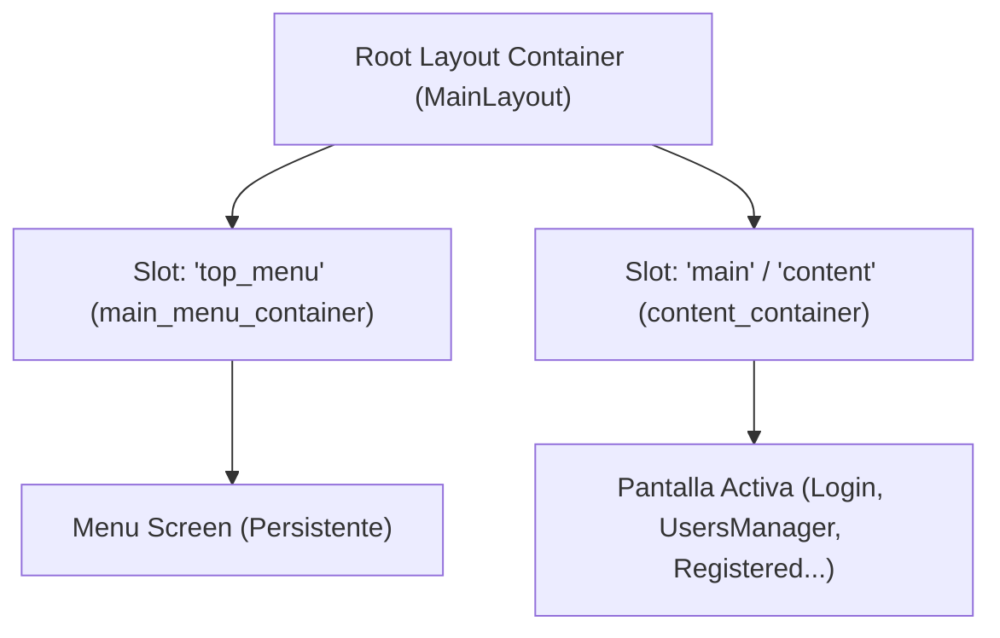

# USIM Framework — Handover Document: Diseño de Layouts, Autenticación y Navegación SPA

> **Fecha:** 2026-10-01  
> **Rama de trabajo:** `menu-refactoring-0`  
> **Estado:** 238 tests pasando (2254 aserciones) | PHPStan nivel máximo: 0 errores en 693 archivos.

---

## 1. Arquitectura y Diseño de Layouts en USIM

### 1.1 El Patrón de Slots (`AbstractLayout`)
USIM implementa layouts estructurados basados en slots. En lugar de recargar la página completa en cada transición, un layout maestro como `app/UI/Layouts/MainLayout.php` define la estructura persistente de la interfaz (cabecera, barra lateral, área principal) y registra contenedores con nombres de slots:

- **`top_menu` / `menu`**: Aloja `app/UI/Screens/Menu.php`, la barra superior interactiva (avatar, temas, idioma, selector de unidades).
- **`main` / `content`**: Aloja la pantalla activa en el cuerpo de la aplicación (`content_container`).



### 1.2 Principio de No-Contaminación de Slots (Container Isolation)
Un slot en USIM es un contenedor gestionado por el layout. Cuando se cambia de pantalla en el cliente vía SPA, el motor invoca `clearSlot()`, que elimina los componentes hijos del slot pero **no resetea las clases o estilos asignados al contenedor del slot**.

- **Problema previo:** Si una pantalla (`app/UI/Screens/Auth/Login.php`) mutaba directamente el contenedor del slot haciéndolo `card()` y con `maxWidth(450px)`, las siguientes pantallas montadas en ese slot heredaban esa restricción (la pantalla quedaba apretada a 450px).
- **Regla de diseño establecida:** Las pantallas **NUNCA** deben aplicar propiedades de diseño terminal (como `card()`, `maxWidth()`, fondos o bordes) directamente sobre el `$container` inyectado en `buildBaseUI`. En su lugar, deben crear sus propios contenedores internos:
  ```php
  // app/UI/Screens/Auth/Login.php
  protected function buildBaseUI(Container $container, ...$params): void
  {
      // 1. Wrapper interno que no ensucia el slot global
      $wrapper = UI::container('login_wrapper')
          ->plain()
          ->width(Size::full())
          ->layout(LayoutType::VERTICAL)
          ->justifyContent(JustifyContent::CENTER)
          ->alignItems(AlignItems::CENTER)
          ->padding(Spacing::px(20));

      // 2. Tarjeta específica de la pantalla
      $card = UI::container('login_card')
          ->card()
          ->maxWidth(Size::px(450))
          ->width(Size::full());

      // Componentes se agregan a $card...
      $wrapper->add($card);
      $container->add($wrapper);
  }
  ```

---

## 2. Motor de Navegación SPA Cliente-Servidor

### 2.1 Emisión en Backend (`Screen::navigate`)
Cuando una pantalla decide cambiar el contenido principal, invoca `$this->navigate($homeScreen)`. Esto no envía un header HTTP 302, sino que emite una directiva estructurada en el payload del evento:
```json
{
  "navigate": {
    "url": "/admin/users-manager",
    "route": "admin/users-manager",
    "title": "Users",
    "slot": "content_container"
  }
}
```

### 2.2 Ejecución en Frontend (`ui-renderer.js`)
1. **Actualización de Historial HTML5:** Se actualiza la URL y el título del navegador con `window.history.pushState`.
2. **Carga dinámica en Slot (`loadScreenIntoSlot`):**
   - Limpia los componentes del slot actual (`clearSlot`).
   - Consulta el endpoint oficial de USIM:
     ```javascript
     const response = await fetch(`/api/ui/${cleanRoute}?parent=${encodeURIComponent(parentId)}`, {
         headers: {
             'Accept': 'application/json',
             'X-Requested-With': 'XMLHttpRequest',
             'X-USIM-Storage': getUsimStorageHeaderValue(),
             ...getCsrfHeaders(),
         },
         credentials: 'same-origin',
     });
     ```
   - Procesa los componentes devueltos mediante `handleUIUpdate()`.

### 2.3 Solución Crítica en Tablas Dinámicas (`rows_container`)
- Las tablas en USIM (`Table`) tienen una estructura interna de capas:  
  `Table` ➔ `Container` (`rows_container`) ➔ `TableRow` (`<tr>`) ➔ `TableCell` (`<td>`).
- En HTML estricto, un elemento `<div>` no puede ser hijo directo de `<tbody>`.
- En `packages/idei/usim/resources/assets/js/ui-renderer.js` tanto en `render()` como en `addComponent()`, el `rows_container` es marcado como **transparente**, enlazando `component.element` directamente al `<tbody>` de la tabla, de modo que las filas `<tr>` se insertan limpiamente en el DOM sin wrappers `<div>` intermedios.

---

## 3. Refactorización del Flujo de Autenticación y Sesión

### 3.1 `LoginRequest` (Validación desacoplada)
- Creado en `app/Http/Requests/Auth/LoginRequest.php`.
- Soporta tanto inyección como FormRequest tradicional en controladores API, como validación estática para eventos de pantalla:
  ```php
  $credentials = LoginRequest::validateData($params);
  ```

### 3.2 `LoginService::login()` Enriquecido
- Centraliza la autenticación (Web y API) sin duplicar validaciones manuales.
- Retorna el payload enriquecido con roles, permisos, unidades y la pantalla de inicio calculada según prioridad:
  ```php
  [
      'status' => 'success',
      'message' => '...',
      'token' => '...',
      'user' => $user,
      'roles' => ['root'],
      'units' => [...],
      'active_unit' => 'main',
      'home_screen' => UsersManager::class,
      'redirect_to' => '/admin/users-manager',
  ]
  ```
- Acepta el parámetro `bool $startSession = false`. Cuando es `true` (usado por `Login.php`), invoca automáticamente a `AuthSessionService::establishSession()`.

### 3.3 `AuthSessionService` y el evento `logged_user`
- Método `establishSession(User $user, ?string $unit, ?string $token, ?string $homeScreen)`:
  - Autentica en Laravel: `Auth::login($user)`.
  - Resuelve la unidad activa y aplica el equipo de permisos: `UnitContextResolver::resolveAndApply($user, $unit)`.
  - Persiste la unidad en la sesión de Laravel:
    ```php
    session()->put('current_unit_id', getPermissionsTeamId());
    session()->put('current_unit_slug', $activeUnitSlug);
    ```
  - Emite el evento de dominio:
    ```php
    event(new UsimEvent('logged_user', [
        'user' => $user,
        'timestamp' => now(),
        'unit' => $activeUnitSlug ?? 'main',
        'home_screen' => $resolvedHomeScreen,
    ]));
    ```
  - Mantiene `start()` como alias retrocompatible deprecado.

### 3.4 Desacoplamiento entre `Login.php` y `Menu.php`
- **`Login.php`:**
  Es el iniciador del flujo; al recibir respuesta exitosa comanda la navegación:
  ```php
  $this->navigate($response['home_screen']);
  ```
- **`Menu.php`:**
  Escucha `onLoggedUser`, pero **solo actualiza su propia barra visual** (avatar, menú de usuario, selector de unidades). Se eliminó cualquier invocación a `$this->navigate()` dentro de `Menu::onLoggedUser()`, evitando colisiones o comportamientos no deseados (ej. en modales).

### 3.5 Middleware `PrepareUIContext`
- Ubicado en `packages/idei/usim/src/Http/Middleware/PrepareUIContext.php`.
- Resuelve la unidad activa para Spatie Permissions Teams:
  1. Primero desde la cabecera `X-USIM-Storage` (`store_unit`).
  2. Si está ausente, usa el fallback de sesión: `$request->session()->get('current_unit_slug')`.

---

## 4. Mapa de Archivos Modificados / Creados

| Archivo | Tipo | Descripción |
| :--- | :--- | :--- |
| `app/Http/Requests/Auth/LoginRequest.php` | **Nuevo** | FormRequest con helper `validateData()` para UI y API. |
| `app/Services/Auth/LoginService.php` | **Modificado** | Retorna `units`, `active_unit`, `home_screen`. Parámetro `startSession`. |
| `app/Services/Auth/AuthSessionService.php` | **Modificado** | Método `establishSession()`, persiste `current_unit_*` en sesión. |
| `app/UI/Screens/Auth/Login.php` | **Modificado** | Encapsula login en `login_wrapper` + `login_card`. Ejecuta `$this->navigate()`. |
| `app/UI/Screens/Menu.php` | **Modificado** | `onLoggedUser` solo refresca el menú visual (sin navegar). |
| `app/Http/Controllers/Api/AuthController.php` | **Modificado** | Usa `LoginRequest`, retorna payload enriquecido. |
| `packages/idei/usim/resources/assets/js/ui-renderer.js` | **Modificado** | Corrige URL `/api/ui/` y contenedor transparente en `addComponent`. |
| `public/vendor/idei/usim/js/ui-renderer.js` | **Modificado** | Versión publicada de assets sincronizada. |
| `packages/idei/usim/src/Http/Middleware/PrepareUIContext.php` | **Modificado** | Fallback a sesión para `current_unit_slug`. |
| `packages/idei/usim/stubs/...` | **Modificado** | Todos los stubs de paquetes sincronizados 1:1 con `app/`. |
| `tests/Feature/LoginServiceAndRequestTest.php` | **Nuevo** | Tests unitarios y funcionales de `LoginRequest` y `LoginService`. |
| `tests/Feature/LoginScreenTest.php` | **Modificado** | Aserciones adaptadas al contrato `navigate.url ?? redirect`. |

---

## 5. Próximos Pasos para el Siguiente LLM / Sesión

1. **Revisar si el usuario desea hacer commit** de los cambios actuales en la rama `menu-refactoring-0`.
2. **Registro de Usuarios y Modales de Autenticación:** Verificar si pantallas/modales como `RegisterDialog` o `ResetPassword` se benefician de la misma convención de navegación SPA (`navigate` en el iniciador).
3. **Persistencia de sesión en clientes concurrentes:** Si se continúa trabajando en multi-tenancy o multi-unidad, monitorear la coherencia entre `session('current_unit_id')` y `store_unit` en localStorage para evitar desincronizaciones entre pestañas de un mismo navegador.
