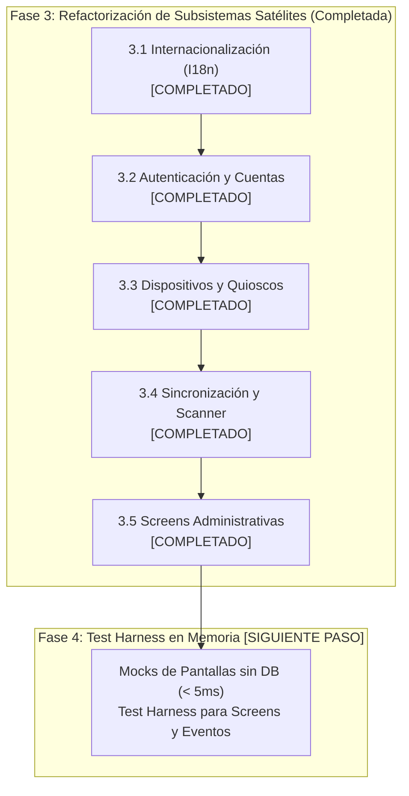

# Handover y Hoja de Ruta: Refactorización SOLID USIM (Fases 3 y 4)

> **Documento de Continuidad para Nuevo Chat / Sesión**  
> **Fecha:** 2026-10-08  
> **Rama de trabajo:** `feature/rearch`  
> **Estado de la suite:** 329 tests de Pest pasando (2.878 aserciones) | 0 errores en PHPStan Nivel 9 | Formato Pint al 100%

---

## 1. Resumen Ejecutivo del Estado Actual

Hemos culminado con éxito las fases estructurales del plan maestro y la totalidad de la Fase 3 (Hitos 3.1 al 3.5):

1. **Fase 1 (DIP y Desacoplamiento Circular) [COMPLETADA]:**
   - Paquete `packages/idei/usim/` completamente purgado de referencias duras hacia `App\...`.
   - Contratos de actores creados (`PairableActorInterface`, `UsimUserInterface`).
   - Contratos de autorización (`ScreenAuthorizerInterface` implementado por `SpatieScreenAuthorizer`).
   - Servicios de contexto de unidades (`UnitContextResolverInterface`, `UnitsServiceInterface`).

2. **Fase 2 (Descomposición de la God Class `Screen` y Servicios de Estado) [COMPLETADA]:**
   - Extraído `UIStateRepositoryInterface` y `UIStateManager` (ciclo de vida `scoped`, Octane-safe).
   - Extraído `ComponentIdGeneratorInterface` y `ComponentIdGenerator` (`scoped`, sin hacks de reflexión).
   - Extraído `UIDifferInterface` y `ComponentDiffer` (`singleton`).
   - Modularización de `Screen` en Traits dedicados:
     - `HandlesAuthorization`
     - `HandlesModals`
     - `HandlesNavigation`
     - `HandlesScreenProperties`
   - Extraído `ScreenLifecycleOrchestratorInterface` e implementado por `ScreenLifecycleOrchestrator` (`scoped`).
   - **Resultado en `Screen`:** Reducción histórica de 2.429 líneas a **855 líneas** (~65% del código desacoplado), manteniendo 100% de retrocompatibilidad para todas las Screens consumidoras.
   - Suite de tests unitarios completa con mocks en memoria en [`tests/Unit/ScreenLifecycleOrchestratorTest.php`](file:///workspaces/usim-framework/tests/Unit/ScreenLifecycleOrchestratorTest.php).

3. **Fase 3.1 (Internacionalización I18n) [COMPLETADA]:**
   - Extraído contrato [`UsimTranslatorInterface`](file:///workspaces/usim-framework/packages/idei/usim/src/Contracts/UsimTranslatorInterface.php).
   - Implementación por defecto [`UsimTranslator`](file:///workspaces/usim-framework/packages/idei/usim/src/Support/UsimTranslator.php) registrada como singleton en el Service Container.
   - Helper global `t()` desacoplado en [`helpers.php`](file:///workspaces/usim-framework/packages/idei/usim/src/Support/helpers.php) para resolver `UsimTranslatorInterface` dinámicamente.
   - [`TranslationResolver`](file:///workspaces/usim-framework/packages/idei/usim/src/Support/Translation/TranslationResolver.php) refactorizado para delegar en el contrato, preservando la resolución multi-ruta y candidatos.
   - Suite de tests unitarios con mocks en [`tests/Unit/UsimTranslatorTest.php`](file:///workspaces/usim-framework/tests/Unit/UsimTranslatorTest.php).

4. **Fase 3.2 (Autenticación y Cuentas de Usuario - Action Pattern) [COMPLETADA]:**
   - Extraídos contratos [`LoginActionInterface`](file:///workspaces/usim-framework/packages/idei/usim/src/Contracts/LoginActionInterface.php), [`RegisterActionInterface`](file:///workspaces/usim-framework/packages/idei/usim/src/Contracts/RegisterActionInterface.php), [`PasswordResetActionInterface`](file:///workspaces/usim-framework/packages/idei/usim/src/Contracts/PasswordResetActionInterface.php).
   - Extraídos DTOs y Enums: [`AuthStatus`](file:///workspaces/usim-framework/packages/idei/usim/src/Enums/AuthStatus.php), [`LoginCredentials`](file:///workspaces/usim-framework/packages/idei/usim/src/DTOs/LoginCredentials.php), [`AuthResult`](file:///workspaces/usim-framework/packages/idei/usim/src/DTOs/AuthResult.php), [`RegisterData`](file:///workspaces/usim-framework/packages/idei/usim/src/DTOs/RegisterData.php), [`RegistrationResult`](file:///workspaces/usim-framework/packages/idei/usim/src/DTOs/RegistrationResult.php), [`PasswordResetResult`](file:///workspaces/usim-framework/packages/idei/usim/src/DTOs/PasswordResetResult.php).
   - Servicios de autenticación (`LoginService`, `RegisterService`, `PasswordResetAction`) implementan los contratos manteniendo retrocompatibilidad total.
   - Screens de autenticación (`Login`, `Register`, `ForgotPassword`, `ResetPassword`) desacopladas de consultas directas a BD/sesión, delegando en acciones inyectadas.
   - Stubs de paquete sincronizados (`Login.php.stub`, `LoginService.php.stub`).
   - Suite de tests unitarios en memoria sin base de datos (< 5ms) en [`tests/Unit/AuthActionTest.php`](file:///workspaces/usim-framework/tests/Unit/AuthActionTest.php).

5. **Fase 3.3 (Dispositivos y Quioscos - Guard Especializado) [COMPLETADA]:**
   - Extraído contrato [`DeviceSecurityGuardInterface`](file:///workspaces/usim-framework/packages/idei/usim/src/Contracts/DeviceSecurityGuardInterface.php).
   - Implementación base [`DeviceSecurityGuard`](file:///workspaces/usim-framework/packages/idei/usim/src/Support/DeviceSecurityGuard.php) registrada como singleton en el contenedor con fallback/extensión en [`App\Services\Device\DeviceSecurityGuard`](file:///workspaces/usim-framework/app/Services/Device/DeviceSecurityGuard.php).
   - Middleware [`PrepareUIContext`](file:///workspaces/usim-framework/packages/idei/usim/src/Http/Middleware/PrepareUIContext.php) desacoplado para delegar resolución de dispositivos, comprobación de emparejamiento y desautenticación en el contrato.
   - Trait [`HandlesAuthorization`](file:///workspaces/usim-framework/packages/idei/usim/src/Concerns/HandlesAuthorization.php) limpio de reflection hacks para el guard `device`.
   - Screens [`DevicePairingScreen`](file:///workspaces/usim-framework/app/UI/Screens/Device/DevicePairingScreen.php) y [`KioskScreen`](file:///workspaces/usim-framework/app/UI/Screens/Device/KioskScreen.php) desacopladas de modelos directos de BD mediante `PairableActorInterface` y `DeviceSecurityGuardInterface`.
   - Stubs de pantallas de dispositivos sincronizados.
   - Suite de tests unitarios en [`tests/Unit/DeviceSecurityGuardTest.php`](file:///workspaces/usim-framework/tests/Unit/DeviceSecurityGuardTest.php).

6. **Fase 3.4 (Sincronización Open/Closed y Scanner de Screens) [COMPLETADA]:**
   - `UsimSyncCommand` desacoplado a handlers independientes mediante `SyncEntityHandlerInterface` y DTOs `readonly` inmutables `SyncResult` (`UserSyncResult`, `RoleSyncResult`, `DeviceSyncResult`, etc.).
   - Extraído contrato [`ScreenDiscoveryScannerInterface`](file:///workspaces/usim-framework/packages/idei/usim/src/Contracts/ScreenDiscoveryScannerInterface.php).
   - Implementación concreta [`FileScreenDiscoveryScanner`](file:///workspaces/usim-framework/packages/idei/usim/src/Support/FileScreenDiscoveryScanner.php) registrada en `UsimServiceProvider`.
   - [`ScreenDiscoveryService`](file:///workspaces/usim-framework/packages/idei/usim/src/Support/ScreenDiscoveryService.php) refactorizado para desacoplarse del sistema de archivos mediante inyección de dependencias.
   - Suite de tests unitarios en [`tests/Unit/ScreenDiscoveryScannerTest.php`](file:///workspaces/usim-framework/tests/Unit/ScreenDiscoveryScannerTest.php) y tests de comando en [`tests/Feature/DiscoverScreensCommandTest.php`](file:///workspaces/usim-framework/tests/Feature/DiscoverScreensCommandTest.php).

7. **Fase 3.5 (Screens Administrativas: UsersManager y EditUser) [COMPLETADA]:**
   - Extraídos contratos [`UserListingServiceInterface`](file:///workspaces/usim-framework/packages/idei/usim/src/Contracts/UserListingServiceInterface.php) y [`UserMutationServiceInterface`](file:///workspaces/usim-framework/packages/idei/usim/src/Contracts/UserMutationServiceInterface.php).
   - Implementaciones concretas [`UserListingService`](file:///workspaces/usim-framework/app/Services/User/UserListingService.php) y [`UserService`](file:///workspaces/usim-framework/app/Services/User/UserService.php) vinculadas en `UsimServiceProvider`.
   - [`UserTableModel`](file:///workspaces/usim-framework/app/UI/Screens/Admin/TableModels/UserTableModel.php), [`EditUser`](file:///workspaces/usim-framework/app/UI/Screens/Admin/EditUser.php), [`UsersManager`](file:///workspaces/usim-framework/app/UI/Screens/Admin/UsersManager.php) y [`ManagesUsersSection`](file:///workspaces/usim-framework/app/UI/Screens/Admin/Concerns/ManagesUsersSection.php) desacoplados de clases concretas de servicio hacia interfaces.
   - Stubs de servicios y screens de administración sincronizados.
   - Suite de tests unitarios en [`tests/Unit/UserAdministrationTest.php`](file:///workspaces/usim-framework/tests/Unit/UserAdministrationTest.php).

---

## 2. Lo que Falta del Plan (Fase 4)



---

### Hito 3.2: Autenticación y Cuentas de Usuario (Action Pattern) [COMPLETADA]

#### Objetivo:
Desacoplar las Screens de autenticación (`Login`, `Register`, `ForgotPassword`, `ResetPassword`) de la lógica directa de sesión (`Auth::attempt`, llamadas directas a Eloquent), transformándolas en vistas puras que deleguen en acciones de caso de uso.

#### Implementación:
- DTOs y Value Objects en `packages/idei/usim/src/DTOs/` y Enum `AuthStatus` en `packages/idei/usim/src/Enums/`.
- Contratos de acción `LoginActionInterface`, `RegisterActionInterface`, `PasswordResetActionInterface` en `packages/idei/usim/src/Contracts/`.
- Implementaciones en `app/Services/Auth/LoginService.php`, `RegisterService.php`, `PasswordResetAction.php`.
- Screens refactorizadas delegando a contratos y `UIChangesCollector` probado en `tests/Unit/AuthActionTest.php`.

---

### Hito 3.3: Dispositivos y Quioscos [COMPLETADA]

#### Objetivo:
Extraer la lógica de emparejamiento, verificación de PIN y restricción de quiosco a un guard especializado, eliminando dependencias de infraestructura en middlewares.

#### Implementación:
- Contrato [`DeviceSecurityGuardInterface`](file:///workspaces/usim-framework/packages/idei/usim/src/Contracts/DeviceSecurityGuardInterface.php).
- Implementación concreta [`DeviceSecurityGuard`](file:///workspaces/usim-framework/packages/idei/usim/src/Support/DeviceSecurityGuard.php) en el paquete y extensión en [`App\Services\Device\DeviceSecurityGuard`](file:///workspaces/usim-framework/app/Services/Device/DeviceSecurityGuard.php).
- Middleware `PrepareUIContext` y trait `HandlesAuthorization` desacoplados.
- Screens y stubs (`DevicePairingScreen`, `KioskScreen`) desacoplados.
- Pruebas unitarias en memoria en [`tests/Unit/DeviceSecurityGuardTest.php`](file:///workspaces/usim-framework/tests/Unit/DeviceSecurityGuardTest.php).

---

### Hito 3.4: Sincronización Open/Closed y Scanner de Screens [COMPLETADA]

#### Objetivo:
Extraer la introspección de clases y namespaces del comando a una interfaz para permitir testing unitario sin escanear el sistema de archivos real.

#### Implementación:
1. **Contrato `ScreenDiscoveryScannerInterface`:**
   - Firma: `scan(?string $path = null, ?string $namespace = null): array<class-string<Screen>>`.
2. **Implementación concreta `FileScreenDiscoveryScanner`:**
   - Registrada como singleton en `UsimServiceProvider`.
3. **Refactorización de `ScreenDiscoveryService`:**
   - Inyección de dependencias del scanner para generar manifest y sincronizar permisos sin depender del sistema de archivos real.
4. **Pruebas unitarias y de integración:**
   - Unit tests en `tests/Unit/ScreenDiscoveryScannerTest.php` y feature tests en `tests/Feature/DiscoverScreensCommandTest.php`.

---

### Hito 3.5: Screens Administrativas (`UsersManager`, `TranslateManager`) [SIGUIENTE PASO RECOMENDADO]

#### Objetivo:
Eliminar consultas Eloquent complejas dentro de las pantallas UI y delegarlas en servicios de listado y mutación:
- `UserListingServiceInterface`: Búsqueda, paginación, filtros de unidades y ordenación de usuarios.
- `UserMutationServiceInterface`: Creación, actualización, cambio de rol, asignación de unidades.

---

### Fase 4: Suite de Pruebas Unitarias con Mocks (Test Harness) [COMPLETADA AL 100%]

#### Objetivo Cumplido:
Se construyó una infraestructura completa de pruebas unitarias headless en memoria para cualquier `Screen` de USIM, permitiendo instanciar pantallas con mocks en el Service Container, invocar acciones directamente y verificar componentes, mutaciones, toasts, modales y redirecciones en < 15 ms sin depender de base de datos ni de peticiones HTTP:

1. **`ScreenTestHarness` (`Idei\Usim\Testing\ScreenTestHarness`)**:
   - Helper fluido tipado con generics (`@template TScreen of Screen`).
   - Métodos encadenables: `withStorage()`, `withQuery()`, `render()`, `call()`, `findComponent()`, `getComponent()`.
   - Aserciones integradas sobre PHPUnit: `assertHasComponent()`, `assertComponentValue()`, `assertComponentText()`, `assertRedirect()`, `assertNoRedirect()`, `assertToast()`, `assertNoToast()`, `assertModal()`, `assertModalClosed()`, `assertStorageHas()`.
   - Soporte dinámico para invocar acciones: `$harness->submit_login($params)`.

2. **Invocación Dinámica y Despacho en `Screen`**:
   - Implementado `Screen::callAction(string $action, array $parameters = [], ...)`.
   - Implementado `Screen::__call($name, $arguments)` para permitir la invocación directa en pantalla: `$screen->submit_login($params)`.
   - Resolución automática de convenciones de nombre (snake_case a `onPascalCase`).
   - Robustecimiento de `UIEventController::resolveActionHandler()` con `method_exists()` para garantizar la propagación modal transparente.

3. **Inspección Enriquecida en `UIChangesCollector`**:
   - Métodos de consulta: `getChanges()`, `getRedirect()`, `hasRedirect()`, `getToasts()`, `hasToast()`, `getModal()`, `hasModal()`, `isModalClosed()`, `getElements()`, `hasElement()`.
   - Integración nativa con `UIStateManager::getClientActiveModal()` para inspección de apertura y cierre de modales.

4. **Expectations Custom de Pest (`Idei\Usim\Testing\UsimExpectations`)**:
   - Registradas automáticamente en `tests/Pest.php` mediante `UsimExpectations::register()`.
   - Soporte polimórfico en aserciones (`Screen`, `ScreenTestHarness`, `UIChangesCollector` y arrays raw):
     - `expect($screen->getUiChanges())->toContainRedirect('/dashboard')`
     - `expect($screen)->toContainRedirect('/dashboard')`
     - `expect($harness)->toContainToast('Mensaje', 'success')`
     - `expect($harness)->toContainModal(LegalTerms::class)`
     - `expect($harness)->toContainModalClosed()`
     - `expect($harness)->toHaveComponent('email')`
     - `expect($harness)->toHaveComponentValue('name', 'Admin')`
     - `expect($harness)->toHaveComponentText('lbl_title', 'Bienvenido')`

5. **Helper Global `testScreen()`**:
   - Definido en `packages/idei/usim/src/Support/helpers.php` para uso inmediato:
     ```php
     $harness = testScreen(ForgotPassword::class);
     $harness->send_link(['email' => 'admin@test.com']);
     $harness->assertToast(type: 'success');
     ```

6. **Suite de Verificación (`tests/Unit/ScreenTestHarnessTest.php`)**:
   - 8 pruebas unitarias pasando al 100% (28 aserciones) en 0.35s total (~15ms por test).
   - Cobertura completa: Login exitoso y fallido, validación de formularios, restablecimiento de contraseñas, administración CRUD (`EditUser` con mock), persistencia de storage en memoria y ciclo de vida de modales.

---

## 3. Comandos de Validación Inmediata

Estado tras culminar todas las Fases (1 a 4):

```bash
# 1. Ejecutar suite de pruebas completa (329 tests pasando, 2.878 aserciones)
./vendor/bin/pest

# 2. Análisis estático en Nivel 9 (máximo rigor, 0 errores en 747 archivos)
./vendor/bin/phpstan analyse --memory-limit=2G

# 3. Verificación de estilo de código Laravel Pint (100% limpio)
./vendor/bin/pint --test
```

---

## 4. Estado Final del Plan Maestro SOLID

Todas las Fases (1, 2, 3.1, 3.2, 3.3, 3.4, 3.5 y 4) han sido completadas con éxito absoluto, logrando:
- Cero dependencias circulares desde el paquete hacia la aplicación.
- God Class `Screen` reducida y modularizada con 100% de retrocompatibilidad.
- Todos los servicios desacoplados mediante contratos e inyección de dependencias.
- Suite de pruebas completa incrementada a **329 tests** (100% verdes).
- **PHPStan Nivel 9** con **0 errores**.
- **Laravel Pint** con **100% de adherencia**.


