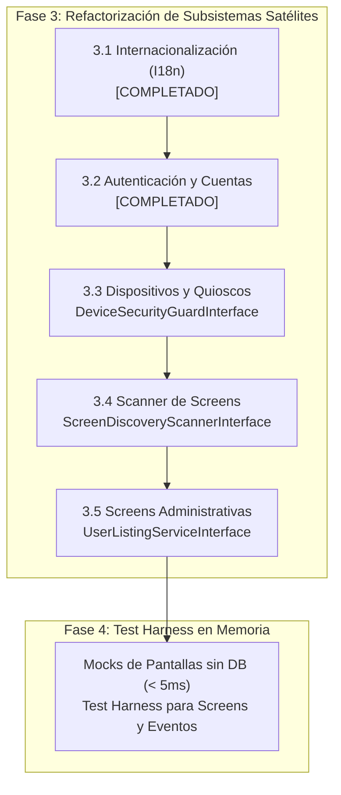

# Handover y Hoja de Ruta: Refactorización SOLID USIM (Fases 3 y 4)

> **Documento de Continuidad para Nuevo Chat / Sesión**  
> **Fecha:** 2026-10-08  
> **Rama de trabajo:** `feature/rearch`  
> **Estado de la suite:** 304 tests de Pest pasando | 0 errores en PHPStan Nivel 9 | Formato Pint al 100%

---

## 1. Resumen Ejecutivo del Estado Actual

Hemos culminado con éxito las dos primeras fases estructurales del plan maestro y las dos primeras partes de la fase 3:

1. **Fase 1 (DIP y Desacoplamiento Circular) [COMPLETADA]:**
   - Paquete `packages/idei/usim/` completamente purgado de referencias duras hacia `App\...`.
   - Contratos de actores creados (`PairableActorInterface`, `UsimUserInterface`).
   - Contratos de autorización (`ScreenAuthorizerInterface` implementado por `SpatieScreenAuthorizer`).
   - Servicios de contexto de unidades (`UnitContextResolverInterface`, `UnitsServiceInterface`).

2. **Fase 2 (Descomposición de la God Class `Screen` y Servicios de Estado) [COMPLETADA]:**
   - Extraído `UIStateRepositoryInterface` y `UIStateManager` (ciclo de vida `scoped`, Octane-safe).
   - Extraído `ComponentIdGeneratorInterface` y `ComponentIdGenerator` (`scoped`, sin hacks de reflexión).
   - Extraído `UIDifferInterface` y `ComponentDiffer` (`singleton`).
   - Modularización de `Screen` en Traits dedicados:
     - `HandlesAuthorization`
     - `HandlesModals`
     - `HandlesNavigation`
     - `HandlesScreenProperties`
   - Extraído `ScreenLifecycleOrchestratorInterface` e implementado por `ScreenLifecycleOrchestrator` (`scoped`).
   - **Resultado en `Screen`:** Reducción histórica de 2.429 líneas a **855 líneas** (~65% del código desacoplado), manteniendo 100% de retrocompatibilidad para todas las Screens consumidoras.
   - Suite de tests unitarios completa con mocks en memoria en [`tests/Unit/ScreenLifecycleOrchestratorTest.php`](file:///workspaces/usim-framework/tests/Unit/ScreenLifecycleOrchestratorTest.php).

3. **Fase 3.1 (Internacionalización I18n) [COMPLETADA]:**
   - Extraído contrato [`UsimTranslatorInterface`](file:///workspaces/usim-framework/packages/idei/usim/src/Contracts/UsimTranslatorInterface.php).
   - Implementación por defecto [`UsimTranslator`](file:///workspaces/usim-framework/packages/idei/usim/src/Support/UsimTranslator.php) registrada como singleton en el Service Container.
   - Helper global `t()` desacoplado en [`helpers.php`](file:///workspaces/usim-framework/packages/idei/usim/src/Support/helpers.php) para resolver `UsimTranslatorInterface` dinámicamente.
   - [`TranslationResolver`](file:///workspaces/usim-framework/packages/idei/usim/src/Support/Translation/TranslationResolver.php) refactorizado para delegar en el contrato, preservando la resolución multi-ruta y candidatos.
   - Suite de tests unitarios con mocks en [`tests/Unit/UsimTranslatorTest.php`](file:///workspaces/usim-framework/tests/Unit/UsimTranslatorTest.php).

4. **Fase 3.2 (Autenticación y Cuentas de Usuario - Action Pattern) [COMPLETADA]:**
   - Extraídos contratos [`LoginActionInterface`](file:///workspaces/usim-framework/packages/idei/usim/src/Contracts/LoginActionInterface.php), [`RegisterActionInterface`](file:///workspaces/usim-framework/packages/idei/usim/src/Contracts/RegisterActionInterface.php), [`PasswordResetActionInterface`](file:///workspaces/usim-framework/packages/idei/usim/src/Contracts/PasswordResetActionInterface.php).
   - Extraídos DTOs y Enums: [`AuthStatus`](file:///workspaces/usim-framework/packages/idei/usim/src/Enums/AuthStatus.php), [`LoginCredentials`](file:///workspaces/usim-framework/packages/idei/usim/src/DTOs/LoginCredentials.php), [`AuthResult`](file:///workspaces/usim-framework/packages/idei/usim/src/DTOs/AuthResult.php), [`RegisterData`](file:///workspaces/usim-framework/packages/idei/usim/src/DTOs/RegisterData.php), [`RegistrationResult`](file:///workspaces/usim-framework/packages/idei/usim/src/DTOs/RegistrationResult.php), [`PasswordResetResult`](file:///workspaces/usim-framework/packages/idei/usim/src/DTOs/PasswordResetResult.php).
   - Servicios de autenticación (`LoginService`, `RegisterService`, `PasswordResetAction`) implementan los contratos manteniendo retrocompatibilidad total.
   - Screens de autenticación (`Login`, `Register`, `ForgotPassword`, `ResetPassword`) desacopladas de consultas directas a BD/sesión, delegando en acciones inyectadas.
   - Stubs de paquete sincronizados (`Login.php.stub`, `LoginService.php.stub`).
   - Suite de tests unitarios en memoria sin base de datos (< 5ms) en [`tests/Unit/AuthActionTest.php`](file:///workspaces/usim-framework/tests/Unit/AuthActionTest.php).

5. **Fase 3.4 (Parcial - Sincronización Open/Closed) [COMPLETADA]:**
   - `UsimSyncCommand` desacoplado a handlers independientes mediante `SyncEntityHandlerInterface` y DTOs `readonly` inmutables `SyncResult` (`UserSyncResult`, `RoleSyncResult`, `DeviceSyncResult`, etc.).

---

## 2. Lo que Falta del Plan (Fases 3 y 4)



---

### Hito 3.2: Autenticación y Cuentas de Usuario (Action Pattern) [COMPLETADA]

#### Objetivo:
Desacoplar las Screens de autenticación (`Login`, `Register`, `ForgotPassword`, `ResetPassword`) de la lógica directa de sesión (`Auth::attempt`, llamadas directas a Eloquent), transformándolas en vistas puras que deleguen en acciones de caso de uso.

#### Implementación:
- DTOs y Value Objects en `packages/idei/usim/src/DTOs/` y Enum `AuthStatus` en `packages/idei/usim/src/Enums/`.
- Contratos de acción `LoginActionInterface`, `RegisterActionInterface`, `PasswordResetActionInterface` en `packages/idei/usim/src/Contracts/`.
- Implementaciones en `app/Services/Auth/LoginService.php`, `RegisterService.php`, `PasswordResetAction.php`.
- Screens refactorizadas delegando a contratos y `UIChangesCollector` probado en `tests/Unit/AuthActionTest.php`.

---

### Hito 3.3: Dispositivos y Quioscos [SIGUIENTE PASO RECOMENDADO]

#### Objetivo:
Extraer la lógica de emparejamiento, verificación de PIN y restricción de quiosco a un guard especializado, eliminando dependencias de infraestructura en middlewares.

#### Especificación Técnica:
1. **Contrato `DeviceSecurityGuardInterface`:**
   - Ubicación: `packages/idei/usim/src/Contracts/DeviceSecurityGuardInterface.php`.
   - Métodos: `isDevicePaired(Request $request): bool`, `isKioskModeEnabled(): bool`, `resolveDevice(Request $request): ?PairableActorInterface`.
2. **Desacoplar `PrepareUIContext` Middleware:**
   - Reemplazar la inspección directa de cookies y base de datos por llamadas a `DeviceSecurityGuardInterface`.
3. **Implementación Concreta:**
   - `app/Services/DeviceSecurityGuard.php` o `Idei\Usim\Support\DeviceSecurityGuard`.

---

### Hito 3.4 (Restante): Scanner de Screens (`DiscoverScreensCommand`)

#### Objetivo:
Extraer la introspección de clases y namespaces del comando a una interfaz para permitir testing unitario sin escanear el sistema de archivos real.

#### Especificación Técnica:
1. **Contrato `ScreenDiscoveryScannerInterface`:**
   - Firma: `scan(string $path, string $namespace): array<class-string<Screen>>`.
2. **Refactorizar `DiscoverScreensCommand`:**
   - Inyectar el scanner; el comando solo se encarga de mostrar la salida en consola y registrar permisos.

---

### Hito 3.5: Screens Administrativas (`UsersManager`, `TranslateManager`)

#### Objetivo:
Eliminar consultas Eloquent complejas dentro de las pantallas UI y delegarlas en servicios de listado y mutación:
- `UserListingServiceInterface`: Búsqueda, paginación, filtros de unidades y ordenación de usuarios.
- `UserMutationServiceInterface`: Creación, actualización, cambio de rol, asignación de unidades.

---

### Fase 4: Suite de Pruebas Unitarias con Mocks (Test Harness)

#### Objetivo:
Crear utilidades y helpers para instanciar cualquier pantalla en memoria con mocks, ejecutar acciones y verificar respuestas en menos de 5 ms sin base de datos ni sesión HTTP.

#### Ejemplo de uso objetivo:
```php
it('submits login and navigates on success', function () {
    $loginAction = Mockery::mock(LoginActionInterface::class);
    $loginAction->shouldReceive('execute')
        ->once()
        ->andReturn(AuthResult::success('/dashboard'));

    app()->instance(LoginActionInterface::class, $loginAction);

    $screen = Screen::make(Login::class);
    $screen->submit_login([
        'login_email' => 'admin@test.com',
        'login_password' => 'secret',
    ]);

    expect($screen->getUiChanges())->toContainRedirect('/dashboard');
});
```

---

## 3. Comandos de Validación Inmediata

Para verificar la integridad antes de continuar o tras cualquier cambio:

```bash
# 1. Ejecutar suite de pruebas completa (290 tests)
./vendor/bin/pest

# 2. Análisis estático en Nivel 9 (máximo rigor)
./vendor/bin/phpstan.phar analyse --no-progress

# 3. Verificación de estilo de código Laravel Pint
./vendor/bin/pint --test
```

---

## 4. Prompt para Continuar en un Nuevo Chat

Copia y pega el siguiente mensaje en el nuevo chat para continuar inmediatamente:

```markdown
Hola, estamos ejecutando el plan maestro de refactorización SOLID para USIM en la rama `feature/rearch`.
Las Fases 1, 2, 3.1 y 3.2 están completadas al 100%, con 304 tests pasando y 0 errores en PHPStan Nivel 9.

Revisa el archivo de handover `docs/HANDOVER_REFACTORING_SOLIDO_FASE3_Y_4.md`.
Continuemos con la **Fase 3 (Hito 3.3: Dispositivos y Quioscos - DeviceSecurityGuardInterface)**:
1. Crear contrato `DeviceSecurityGuardInterface` en `packages/idei/usim/src/Contracts/`.
2. Implementar servicio `DeviceSecurityGuard` desacoplado de HTTP y BD directa.
3. Refactorizar middleware `PrepareUIContext` para inyectar y delegar en `DeviceSecurityGuardInterface`.
4. Agregar pruebas unitarias con mocks.
5. Validar con Pest, PHPStan Nivel 9 y Pint.
```

