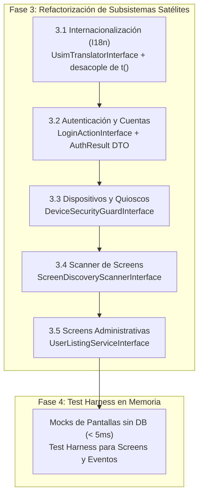

# Handover y Hoja de Ruta: Refactorización SOLID USIM (Fases 3 y 4)

> **Documento de Continuidad para Nuevo Chat / Sesión**  
> **Fecha:** 2026-10-08  
> **Rama de trabajo:** `feature/rearch`  
> **Estado de la suite:** 290 tests de Pest pasando | 0 errores en PHPStan Nivel 9 | Formato Pint al 100%

---

## 1. Resumen Ejecutivo del Estado Actual

Hemos culminado con éxito las dos primeras fases estructurales del plan maestro y parte de la fase 3:

1. **Fase 1 (DIP y Desacoplamiento Circular) [COMPLETADA]:**
   - Paquete `packages/idei/usim/` completamente purgado de referencias duras hacia `App\...`.
   - Contratos de actores creados (`PairableActorInterface`, `UsimUserInterface`).
   - Contratos de autorización (`ScreenAuthorizerInterface` implementado por `SpatieScreenAuthorizer`).
   - Servicios de contexto de unidades (`UnitContextResolverInterface`, `UnitsServiceInterface`).

2. **Fase 2 (Descomposición de la God Class `Screen` y Servicios de Estado) [COMPLETADA]:**
   - Extraído `UIStateRepositoryInterface` y `UIStateManager` (ciclo de vida `scoped`, Octane-safe).
   - Extraído `ComponentIdGeneratorInterface` y `ComponentIdGenerator` (`scoped`, sin hacks de reflexión).
   - Extraído `UIDifferInterface` y `ComponentDiffer` (`singleton`).
   - Modularización de `Screen` en Traits dedicados:
     - `HandlesAuthorization`
     - `HandlesModals`
     - `HandlesNavigation`
     - `HandlesScreenProperties`
   - Extraído `ScreenLifecycleOrchestratorInterface` e implementado por `ScreenLifecycleOrchestrator` (`scoped`).
   - **Resultado en `Screen`:** Reducción histórica de 2.429 líneas a **855 líneas** (~65% del código desacoplado), manteniendo 100% de retrocompatibilidad para todas las Screens consumidoras.
   - Suite de tests unitarios completa con mocks en memoria en [`tests/Unit/ScreenLifecycleOrchestratorTest.php`](file:///workspaces/usim-framework/tests/Unit/ScreenLifecycleOrchestratorTest.php).

3. **Fase 3.4 (Parcial - Sincronización Open/Closed) [COMPLETADA]:**
   - `UsimSyncCommand` desacoplado a handlers independientes mediante `SyncEntityHandlerInterface` y DTOs `readonly` inmutables `SyncResult` (`UserSyncResult`, `RoleSyncResult`, `DeviceSyncResult`, etc.).

---

## 2. Lo que Falta del Plan (Fases 3 y 4)



---

### Hito 3.1: Internacionalización (I18n) [SIGUIENTE PASO RECOMENDADO]

#### Objetivo:
Desacoplar la resolución y persistencia de traducciones para permitir mocks en tests sin requerir base de datos ni lecturas físicas de disco en cada invocación.

#### Especificación Técnica:
1. **Contrato `UsimTranslatorInterface`:**
   - Ubicación: `packages/idei/usim/src/Contracts/UsimTranslatorInterface.php`.
   - Firma esencial:
     ```php
     public function get(string $key, array $replace = [], ?string $locale = null): string;
     public function has(string $key, ?string $locale = null): bool;
     public function getLocale(): string;
     public function setLocale(string $locale): void;
     ```
2. **Implementación por Defecto (`UsimTranslator`):**
   - Ubicación: `packages/idei/usim/src/Support/UsimTranslator.php`.
   - Implementa `UsimTranslatorInterface`, delegando en caché o en el translator de Laravel.
3. **Desacoplar el Helper Global `t()`:**
   - En `packages/idei/usim/src/Support/helpers.php`:
     ```php
     function t(string $key, array $replace = [], ?string $locale = null): string {
         return app(UsimTranslatorInterface::class)->get($key, $replace, $locale);
     }
     ```
4. **Separación de Responsabilidades:**
   - `TranslationQueryService`: Lectura ultrarrápida optimizada en memoria.
   - `TranslationAdminRepository`: Operaciones administrativas para la screen `TranslateManager`.
   - `TranslationSyncService`: Sincronización entre archivos de idioma y base de datos.
5. **Verificación:**
   - Crear `tests/Unit/UsimTranslatorTest.php` probando el helper `t()` y el servicio con mocks de Mockery.

---

### Hito 3.2: Autenticación y Cuentas de Usuario (Action Pattern)

#### Objetivo:
Desacoplar las Screens de autenticación (`Login`, `Register`, `ForgotPassword`, `ResetPassword`) de la lógica directa de sesión (`Auth::attempt`, llamadas directas a Eloquent), transformándolas en vistas puras que deleguen en acciones de caso de uso.

#### Especificación Técnica:
1. **DTOs y Value Objects:**
   - Ubicación: `packages/idei/usim/src/DTOs/` o `app/DTOs/`.
   - `LoginCredentials`: `readonly class LoginCredentials { public string $email; public string $password; public bool $remember; }`
   - `AuthResult`:
     ```php
     enum AuthStatus: string {
         case SUCCESS = 'success';
         case BAD_CREDENTIALS = 'bad_credentials';
         case TERMS_REQUIRED = 'terms_required';
         case DEVICE_UNPAIRED = 'device_unpaired';
         case USER_DISABLED = 'user_disabled';
     }
     ```
2. **Contratos de Acción:**
   - `LoginActionInterface`: `execute(LoginCredentials $credentials): AuthResult`
   - `RegisterActionInterface`: `execute(RegisterData $data): RegistrationResult`
   - `PasswordResetActionInterface`: `execute(string $email): void`
3. **Refactorización de Screens:**
   - `app/UI/Screens/Auth/Login.php`: Inyectar `LoginActionInterface` (o resolver vía container) en el método de submit, delegando la autenticación y reaccionando según el `AuthStatus`.
4. **Verificación:**
   - Tests unitarios probando `Login` y `Register` en memoria sin interactuar con la base de datos real.

---

### Hito 3.3: Dispositivos y Quioscos

#### Objetivo:
Extraer la lógica de emparejamiento, verificación de PIN y restricción de quiosco a un guard especializado, eliminando dependencias de infraestructura en middlewares.

#### Especificación Técnica:
1. **Contrato `DeviceSecurityGuardInterface`:**
   - Ubicación: `packages/idei/usim/src/Contracts/DeviceSecurityGuardInterface.php`.
   - Métodos: `isDevicePaired(Request $request): bool`, `isKioskModeEnabled(): bool`, `resolveDevice(Request $request): ?PairableActorInterface`.
2. **Desacoplar `PrepareUIContext` Middleware:**
   - Reemplazar la inspección directa de cookies y base de datos por llamadas a `DeviceSecurityGuardInterface`.
3. **Implementación Concreta:**
   - `app/Services/DeviceSecurityGuard.php` o `Idei\Usim\Support\DeviceSecurityGuard`.

---

### Hito 3.4 (Restante): Scanner de Screens (`DiscoverScreensCommand`)

#### Objetivo:
Extraer la introspección de clases y namespaces del comando a una interfaz para permitir testing unitario sin escanear el sistema de archivos real.

#### Especificación Técnica:
1. **Contrato `ScreenDiscoveryScannerInterface`:**
   - Firma: `scan(string $path, string $namespace): array<class-string<Screen>>`.
2. **Refactorizar `DiscoverScreensCommand`:**
   - Inyectar el scanner; el comando solo se encarga de mostrar la salida en consola y registrar permisos.

---

### Hito 3.5: Screens Administrativas (`UsersManager`, `TranslateManager`)

#### Objetivo:
Eliminar consultas Eloquent complejas dentro de las pantallas UI y delegarlas en servicios de listado y mutación:
- `UserListingServiceInterface`: Búsqueda, paginación, filtros de unidades y ordenación de usuarios.
- `UserMutationServiceInterface`: Creación, actualización, cambio de rol, asignación de unidades.

---

### Fase 4: Suite de Pruebas Unitarias con Mocks (Test Harness)

#### Objetivo:
Crear utilidades y helpers para instanciar cualquier pantalla en memoria con mocks, ejecutar acciones y verificar respuestas en menos de 5 ms sin base de datos ni sesión HTTP.

#### Ejemplo de uso objetivo:
```php
it('submits login and navigates on success', function () {
    $loginAction = Mockery::mock(LoginActionInterface::class);
    $loginAction->shouldReceive('execute')
        ->once()
        ->andReturn(AuthResult::success('/dashboard'));

    app()->instance(LoginActionInterface::class, $loginAction);

    $screen = Screen::make(Login::class);
    $screen->submit_login([
        'login_email' => 'admin@test.com',
        'login_password' => 'secret',
    ]);

    expect($screen->getUiChanges())->toContainRedirect('/dashboard');
});
```

---

## 3. Comandos de Validación Inmediata

Para verificar la integridad antes de continuar o tras cualquier cambio:

```bash
# 1. Ejecutar suite de pruebas completa (290 tests)
./vendor/bin/pest

# 2. Análisis estático en Nivel 9 (máximo rigor)
./vendor/bin/phpstan.phar analyse --no-progress

# 3. Verificación de estilo de código Laravel Pint
./vendor/bin/pint --test
```

---

## 4. Prompt para Continuar en un Nuevo Chat

Copia y pega el siguiente mensaje en el nuevo chat para continuar inmediatamente:

```markdown
Hola, estamos ejecutando el plan maestro de refactorización SOLID para USIM en la rama `feature/rearch`.
Las Fases 1 y 2 están completadas al 100% (incluyendo la extracción de ScreenLifecycleOrchestrator y Traits en Screen.php, reduciéndola a 855 líneas), con 290 tests pasando y 0 errores en PHPStan Nivel 9.

Revisa el archivo de handover `docs/HANDOVER_REFACTORING_SOLIDO_FASE3_Y_4.md`.
Continuemos con la **Fase 3 (Hito 3.1: Internacionalización I18n)**:
1. Crear el contrato `Idei\Usim\Contracts\UsimTranslatorInterface`.
2. Crear la implementación concreta y registrarla en el Service Container.
3. Desacoplar el helper global `t()` en `packages/idei/usim/src/Support/helpers.php` para resolver la interfaz desde el contenedor.
4. Agregar pruebas unitarias con mocks en `tests/Unit/UsimTranslatorTest.php`.
5. Validar con Pest, PHPStan Nivel 9 y Pint.
```

