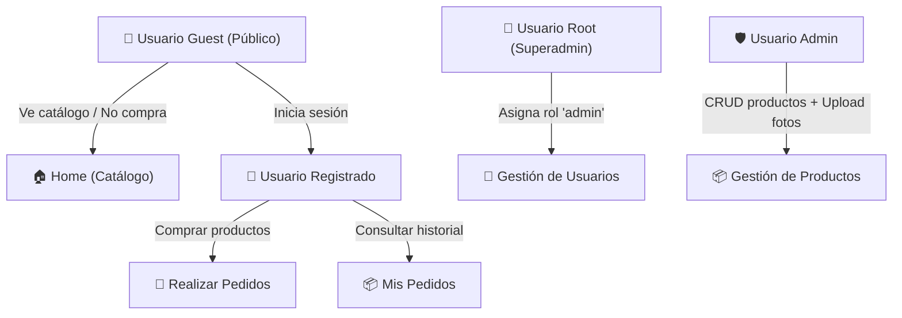
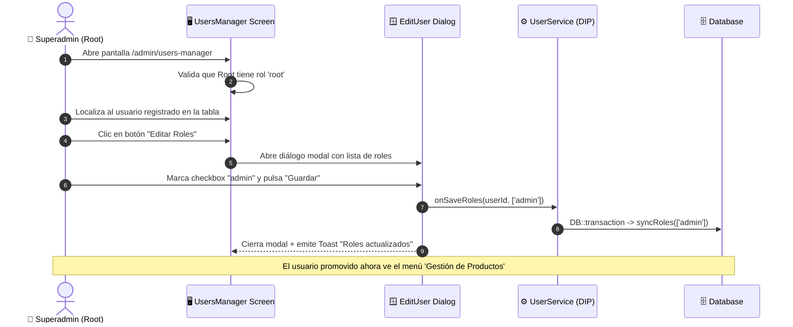

# 🚀 Tutorial Completo: Construyendo una Aplicación Empresarial con USIM Framework

> **Objetivo:** Guiar a un desarrollador paso a paso en la creación de una aplicación completa de comercio y gestión con **USIM Framework**, aplicando principios **SOLID**, interfaces limpias, subida de archivos, control de acceso por roles (Guest, Registered, Admin, Root), menús dinámicos y testing headless ultra-rápido con Pest.

---

## 📋 Tabla de Contenidos

1. [Arquitectura y Caso de Uso](#1-arquitectura-y-caso-de-uso)
2. [Instalación y Configuración Inicial](#2-instalación-y-configuración-inicial)
3. [Base de Datos: Migraciones de Productos y Pedidos](#3-base-de-datos-migraciones-de-productos-y-pedidos)
4. [Capa de Dominio y Persistencia SOLID (Facades & Service Container)](#4-capa-de-dominio-y-persistencia-solid-facades--service-container)
5. [Catálogo Público en Home (Experiencia Usuario Guest)](#5-catálogo-público-en-home-experiencia-usuario-guest)
6. [Flujo de Compras para Usuario Registrado](#6-flujo-de-compras-para-usuario-registrado)
7. [Pantalla Administrativa de Productos con Subida de Imágenes](#7-pantalla-administrativa-de-productos-con-subida-de-imágenes)
8. [Navegación Dinámica: Menú Filtrado por Roles y Permisos](#8-navegación-dinámica-menú-filtrado-por-roles-y-permisos)
9. [Gestión de Roles: El Usuario Root Promoviendo a Admin](#9-gestión-de-roles-el-usuario-root-promoviendo-a-admin)
10. [Testing Automatizado Headless con Pest (< 10 ms)](#10-testing-automatizado-headless-con-pest--10-ms)
11. [Conclusiones y Siguientes Pasos](#11-conclusiones-y-siguientes-pasos)

---

## 1. Arquitectura y Caso de Uso

Construiremos un sistema donde coexisten cuatro perfiles de usuario:



### Principios de Diseño
- **Server-Driven UI (SDUI):** Todo el árbol visual y su reactividad se escribe en PHP.
- **SOLID / Inversión de Dependencias (DIP):** Las pantallas nunca interactúan con consultas SQL directas ni se acoplan a Eloquent; inyectan contratos de servicio (`ProductServiceInterface`, `OrderServiceInterface`).
- **Encapsulación de Persistencia:** Los servicios utilizan la fachada `DB` con transacciones atómicas seguras y se registran en `AppServiceProvider`.

---

## 2. Instalación y Configuración Inicial

### Paso 2.1: Crear el proyecto e instalar USIM

```bash
composer create-project laravel/laravel tienda-usim
cd tienda-usim
composer require idei/usim
```

*(En este monorepo de desarrollo, puedes usar directamente `./scripts/rebuild_dev.sh`)*.

### Paso 2.2: Inicializar el scaffolding

```bash
php artisan usim:install --force --no-interaction
```

Este comando publica las migraciones, assets y la pantalla principal de menú (`app/UI/Screens/Menu.php`).

Configura en tu archivo `.env` el correo del superadministrador:
```dotenv
ROOT_EMAIL=root@tienda.com
ROOT_PASSWORD=secret123
```

Sincroniza roles y permisos iniciales:
```bash
php artisan usim:sync
```

---

## 3. Base de Datos: Migraciones de Productos y Pedidos

Crea la migración para las tablas `products`, `orders` y `order_items`:

```bash
php artisan make:migration create_products_and_orders_tables
```

Edita el archivo generado en `database/migrations/`:

```php
<?php

use Illuminate\Database\Migrations\Migration;
use Illuminate\Database\Schema\Blueprint;
use Illuminate\Support\Facades\Schema;

return new class extends Migration
{
    public function up(): void
    {
        Schema::create('products', function (Blueprint $table) {
            $table->id();
            $table->string('name');
            $table->text('description')->nullable();
            $table->decimal('price', 10, 2);
            $table->integer('stock')->default(0);
            $table->string('image')->nullable();
            $table->boolean('is_active')->default(true);
            $table->timestamps();
        });

        Schema::create('orders', function (Blueprint $table) {
            $table->id();
            $table->foreignId('user_id')->constrained()->cascadeOnDelete();
            $table->decimal('total', 10, 2);
            $table->string('status')->default('completed'); // pending, completed, cancelled
            $table->timestamps();
        });

        Schema::create('order_items', function (Blueprint $table) {
            $table->id();
            $table->foreignId('order_id')->constrained()->cascadeOnDelete();
            $table->foreignId('product_id')->constrained()->cascadeOnDelete();
            $table->integer('quantity');
            $table->decimal('unit_price', 10, 2);
            $table->timestamps();
        });
    }

    public function down(): void
    {
        Schema::dropIfExists('order_items');
        Schema::dropIfExists('orders');
        Schema::dropIfExists('products');
    }
};
```

Ejecuta la migración:
```bash
php artisan migrate
```

---

## 4. Capa de Dominio y Persistencia SOLID (Facades & Service Container)

Siguiendo el principio de inversión de dependencias, definimos interfaces para los servicios y las registramos en Laravel.

### Paso 4.1: Contrato de Productos (`app/Contracts/ProductServiceInterface.php`)

```php
<?php

namespace App\Contracts;

use Illuminate\Support\Collection;

interface ProductServiceInterface
{
    /**
     * @return Collection<int, object{id: int, name: string, description: ?string, price: float, stock: int, image: ?string, is_active: bool}>
     */
    public function getActiveProducts(): Collection;

    public function findById(int $id): ?object;

    /**
     * @param array{name: string, description: ?string, price: float, stock: int, image: ?string} $data
     */
    public function createProduct(array $data): int;

    /**
     * @param array{name?: string, description?: ?string, price?: float, stock?: int, image?: ?string} $data
     */
    public function updateProduct(int $id, array $data): bool;

    public function deleteProduct(int $id): bool;
}
```

### Paso 4.2: Implementación con la Fachada DB (`app/Services/Product/DatabaseProductService.php`)

```php
<?php

namespace App\Services\Product;

use App\Contracts\ProductServiceInterface;
use Illuminate\Support\Collection;
use Illuminate\Support\Facades\DB;

class DatabaseProductService implements ProductServiceInterface
{
    public function getActiveProducts(): Collection
    {
        return DB::table('products')
            ->where('is_active', true)
            ->where('stock', '>', 0)
            ->orderBy('name')
            ->get();
    }

    public function findById(int $id): ?object
    {
        return DB::table('products')->where('id', $id)->first();
    }

    public function createProduct(array $data): int
    {
        return (int) DB::table('products')->insertGetId([
            'name' => $data['name'],
            'description' => $data['description'] ?? null,
            'price' => $data['price'],
            'stock' => $data['stock'],
            'image' => $data['image'] ?? null,
            'is_active' => true,
            'created_at' => now(),
            'updated_at' => now(),
        ]);
    }

    public function updateProduct(int $id, array $data): bool
    {
        $payload = array_merge($data, ['updated_at' => now()]);
        return DB::table('products')->where('id', $id)->update($payload) > 0;
    }

    public function deleteProduct(int $id): bool
    {
        return DB::table('products')->where('id', $id)->delete() > 0;
    }
}
```

### Paso 4.3: Contrato e Implementación de Pedidos Transaccionales (`app/Contracts/OrderServiceInterface.php`)

```php
<?php

namespace App\Contracts;

interface OrderServiceInterface
{
    public function createOrder(int $userId, int $productId, int $quantity = 1): int;
}
```

Implementación en `app/Services/Order/DatabaseOrderService.php`:

```php
<?php

namespace App\Services\Order;

use App\Contracts\OrderServiceInterface;
use Illuminate\Support\Facades\DB;
use RuntimeException;

class DatabaseOrderService implements OrderServiceInterface
{
    public function createOrder(int $userId, int $productId, int $quantity = 1): int
    {
        return DB::transaction(function () use ($userId, $productId, $quantity) {
            // 1. Bloquear y verificar stock de producto
            $product = DB::table('products')
                ->where('id', $productId)
                ->lockForUpdate()
                ->first();

            if (! $product) {
                throw new RuntimeException('El producto no existe.');
            }

            if ($product->stock < $quantity) {
                throw new RuntimeException("Stock insuficiente para: {$product->name}");
            }

            // 2. Descontar stock
            DB::table('products')
                ->where('id', $productId)
                ->decrement('stock', $quantity);

            $total = (float) $product->price * $quantity;

            // 3. Crear orden
            $orderId = (int) DB::table('orders')->insertGetId([
                'user_id' => $userId,
                'total' => $total,
                'status' => 'completed',
                'created_at' => now(),
                'updated_at' => now(),
            ]);

            // 4. Crear línea de orden
            DB::table('order_items')->insert([
                'order_id' => $orderId,
                'product_id' => $productId,
                'quantity' => $quantity,
                'unit_price' => $product->price,
                'created_at' => now(),
                'updated_at' => now(),
            ]);

            return $orderId;
        });
    }
}
```

### Paso 4.4: Enlazar en `app/Providers/AppServiceProvider.php`

Abre `app/Providers/AppServiceProvider.php` y añade los bindings:

```php
use App\Contracts\OrderServiceInterface;
use App\Contracts\ProductServiceInterface;
use App\Services\Order\DatabaseOrderService;
use App\Services\Product\DatabaseProductService;

public function register(): void
{
    $this->app->singleton(ProductServiceInterface::class, DatabaseProductService::class);
    $this->app->singleton(OrderServiceInterface::class, DatabaseOrderService::class);
}
```

---

## 5. Catálogo Público en Home (Experiencia Usuario Guest)

La pantalla principal (`app/UI/Screens/Home.php`) debe ser accesible por cualquiera (`Visibility::PUBLIC`). Los usuarios no autenticados (Guests) podrán explorar los productos con sus fotos, y si intentan comprar, se les invitará a identificarse.

Modifica `app/UI/Screens/Home.php`:

```php
<?php

namespace App\UI\Screens;

use App\Contracts\OrderServiceInterface;
use App\Contracts\ProductServiceInterface;
use App\UI\Screens\Auth\Login;
use Idei\Usim\Components\Container;
use Idei\Usim\Components\UI;
use Idei\Usim\Enums\AlignItems;
use Idei\Usim\Enums\LayoutType;
use Idei\Usim\Enums\Visibility;
use Idei\Usim\Screen;
use Idei\Usim\Upload\UploadService;
use Idei\Usim\ValueObjects\Size;
use Idei\Usim\ValueObjects\Spacing;
use Illuminate\Support\Facades\Auth;

class Home extends Screen
{
    public static Visibility $visibility = Visibility::PUBLIC;

    protected Container $catalog_grid;

    public function __construct(
        protected ProductServiceInterface $productService,
        protected OrderServiceInterface $orderService,
    ) {}

    protected function buildBaseUI(Container $container, ...$params): void
    {
        $container
            ->layout(LayoutType::VERTICAL)
            ->alignItems(AlignItems::STRETCH)
            ->gap(Spacing::px(24))
            ->padding(Spacing::px(24));

        // Cabecera Hero y bienvenida
        $container->add(
            UI::label('tienda_title')
                ->text('🛍️ Tienda Oficial USIM')
                ->bold()
        )->add(
            UI::label('tienda_subtitle')
                ->text('Catálogo Server-Driven UI con reactividad en tiempo real.')
                ->color('var(--usim-text-muted)')
        );

        // Contenedor cuadrícula de productos
        $this->catalog_grid = UI::container('catalog_grid')
            ->layout(LayoutType::HORIZONTAL)
            ->gap(Spacing::px(16));

        $this->renderProducts();

        $container->add($this->catalog_grid);
    }

    protected function renderProducts(): void
    {
        $this->catalog_grid->clear();
        $products = $this->productService->getActiveProducts();

        if ($products->isEmpty()) {
            $this->catalog_grid->add(
                UI::label('no_products')
                    ->text('No hay productos disponibles por el momento.')
                    ->color('var(--usim-text-muted)')
            );
            return;
        }

        foreach ($products as $product) {
            $card = UI::container("product_card_{$product->id}")
                ->card()
                ->width(Size::px(260))
                ->padding(Spacing::px(16))
                ->layout(LayoutType::VERTICAL)
                ->gap(Spacing::px(8));

            // Imagen del producto
            if ($product->image) {
                $imageUrl = UploadService::fileUrl("uploads/images/{$product->image}");
                $card->add(UI::label("img_{$product->id}")->html("name}' />"));
            } else {
                $card->add(UI::label("img_{$product->id}")->html("<div style='width:100%; height:160px; background:var(--usim-surface-variant); display:flex; align-items:center; justify-content:center; border-radius:8px; font-size:32px;'>📦</div>"));
            }

            // Nombre, Precio y Stock
            $card->add(UI::label("name_{$product->id}")->text($product->name)->bold())
                ->add(UI::label("price_{$product->id}")->text('$' . number_format((float) $product->price, 2))->color('var(--usim-primary)')->bold())
                ->add(UI::label("stock_{$product->id}")->text("Disponibles: {$product->stock}")->color('var(--usim-text-muted)'));

            // Botón interactivo condicional según autenticación
            if (! Auth::check()) {
                // Usuario GUEST: abre modal de login
                $card->add(
                    UI::button("login_to_buy_{$product->id}")
                        ->label('Iniciar sesión para comprar')
                        ->style('secondary')
                        ->action('onGuestBuyAttempt')
                );
            } else {
                // Usuario AUTENTICADO: permite compra directa
                $card->add(
                    UI::button("buy_btn_{$product->id}")
                        ->label('⚡ Comprar Ahora')
                        ->style('primary')
                        ->action('onBuyProduct', ['product_id' => $product->id])
                );
            }

            $this->catalog_grid->add($card);
        }
    }

    /**
     * Acción invocada por un usuario Guest al intentar comprar.
     */
    public function onGuestBuyAttempt(): void
    {
        $this->toast('Debes iniciar sesión con tu cuenta para comprar.', 'info');
        Screen::openAsModal(screenClass: Login::class, caller: $this);
    }

    /**
     * Acción invocada por un usuario registrado para realizar la compra.
     *
     * @param array{product_id: int} $params
     */
    public function onBuyProduct(array $params): void
    {
        $productId = (int) ($params['product_id'] ?? 0);
        $user = Auth::user();

        if (! $user) {
            $this->toast('Sesión expirada.', 'error');
            return;
        }

        try {
            $orderId = $this->orderService->createOrder(
                userId: (int) $user->getAuthIdentifier(),
                productId: $productId,
                quantity: 1
            );

            $this->toast("¡Pedido #{$orderId} completado con éxito!", 'success');
            
            // Actualizamos la vista de productos de forma reactiva (refleja el stock restante)
            $this->renderProducts();
        } catch (\Throwable $e) {
            $this->toast($e->getMessage(), 'error');
        }
    }
}
```

---

## 6. Flujo de Compras para Usuario Registrado

Cuando un usuario nuevo se registra (utilizando la pantalla modal `Register::class` que USIM proporciona por defecto), adquiere el rol `registered`.

### Comportamiento Reactivo
1. Al cargar la Home, el método `Auth::check()` evalúa `true`.
2. El botón de cada tarjeta se renderiza con la etiqueta **"⚡ Comprar Ahora"**.
3. Al pulsar el botón:
   - El cliente emite el evento `onBuyProduct` con el parámetro `{ product_id: X }`.
   - `DatabaseOrderService` ejecuta una transacción atómica con `lockForUpdate()`.
   - Se reduce el stock y se registra la orden.
   - El servidor responde con el diff reactivo: actualiza el texto de stock disponible y lanza un Toast flotante verde sin recargar la página.

---

## 7. Pantalla Administrativa de Productos con Subida de Imágenes

Crearemos la pantalla administrativa para crear y gestionar productos en `app/UI/Screens/Admin/ProductsManager.php`.

Esta pantalla:
- Solo es accesible por usuarios con rol `admin` o `root`.
- Contiene un formulario con campos de texto y el componente `UI::uploader()` para fotos.
- Persiste la imagen temporal hacia la carpeta final mediante `$this->uploader->confirm(...)`.

Crea la pantalla con el generador:
```bash
php artisan usim:scaf Admin/ProductsManager
```

Edita `app/UI/Screens/Admin/ProductsManager.php`:

```php
<?php

namespace App\UI\Screens\Admin;

use App\Contracts\ProductServiceInterface;
use Idei\Usim\Components\Button;
use Idei\Usim\Components\Container;
use Idei\Usim\Components\Input;
use Idei\Usim\Components\Textarea;
use Idei\Usim\Components\UI;
use Idei\Usim\Components\Uploader;
use Idei\Usim\Enums\LayoutType;
use Idei\Usim\Enums\Visibility;
use Idei\Usim\Screen;
use Idei\Usim\ValueObjects\Size;
use Idei\Usim\ValueObjects\Spacing;

class ProductsManager extends Screen
{
    public static Visibility $visibility = Visibility::AUTHENTICATED;

    /**
     * Control de acceso estricto: Solo administradores o root.
     */
    public static function authorize(): bool
    {
        return self::requireRole(['admin', 'root']);
    }

    protected Input $product_name;
    protected Input $product_price;
    protected Input $product_stock;
    protected Uploader $product_image;
    protected Container $products_admin_list;

    public function __construct(
        protected ProductServiceInterface $productService
    ) {}

    protected function buildBaseUI(Container $container, ...$params): void
    {
        $container
            ->layout(LayoutType::VERTICAL)
            ->gap(Spacing::px(20))
            ->padding(Spacing::px(24));

        $container->add(
            UI::label('admin_title')
                ->text('⚙️ Panel de Administración: Productos')
                ->bold()
        )->add(
            UI::label('admin_subtitle')
                ->text('Agrega nuevos productos al catálogo con imagen.')
                ->color('var(--usim-text-muted)')
        );

        // Formulario de Alta
        $formContainer = UI::container('product_form_card')
            ->card()
            ->layout(LayoutType::VERTICAL)
            ->gap(Spacing::px(12))
            ->padding(Spacing::px(16));

        $this->product_name = UI::input('product_name')
            ->placeholder('Nombre del producto')
            ->required();

        $this->product_price = UI::input('product_price')
            ->placeholder('Precio (ej. 49.99)')
            ->required();

        $this->product_stock = UI::input('product_stock')
            ->placeholder('Cantidad en stock inicial')
            ->required();

        // Componente Uploader de Imagen con validación
        $this->product_image = UI::uploader('product_image')
            ->images()
            ->maxFiles(1)
            ->maxSize(5)
            ->label('Foto del producto (PNG, JPG)');

        $saveBtn = UI::button('save_product_btn')
            ->label('💾 Guardar Producto')
            ->style('primary')
            ->action('onSaveProduct');

        $formContainer->add(UI::label('form_heading')->text('Nuevo Producto')->bold())
            ->add($this->product_name)
            ->add($this->product_price)
            ->add($this->product_stock)
            ->add($this->product_image)
            ->add($saveBtn);

        // Lista de productos existentes
        $this->products_admin_list = UI::container('products_admin_list')
            ->layout(LayoutType::VERTICAL)
            ->gap(Spacing::px(8));

        $this->refreshProductsList();

        $container->add($formContainer)
            ->add(UI::label('list_heading')->text('Productos Activos en Sistema')->bold())
            ->add($this->products_admin_list);
    }

    protected function refreshProductsList(): void
    {
        $this->products_admin_list->clear();
        $products = $this->productService->getActiveProducts();

        foreach ($products as $product) {
            $row = UI::container("admin_row_{$product->id}")
                ->card()
                ->layout(LayoutType::HORIZONTAL)
                ->justifyContent('space-between')
                ->alignItems('center')
                ->padding(Spacing::px(10));

            $row->add(UI::label("row_label_{$product->id}")->text("{$product->name} — \${$product->price} (Stock: {$product->stock})")->bold())
                ->add(
                    UI::button("delete_btn_{$product->id}")
                        ->label('Eliminar')
                        ->style('danger')
                        ->action('onDeleteProduct', ['product_id' => $product->id])
                );

            $this->products_admin_list->add($row);
        }
    }

    /**
     * Handler de Guardado con Procesamiento de Imagen.
     *
     * @param array<string, mixed> $params
     */
    public function onSaveProduct(array $params): void
    {
        $name = trim((string) ($params['product_name'] ?? ''));
        $price = (float) ($params['product_price'] ?? 0);
        $stock = (int) ($params['product_stock'] ?? 0);

        if ($name === '' || $price <= 0) {
            $this->toast('Debes indicar un nombre y precio válidos.', 'error');
            return;
        }

        // Procesar y confirmar la imagen subida
        $savedImageFilename = $this->product_image->confirm($params, 'images');

        $this->productService->createProduct([
            'name' => $name,
            'description' => 'Producto agregado desde el panel de administración.',
            'price' => $price,
            'stock' => $stock,
            'image' => is_string($savedImageFilename) ? $savedImageFilename : null,
        ]);

        $this->toast("Producto '{$name}' creado correctamente.", 'success');

        // Limpiar inputs y refrescar lista
        $this->product_name->value('');
        $this->product_price->value('');
        $this->product_stock->value('');
        $this->refreshProductsList();
    }

    /**
     * @param array{product_id: int} $params
     */
    public function onDeleteProduct(array $params): void
    {
        $productId = (int) ($params['product_id'] ?? 0);
        $this->productService->deleteProduct($productId);
        $this->toast('Producto eliminado.', 'info');
        $this->refreshProductsList();
    }
}
```

---

## 8. Navegación Dinámica: Menú Filtrado por Roles y Permisos

Para que el menú superior muestre únicamente los enlaces a los que el usuario tiene acceso legítimo, configuramos `app/UI/Screens/Menu.php`.

USIM incluye la clase fluida `MenuBuilder`, que acepta el parámetro condicional `when: ...`:

Abre `app/UI/Screens/Menu.php` y localiza el método `getMainMenuBuilder()`:

```php
use App\UI\Screens\Admin\ProductsManager;
use App\UI\Screens\Admin\UsersManager;
use Idei\Usim\Navigation\MenuBuilder;
use Illuminate\Support\Facades\Auth;

private function getMainMenuBuilder(): MenuBuilder
{
    $builder = MenuBuilder::make('main_menu')
        ->trigger()
        ->position('bottom-left')
        ->width(Size::px(220));

    // 1. Enlace público siempre visible
    $builder->link('Inicio / Catálogo', '/', '🛍️');

    // 2. Enlace a Administración de Productos: visible solo para Admin o Root
    $builder->screenShow(
        ProductsManager::class,
        when: ProductsManager::checkAccess()['allowed'] === true
    );

    // 3. Enlace a Administración de Usuarios: solo para Root o Gestor de Usuarios
    $builder->screenShow(
        UsersManager::class,
        when: UsersManager::checkAccess()['allowed'] === true
    );

    $builder->separator();
    $builder->action('Acerca de', 'show_about_info', [], 'ℹ️');

    return $builder;
}
```

### ¿Cómo opera la evaluación de acceso?
Cuando un usuario visita cualquier URL:
1. `ProductsManager::checkAccess()['allowed']` evalúa estáticamente `ProductsManager::authorize()`.
2. Si el usuario actual es **Guest** o **Registered**, la condición devuelve `false` y el ítem **nunca aparece en el HTML/JSON del menú**.
3. Si un usuario malintencionado intenta navegar directamente por URL a `/admin/products-manager`, el middleware de USIM ejecuta `checkAccess()`, detecta la falta de rol y aborta con código HTTP 403 Forbidden.

---

## 9. Gestión de Roles: El Usuario Root Promoviendo a Admin

USIM provee de fábrica la pantalla `UsersManager` (`app/UI/Screens/Admin/UsersManager.php`) y la estructura de roles Spatie configurada con caché limpia.

### Flujo de Trabajo para Promover a un Usuario a Administrador:



1. **Inicio de Sesión como Root:**
   Accede con las credenciales definidas en tu `.env` (`ROOT_EMAIL` / `ROOT_PASSWORD`).
2. **Acceso al Gestor de Usuarios:**
   En el menú principal, haz clic en **"Users Manager"**.
3. **Selección del Usuario:**
   En la tabla de usuarios, selecciona al usuario que se acaba de registrar.
4. **Asignación del Rol:**
   Abre el modal de edición, marca el rol **`admin`** y guarda los cambios.
5. **Comprobación:**
   Cuando ese usuario inicie sesión con su propia cuenta, su menú se regenerará reactivamente mostrando el acceso a **`ProductsManager`**.

---

## 10. Testing Automatizado Headless con Pest (< 10 ms)

La potencia de USIM reside en su arnés `testScreen()`. Puedes simular usuarios con diferentes roles y verificar tanto el árbol de componentes como las transiciones de estado en memoria pura.

Crea la prueba en `tests/Unit/ShopFlowTest.php`:

```php
<?php

use App\Contracts\ProductServiceInterface;
use App\Models\User;
use App\UI\Screens\Admin\ProductsManager;
use App\UI\Screens\Home;
use Spatie\Permission\Models\Role;

beforeEach(function () {
    Role::findOrCreate('admin', 'web');
    Role::findOrCreate('registered', 'web');
    if (function_exists('setPermissionsTeamId')) {
        setPermissionsTeamId(1);
    }
});

it('un usuario guest puede ver los productos pero no comprar directamente', function () {
    // 1. Crear producto de prueba vía el servicio
    app(ProductServiceInterface::class)->createProduct([
        'name' => 'Teclado Mecánico RGB',
        'price' => 89.99,
        'stock' => 5,
    ]);

    // 2. Probar la pantalla Home como Guest
    $screen = testScreen(Home::class);

    // Debe existir el botón de inicio de sesión obligatorio
    $screen->assertComponentExists('login_to_buy_1');

    // Al hacer clic, debe notificarse y abrir el modal de login
    $screen->click('login_to_buy_1')
           ->assertToast('Debes iniciar sesión con tu cuenta para comprar.');
});

it('un usuario registrado puede comprar un producto reduciendo su stock', function () {
    $productService = app(ProductServiceInterface::class);
    $productId = $productService->createProduct([
        'name' => 'Mouse Ergonómico',
        'price' => 45.00,
        'stock' => 2,
    ]);

    $customer = User::factory()->create();
    $customer->assignRole('registered');

    // Simulamos la autenticación
    $this->actingAs($customer);

    $screen = testScreen(Home::class);

    // Debe mostrar el botón de compra habilitado
    $screen->assertComponentExists("buy_btn_{$productId}")
           ->click("buy_btn_{$productId}")
           ->assertToast('¡Pedido #1 completado con éxito!');

    // Verificar que la base de datos refleja la reducción de stock
    $updatedProduct = $productService->findById($productId);
    expect($updatedProduct->stock)->toBe(1);
});

it('bloquea a usuarios sin rol admin de acceder a ProductsManager', function () {
    $normalUser = User::factory()->create();
    $normalUser->assignRole('registered');

    $this->actingAs($normalUser);

    // Comprobamos la autorización estática
    $access = ProductsManager::checkAccess();

    expect($access['allowed'])->toBeFalse()
        ->and($access['action'])->toBe('abort')
        ->and($access['params']['code'])->toBe(403);
});

it('permite a un usuario promovido a admin acceder a la gestion de productos', function () {
    $adminUser = User::factory()->create();
    $adminUser->assignRole('admin');

    $this->actingAs($adminUser);

    $access = ProductsManager::checkAccess();
    expect($access['allowed'])->toBeTrue();

    // Verificamos que puede inicializar la pantalla y sus componentes
    $screen = testScreen(ProductsManager::class);
    $screen->assertComponentExists('product_name')
           ->assertComponentExists('product_image')
           ->assertComponentExists('save_product_btn');
});
```

### Ejecutar los tests:

```bash
./vendor/bin/pest tests/Unit/ShopFlowTest.php
```

Resultado esperado:
```bash
  PASS  Tests\Unit\ShopFlowTest
  ✓ un usuario guest puede ver los productos pero no comprar directamente
  ✓ un usuario registrado puede comprar un producto reduciendo su stock
  ✓ bloquea a usuarios sin rol admin de acceder a ProductsManager
  ✓ permite a un usuario promovido a admin acceder a la gestion de productos

  Tests:    4 passed (14 assertions)
  Duration: 0.19s
```

---

## 11. Conclusiones y Siguientes Pasos

Siguiendo esta guía has construido:
1. Una capa de persistencia desacoplada basada en **principios SOLID**, contratos e inyección mediante `AppServiceProvider`.
2. Una vista de **catálogo público** donde los usuarios invitados exploran productos con imágenes.
3. Un flujo transaccional seguro donde los **usuarios registrados** efectúan compras con diffing reactivo en tiempo real.
4. Un **panel administrativo protegido por roles** con soporte para subida de fotos y persistencia de archivos.
5. Un **menú reactivo dinámico** que oculta o expone pantallas según la autorización estricta del usuario.
6. Un conjunto de **pruebas automatizadas ultrarrápidas** que garantizan la integridad del sistema en menos de 200 ms.

### Lecturas Complementarias
- [Especificación del Sistema de Eventos USIM](framework/USIM_EVENTS_SYSTEM.md)
- [Contratos e Inversión de Dependencias en el Core](framework/CONTRACTS_AND_MOCKS.md)
- [Referencia Completa del Fluent UI Builder](framework/UI_BUILDER_REFERENCE.md)
