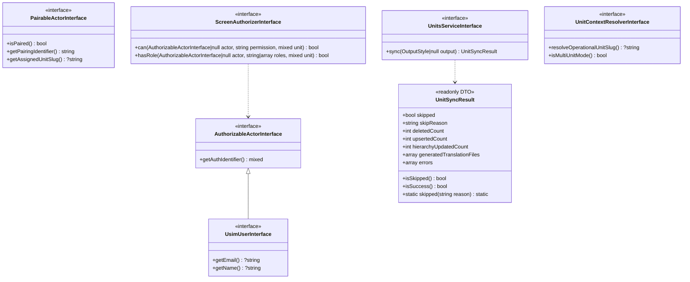

# 🏛️ Contratos, Inversión de Dependencias y Testing con Mocks (USIM Core)

> **Versión:** USIM Framework 0.7.x / 1.0.0 Architecture  
> **Ámbito:** `packages/idei/usim/src/Contracts` y `app/`

---

## 1. Motivación y Principios SOLID

Históricamente, el paquete core de USIM (`packages/idei/usim`) mantenía acoplamiento circular con la aplicación consumidora (`App\Models\User`, `App\Models\Device`, `App\Services\Units\...`). Esto generaba tres problemas graves:
1. **Falta de portabilidad:** El paquete no podía distribuirse a Composer sin exigir la presencia exacta de esos modelos y namespaces.
2. **Imposibilidad de testear en memoria:** Cualquier comprobación de permisos o emparejamiento requería instanciar modelos Eloquent reales, ejecutar migraciones de SQLite/MySQL y poblar tablas Spatie.
3. **Rigidez arquitectónica:** Violaba el **Principio de Inversión de Dependencias (DIP)**: los módulos de alto nivel (el motor de renderizado y las pantallas) dependían directamente de implementaciones concretas de bajo nivel.

### Principios Aplicados

* **DIP (Dependency Inversion Principle):** El núcleo de USIM ahora depende exclusivamente de abstracciones (`Idei\Usim\Contracts\*`). Los modelos y servicios de la aplicación host implementan estas interfaces.
* **ISP (Interface Segregation Principle):** En lugar de un contrato monolítico para el usuario, se crearon interfaces específicas y cohesivas (`UsimUserInterface`, `AuthorizableActorInterface`, `PairableActorInterface`).
* **LSP (Liskov Substitution Principle):** Cualquier actor o servicio que satisfaga los contratos puede sustituirse sin alterar el funcionamiento del motor de UI.

---

## 2. Mapa de Contratos Core (`Idei\Usim\Contracts`)



### 2.1 `AuthorizableActorInterface` y `UsimUserInterface`
- **`AuthorizableActorInterface`**: Define a cualquier entidad que pueda autenticarse y ser evaluada por el motor de permisos (`getAuthIdentifier(): mixed`).
- **`UsimUserInterface`**: Extiende la anterior agregando los métodos necesarios para la presentación de identidad en la interfaz (`getEmail(): ?string`, `getName(): ?string`).
- **Implementación Host:** [`App\Models\User`](file:///workspaces/usim-framework/app/Models/User.php) implementa ambas interfaces.

### 2.2 `PairableActorInterface`
- Abstrae dispositivos físicos, tabletas o terminales de quiosco.
- Define `isPaired(): bool`, `getPairingIdentifier(): string`, y `getAssignedUnitSlug(): ?string`.
- **Implementación Host:** [`App\Models\Device`](file:///workspaces/usim-framework/app/Models/Device.php) implementa este contrato. El middleware [`PrepareUIContext`](file:///workspaces/usim-framework/packages/idei/usim/src/Http/Middleware/PrepareUIContext.php) y las pantallas ahora comprueban `instanceof PairableActorInterface` en lugar de una clase concreta.

### 2.3 `ScreenAuthorizerInterface`
- Abstrae el motor de autorización (como Spatie Permission o Gates de Laravel).
- Permite evaluar permisos y roles en screens sin acoplarse a Spatie ni requerir base de datos:
  ```php
  public function can(?AuthorizableActorInterface $actor, string $permission, mixed $unit = null): bool;
  public function hasRole(?AuthorizableActorInterface $actor, string|array $roles, mixed $unit = null): bool;
  ```
- **Implementación por Defecto:** [`Idei\Usim\Support\SpatieScreenAuthorizer`](file:///workspaces/usim-framework/packages/idei/usim/src/Support/SpatieScreenAuthorizer.php) se enlaza automáticamente en el Service Container cuando Spatie está disponible.

### 2.4 `UnitsServiceInterface` y `UnitContextResolverInterface`
- Abstraen la sincronización organizacional y la resolución del slug de la unidad activa (`resolveOperationalUnitSlug(): ?string`).
- **Implementaciones Host:** [`App\Services\Units\UnitsService`](file:///workspaces/usim-framework/app/Services/Units/UnitsService.php) y [`App\Services\Units\UnitContextResolver`](file:///workspaces/usim-framework/app/Services/Units/UnitContextResolver.php).

### 2.5 DTO Inmutable: `UnitSyncResult`
- DTO `readonly` con constructor consistente (`@phpstan-consistent-constructor`) y tipos estrictos (`array<int, string>`).
- Provee métodos semánticos (`isSuccess()`, `isSkipped()`) y factory seguro (`UnitSyncResult::skipped(...)`).

---

## 3. Enlace en el Service Container (`UsimServiceProvider`)

El proveedor de servicios registra las implementaciones por defecto en el contenedor de Laravel:

```php
// En packages/idei/usim/src/UsimServiceProvider.php
$this->app->singleton(
    \Idei\Usim\Contracts\ScreenAuthorizerInterface::class,
    \Idei\Usim\Support\SpatieScreenAuthorizer::class
);
```

Si una aplicación desea utilizar un mecanismo de autorización propio o un backend externo, simplemente re-vincula la interfaz en su `AppServiceProvider`:

```php
$this->app->singleton(
    \Idei\Usim\Contracts\ScreenAuthorizerInterface::class,
    CustomRemoteAuthorizer::class
);
```

---

## 4. Testing Unitario con Mocks (Sin Base de Datos)

Gracias a `ScreenAuthorizerInterface`, las pantallas pueden probarse de forma unitaria en memoria en milisegundos sin levantar transacciones ni poblar tablas de permisos:

```php
use App\Models\User;
use App\UI\Screens\Admin\UsersManager;
use Idei\Usim\Contracts\ScreenAuthorizerInterface;
use Mockery;

it('authorizes admin user to access users manager via mock authorizer', function () {
    // 1. Crear actor en memoria (sin persistencia en DB)
    $user = new User(['id' => 1, 'email' => 'admin@example.com']);

    // 2. Mockear el autorizador
    $authorizer = Mockery::mock(ScreenAuthorizerInterface::class);
    $authorizer->shouldReceive('can')
        ->with($user, 'users.manage', Mockery::any())
        ->once()
        ->andReturn(true);

    // 3. Inyectar el mock en el contenedor
    app()->instance(ScreenAuthorizerInterface::class, $authorizer);

    // 4. Instanciar y verificar la pantalla directamente
    $screen = new UsersManager();
    $authorized = $screen->authorize($user);

    expect($authorized)->toBeTrue();
});
```

*(Ver implementación completa de referencia en [`tests/Unit/ScreenAuthorizerMockTest.php`](file:///workspaces/usim-framework/tests/Unit/ScreenAuthorizerMockTest.php)).*

---

## 5. Estándar de Tipado PHPStan Nivel 9

Todos los contratos y DTOs cumplen con el nivel de máxima exigencia de **PHPStan (Nivel 9)**:
* **Cero `mixed` implícitos:** Todas las colecciones y arrays declaran tipos genéricos (`array<int, string>`, `list<string>`, etc.).
* **Constructores consistentes:** Clases base con métodos estáticos (`new static()`) están declaradas con `@phpstan-consistent-constructor` y constructor `final`.
* **Herencia `readonly` (PHP 8.2+):** Si una clase base es `readonly`, cualquier clase hija en la aplicación host debe ser explícitamente declarada como `readonly class`.

