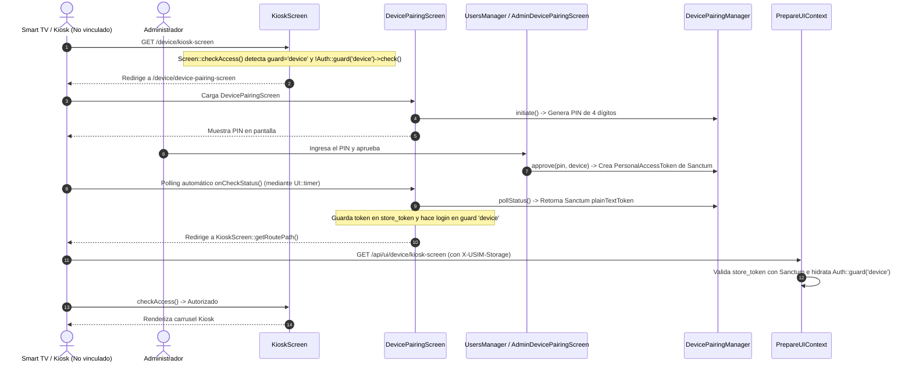

# Autenticación de Dispositivos y Modo Kiosk en USIM Framework

Este documento describe la arquitectura, el flujo de autenticación por emparejamiento (PIN Pairing), el control de acceso con Spatie Permission y el modo Kiosk sin menú en el framework USIM.

---

## 1. Arquitectura de Actores y Guards

USIM soporta múltiples tipos de actores polimórficos vinculados a unidades organizacionales (`UsimUnit`):
- **Usuarios (`App\Models\User`):** Actores interactivos humanos. Utilizan el guard `web` (basado en sesión) y la ruta de autenticación `/auth/login`.
- **Dispositivos (`App\Models\Device`):** Actores de hardware (Smart TVs, Kiosks, tablets, sensores). Utilizan el guard `device` y se autentican mediante tokens de Sanctum o emparejamiento con PIN.
- **Agentes (Futuro):** Actores sintéticos de software o automatización.

### 1.1. Inyección Dinámica de Guards (`UsimServiceProvider`)
Para evitar modificar el archivo físico `config/auth.php` del usuario, `packages/idei/usim/src/UsimServiceProvider.php` inyecta en tiempo de ejecución en el método `boot()`:

```php
config([
    'auth.providers.devices' => [
        'driver' => 'eloquent',
        'model' => config('usim.models.device', App\Models\Device::class),
    ],
    'auth.guards.device' => [
        'driver' => 'session',
        'provider' => 'devices',
    ]
]);
```

### 1.2. Configuración Tipada con `UsimConfig` (PHPStan Level 9)
Para satisfacer el análisis estático en nivel 9 de PHPStan y evitar comprobaciones manuales de tipos sobre `config('usim')`, el framework provee el servicio `Idei\Usim\Support\UsimConfig`:

```php
/** @var \Idei\Usim\Support\UsimConfig $usimConfig */
$usimConfig = app(\Idei\Usim\Support\UsimConfig::class);

// Acceso directo a propiedades y colecciones DTO fuertemente tipadas:
$usimConfig->screensNamespace;
$usimConfig->headlessMode;
$usimConfig->deviceRoles; // Filtra RoleConfig con guardName === 'device'
```

---

## 2. Flujo de Emparejamiento (Device PIN Pairing)

Los dispositivos que disponen de pantalla (Smart TV, tótem, kiosco) se autentican mediante el flujo de emparejamiento:



### 2.1. Persistencia del Token en el Frontend
En `DevicePairingScreen::onCheckStatus()`, al detectarse la aprobación:
1. Se limpia el estado transitorio del PIN (`store_session_token = ''`, `store_pin = ''`).
2. Se asigna `$this->store_token = $status;`, lo que persiste el token en el `localStorage` del cliente USIM.
3. Se inicia sesión en el guard de sesión del dispositivo: `Auth::guard('device')->login($device);`.
4. Se redirige al destino definitivo: `\App\UI\Screens\Device\KioskScreen::getRoutePath()`.

### 2.2. Hidratación Automática en `PrepareUIContext`
Si el televisor o dispositivo se reinicia o se pierde la cookie de sesión, el middleware `PrepareUIContext` recupera `store_token` desde la cabecera `X-USIM-Storage`, busca el token en `PersonalAccessToken`, y si el modelo corresponde a `Device`, lo hidrata automáticamente en `Auth::guard('device')->setUser($device);`.

---

## 3. Modo Kiosk y Control de Menú (`$hasMenu`)

Por defecto, la vista catch-all `usim::app` incluye la barra de menú superior (`#top-menu-bar`) para usuarios regulares. Sin embargo, en pantallas de terminal o kiosco la interfaz debe ser limpia e inmersiva a pantalla completa.

### 3.1. Propiedad `$hasMenu` en `Screen`
En `packages/idei/usim/src/Screen.php`:
- `public static bool $hasMenu = true;`
- `public static function hasMenu(): bool`: retorna `false` si `$hasMenu === false` o si la pantalla se ubica en el namespace `Screens\Device\`.

En `KioskScreen.php` y `DevicePairingScreen.php`:
```php
public static ?string $guard = 'device';
public static bool $hasMenu = false;
```

### 3.2. Renderizado Condicional en `routes/web.php` y `app.blade.php`
- `routes/web.php` resuelve la clase de la pantalla mediante `UsimConfig->screensNamespace`, consulta `$screenClass::hasMenu()` y pasa `'hasMenu' => $hasMenu` a la vista.
- `app.blade.php` envuelve el `<header id="top-menu-bar">` en `@if($hasMenu ?? true)` y configura:
  ```javascript
  window.MENU_SERVICE = {{ ($hasMenu ?? true) ? "'menu'" : 'null' }};
  ```
  Al ser `null`, `ui-renderer.js` omite por completo la petición de red a `/api/ui/menu`.
- La etiqueta `<main id="main">` recibe la clase CSS `usim-kiosk-mode` para ocupar el 100% de la pantalla sin márgenes.

---

## 4. Integridad y Whitelisting de Roles por Actor

Para evitar asignaciones cruzadas accidentales (por ejemplo, asignar el rol `smart_tv` a un usuario humano o un rol `admin` a un dispositivo):

1. **Whitelisting en `RoleService::getRolesForActor()`:**
   En lugar de listas negras (`excludedGuards`), los formularios obtienen roles mediante el método tipado:
   ```php
   // Para usuarios (solo guard 'web'):
   $roles = $roleService->getRolesForActor(\App\Models\User::class);

   // Para dispositivos (solo guard 'device'):
   $roles = $roleService->getRolesForActor(\App\Models\Device::class);
   ```
2. **Validación Defensiva en `UserService` y `DeviceService`:**
   Al sincronizar roles en el backend (`syncRoles`), `UserService` valida que todos los roles pertenezcan a `guard_name = 'web'`, y `Device` declara `protected string $guard_name = 'device';`, garantizando que Spatie impida discrepancias de guard.

