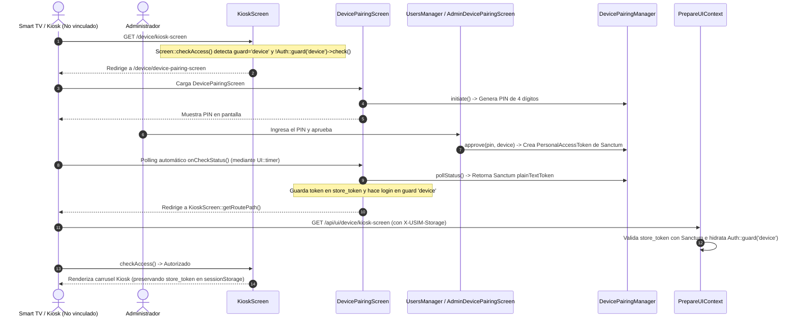

# Autenticación de Dispositivos y Modo Kiosk en USIM Framework

Este documento describe la arquitectura, el flujo de autenticación por emparejamiento (PIN Pairing), el control de acceso con Spatie Permission y el modo Kiosk sin menú en el framework USIM.

---

## 1. Arquitectura de Actores y Guards: Equivalencia Usuario-Dispositivo

USIM soporta múltiples tipos de actores polimórficos vinculados a unidades organizacionales (`UsimUnit`):
- **Usuarios (`App\Models\User`):** Actores interactivos humanos. Utilizan el guard `web` (basado en sesión) y la ruta de autenticación `/auth/login`.
- **Dispositivos (`App\Models\Device`):** Actores de hardware (Smart TVs, Kiosks, tablets, sensores). Utilizan el guard `device` y se autentican mediante tokens de Sanctum o emparejamiento con PIN.
- **Agentes (Futuro):** Actores sintéticos de software o automatización.

### 1.1. Simetría Conceptual: Pairing es Login, Unpairing es Logout
En la arquitectura de USIM, la única diferencia estructural entre un usuario humano y un dispositivo es su guard de autenticación (`web` vs `device`):
- **Pairing $\equiv$ Login:** Cuando un dispositivo es emparejado mediante PIN en la administración o vía Just-In-Time (JIT), el sistema genera un `PersonalAccessToken` de Sanctum y autentica el guard `device`.
- **Unpairing $\equiv$ Logout:** Cuando un administrador desvincula un dispositivo (`DeviceService::unpairDevice()`), se revocan sus tokens de acceso en la base de datos, invalidando la sesión de forma inmediata.
- **Contrato `Device::isPaired(): bool`:** El modelo `Device` implementa el método `isPaired()`, el cual verifica si el dispositivo posee un `device_token` o tokens válidos en la tabla `personal_access_tokens`.

### 1.2. Inyección Dinámica de Guards (`UsimServiceProvider`)
Para evitar modificar el archivo físico `config/auth.php` del usuario, `packages/idei/usim/src/UsimServiceProvider.php` inyecta en tiempo de ejecución en el método `boot()`:

```php
config([
    'auth.providers.devices' => [
        'driver' => 'eloquent',
        'model' => config('usim.models.device', App\Models\Device::class),
    ],
    'auth.guards.device' => [
        'driver' => 'session',
        'provider' => 'devices',
    ]
]);
```

### 1.3. Configuración Tipada con `UsimConfig` (PHPStan Level 9)
Para satisfacer el análisis estático en nivel 9 de PHPStan y evitar comprobaciones manuales de tipos sobre `config('usim')`, el framework provee el servicio `Idei\Usim\Support\UsimConfig`:

```php
/** @var \Idei\Usim\Support\UsimConfig $usimConfig */
$usimConfig = app(\Idei\Usim\Support\UsimConfig::class);

// Acceso directo a propiedades y colecciones DTO fuertemente tipadas:
$usimConfig->screensNamespace;
$usimConfig->headlessMode;
$usimConfig->deviceRoles; // Filtra RoleConfig con guardName === 'device'
```

---

## 2. Flujo de Emparejamiento (Device PIN Pairing) y Desemparejamiento

Los dispositivos que disponen de pantalla (Smart TV, tótem, kiosco) se autentican mediante el flujo de emparejamiento:


```mermaid
sequenceDiagram
    autonumber
    actor TV as Smart TV / Kiosk (No vinculado)
    actor Admin as Administrador
    participant Kiosk as KioskScreen
    participant Pairing as DevicePairingScreen
    participant AdminUI as UsersManager / AdminDevicePairingScreen
    participant DPM as DevicePairingManager
    participant Mid as PrepareUIContext

    TV->>Kiosk: GET /device/kiosk-screen
    Note over Kiosk: Screen::checkAccess() detecta guard='device' y !Auth::guard('device')->check()
    Kiosk-->>TV: Redirige a /device/device-pairing-screen
    TV->>Pairing: Carga DevicePairingScreen
    Pairing->>DPM: initiate() -> Genera PIN de 4 dígitos
    Pairing-->>TV: Muestra PIN en pantalla
    Admin->>AdminUI: Ingresa el PIN y aprueba
    AdminUI->>DPM: approve(pin, device) -> Crea PersonalAccessToken de Sanctum
    TV->>Pairing: Polling automático onCheckStatus() (mediante UI::timer)
    Pairing->>DPM: pollStatus() -> Retorna Sanctum plainTextToken
    Note over Pairing: Guarda token en store_token y hace login en guard 'device'
    Pairing-->>TV: Redirige a KioskScreen::getRoutePath()
    TV->>Mid: GET /api/ui/device/kiosk-screen (con X-USIM-Storage)
    Mid->>Mid: Valida store_token con Sanctum e hidrata Auth::guard('device')
    TV->>Kiosk: checkAccess() -> Autorizado
    Kiosk-->>TV: Renderiza carrusel Kiosk (preservando store_token en sessionStorage)
```

### 2.1. Persistencia de `store_token` en `KioskScreen`
Para que el frontend conserve el token de sesión en `sessionStorage` (en la clave configurada en `usim.front_store_key`) y lo envíe en cada petición mediante `X-USIM-Storage`, las pantallas de dispositivo (como `KioskScreen`) deben declarar explícitamente:
```php
protected string $store_token = '';
```
Si una pantalla no declara esta propiedad de almacenamiento (`store_*`), `Screen::getStorageVariables()` devuelve un objeto de almacenamiento vacío, sobrescribiendo el `sessionStorage` del navegador y provocando la pérdida del token en recargas o llamadas posteriores.

### 2.2. Hidratación y Validación en `PrepareUIContext`
El middleware `PrepareUIContext` recupera `store_token` desde la cabecera `X-USIM-Storage`:
1. Busca el token mediante `PersonalAccessToken::findToken($storeToken)`.
2. Si el token es de un `Device`:
   - Verifica si el dispositivo sigue emparejado mediante `$device->isPaired()`.
   - Si no está emparejado o el token fue revocado, limpia el guard `web` y `device` (marcando `loggedOut = true` en `SessionGuard`) y anula el resolvedor de usuario del request.
   - Si es válido y está emparejado, hidrata `Auth::guard('device')->setUser($actor)`.

### 2.3. Desemparejamiento Inmediato (Unpairing en Tiempo Real)
Cuando un administrador desvincula un dispositivo en el panel de control:
1. `DeviceService::unpairDevice($deviceId)` elimina todos sus `personal_access_tokens` y limpia `device_token` y `pairing_pin`.
2. En el siguiente pulso o polling del dispositivo en `KioskScreen` (por ejemplo, el evento periódico `carousel_tick` del carrusel multimedia):
   - El middleware `PrepareUIContext` no encuentra el token revocado en la base de datos y desautentica el guard `device`.
   - `KioskScreen::authorize()` evalúa `$device->isPaired()` y retorna `false`.
   - `Screen::checkAccess()` detecta que el guard `device` no está autenticado y emite inmediatamente una respuesta de redirección (`'action' => 'redirect'`) hacia `/device/device-pairing-screen`.
   - El cliente web del televisor/kiosco navega automáticamente a la pantalla de emparejamiento con PIN sin requerir recarga manual ni intervención física en el dispositivo.

---

## 3. Modo Kiosk y Control de Layout (`$layout`)

Por defecto, las pantallas regulares se enmarcan en el layout principal (`MainLayout`), el cual incluye la barra de menú superior embebida. Sin embargo, en pantallas de terminal o kiosco la interfaz debe ser limpia e inmersiva a pantalla completa sin layout.

### 3.1. Propiedad `$layout` en `Screen`
En `packages/idei/usim/src/Screen.php`:
- `public static ?string $layout = 'default';`
- `public static function hasLayout(): bool`: retorna `false` si `$layout === null` o si la pantalla se ubica en el namespace `Screens\Device\`.

En `KioskScreen.php` y `DevicePairingScreen.php`:
```php
public static ?string $guard = 'device';
public static ?string $layout = null;
```

### 3.2. Renderizado Condicional en `routes/web.php` y `app.blade.php`
- `routes/web.php` resuelve la clase de la pantalla mediante `UsimConfig->screensNamespace`, consulta `$screenClass::hasLayout()` y pasa `'hasLayout' => $hasLayout` a la vista.
- La etiqueta `<main id="main">` recibe la clase CSS `usim-kiosk-mode` cuando `$hasLayout === false` para ocupar el 100% de la pantalla sin márgenes.

---

## 4. Integridad y Whitelisting de Roles por Actor

Para evitar asignaciones cruzadas accidentales (por ejemplo, asignar el rol `smart_tv` a un usuario humano o un rol `admin` a un dispositivo):

1. **Whitelisting en `RoleService::getRolesForActor()`:**
   En lugar de listas negras (`excludedGuards`), los formularios obtienen roles mediante el método tipado:
   ```php
   // Para usuarios (solo guard 'web'):
   $roles = $roleService->getRolesForActor(\App\Models\User::class);

   // Para dispositivos (solo guard 'device'):
   $roles = $roleService->getRolesForActor(\App\Models\Device::class);
   ```
2. **Validación Defensiva en `UserService` y `DeviceService`:**
   Al sincronizar roles en el backend (`syncRoles`), `UserService` valida que todos los roles pertenezcan a `guard_name = 'web'`, y `Device` declara `protected string $guard_name = 'device';`, garantizando que Spatie impida discrepancias de guard.

