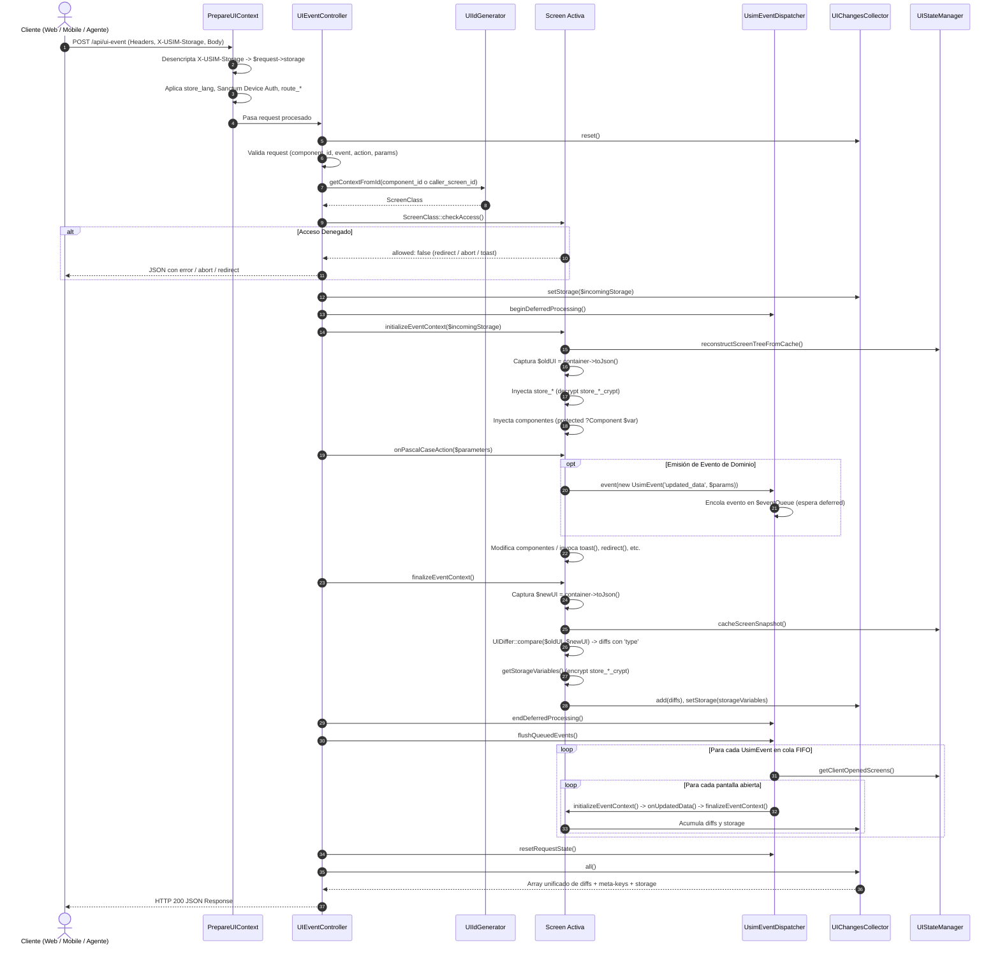

# Sistema de Eventos de USIM: Arquitectura, Protocolo y Guía de Referencia

> **Versión:** 1.2.0 — **Actualizado:** Septiembre 2026  
> **Ámbito:** Framework USIM (`packages/idei/usim`) y aplicaciones consumidoras  
> **Destinatarios:** Desarrolladores PHP/Fullstack y Modelos de Lenguaje (LLMs / Agentes Autónomos)

---

## Índice

1. [Visión General y Modelo Mental](#1-visión-general-y-modelo-mental)
2. [Los Dos Tipos de Eventos en USIM: Clarificación Fundamental](#2-los-dos-tipos-de-eventos-en-usim-clarificación-fundamental)
   - [2.1 Eventos de Interacción UI (Frontend → Backend vía POST /api/ui-event)](#21-eventos-de-interacción-ui-frontend--backend-vía-post-apiui-event)
   - [2.2 Eventos Internos de Dominio y Cross-Screen (UsimEvent → Handlers on...)](#22-eventos-internos-de-dominio-y-cross-screen-usimevent--handlers-on)
   - [2.3 Tabla Comparativa Frente a Frente](#23-tabla-comparativa-frente-a-frente)
   - [2.4 Cómo Convergen en la Clase Screen y en la Misma Petición HTTP](#24-cómo-convergen-en-la-clase-screen-y-en-la-misma-petición-http)
3. [Ciclo de Vida de Ejecución de un Evento](#3-ciclo-de-vida-de-ejecución-de-un-evento)
   - [3.1 Diagrama de Secuencia del Flujo Completo](#31-diagrama-de-secuencia-del-flujo-completo)
   - [3.2 Detalle Paso a Paso del Ciclo de Vida](#32-detalle-paso-a-paso-del-ciclo-de-vida)
4. [Especificación Formal del Protocolo HTTP (`POST /api/ui-event`)](#4-especificación-formal-del-protocolo-http-post-apiui-event)
   - [4.1 Headers HTTP Requeridos y Opcionales](#41-headers-http-requeridos-y-opcionales)
   - [4.2 Contrato del Request (JSON Body)](#42-contrato-del-request-json-body)
   - [4.3 Tipos de Eventos Soportados y Semántica](#43-tipos-de-eventos-soportados-y-semántica)
   - [4.4 Contrato de Respuesta: Diff Engine y Meta-Keys](#44-contrato-de-respuesta-diff-engine-y-meta-keys)
   - [4.5 Protocolo de Deltas (`UIDiffer`)](#45-protocolo-de-deltas-uidiffer)
   - [4.6 Códigos de Estado y Manejo de Errores](#46-códigos-de-estado-y-manejo-de-errores)
5. [Gestión de Estado Persistente (`X-USIM-Storage` y `store_*`)](#5-gestión-de-estado-persistente-x-usim-storage-y-store_)
   - [5.1 Variables de Estado `store_*`](#51-variables-de-estado-store_)
   - [5.2 Cifrado Transparente (`store_*_crypt`)](#52-cifrado-transparente-store__crypt)
   - [5.3 Transporte de Storage en el Cliente](#53-transporte-de-storage-en-el-cliente)
   - [5.4 Identificador de Cliente (`ui_client_id`)](#54-identificador-de-cliente-ui_client_id)
6. [Catálogo de Componentes y Declaración de Eventos en PHP](#6-catálogo-de-componentes-y-declaración-de-eventos-en-php)
7. [Guía Práctica para Desarrolladores](#7-guía-práctica-para-desarrolladores)
   - [7.1 Cómo escribir un Handler de Evento](#71-cómo-escribir-un-handler-de-evento)
   - [7.2 Emisión y Recepción de Eventos de Dominio (`UsimEvent`)](#72-emisión-y-recepción-de-eventos-de-dominio-usimevent)
   - [7.3 Modales y Enrutamiento con `_caller_screen_id`](#73-modales-y-enrutamiento-con-_caller_screen_id)
   - [7.4 Pruebas Automatizadas con Pest y `UiScenario`](#74-pruebas-automatizadas-con-pest-y-uiscenario)
8. [Guía de Contexto y Reglas para Modelos de Lenguaje (LLMs / Agentes)](#8-guía-de-contexto-y-reglas-para-modelos-de-lenguaje-llms--agentes)
   - [8.1 Reglas para LLM como Generador de Código](#81-reglas-para-llm-como-generador-de-código)
   - [8.2 Reglas para LLM como Cliente Autónomo / Headless Agent](#82-reglas-para-llm-como-cliente-autónomo--headless-agent)
9. [Auditoría de Documentación Histórica y Correcciones](#9-auditoría-de-documentación-histórica-y-correcciones)

---

## 1. Visión General y Modelo Mental

USIM (**UI Services Implementation Model**) es un framework de **Server-Driven UI (SDUI)** reactivo construido sobre Laravel. En USIM:

1. **La UI completa y su lógica residen en el backend.** Cada pantalla es una clase PHP que extiende `Idei\Usim\Screen`.
2. **No existen endpoints REST explícitos por cada formulario o acción.** Las pantallas se cargan inicialmente vía `GET /api/ui/{screen_path}` y todas las interacciones del usuario se canalizan a través de un único endpoint unificado: `POST /api/ui-event`.
3. **Cálculo automático de Deltas (Diffing).** El framework reconstruye el árbol de componentes desde caché, ejecuta la acción invocada, detecta los cambios mediante `UIDiffer` y retorna únicamente las mutaciones (deltas parciales), minimizando el ancho de banda y permitiendo actualizaciones quirúrgicas en el cliente.
4. **Desacoplamiento total del cliente.** El cliente (Web, Flutter, iOS SwiftUI, Android Kotlin, SmartTV o Agentes Autónomos) es un renderer agnóstico de componentes y emisor de eventos JSON.

---

## 2. Los Dos Tipos de Eventos en USIM: Clarificación Fundamental

Para comprender el flujo de control de USIM (tanto para programadores como para modelos de lenguaje), es imprescindible distinguir con total claridad **dos conceptos distintos que a menudo se denominan genéricamente "eventos"**:

```
┌────────────────────────────────────────────────────────────────────────────────────────┐
│              TIPO 1: EVENTOS DE INTERACCIÓN UI (HTTP EXTERNO A api/ui-event)           │
│                                                                                        │
│   Origen: Cliente (DOM / Mobile / AI Agent)                                            │
│   Canal:  POST /api/ui-event                                                           │
│   Payload: { component_id, event: "click", action: "submit_form", parameters }         │
│   Destino: Unicast (1 componente -> 1 Screen)                                          │
│   Resolución:                                                                          │
│       1. component_id ──► UIIdGenerator::getContextFromId() ──► ScreenClass           │
│       2. action: "submit_form" ──► actionToMethodName() ──► Screen::onSubmitForm()     │
│   Obligatoriedad: Si el método onSubmitForm() NO existe, devuelve HTTP 404 Error       │
└───────────────────────────────────────────┬────────────────────────────────────────────┘
                                            │
                                            │ Durante la ejecución de onSubmitForm(),
                                            │ el backend puede emitir eventos internos:
                                            ▼
┌────────────────────────────────────────────────────────────────────────────────────────┐
│            TIPO 2: EVENTOS INTERNOS DE DOMINIO / CROSS-SCREEN (UsimEvent)              │
│                                                                                        │
│   Origen: Servidor / Backend (PHP)                                                     │
│   Canal:  event(new \Idei\Usim\Events\UsimEvent('usuario_actualizado', $datos))        │
│   Destino: Broadcast a TODAS las pantallas abiertas del cliente (getClientOpenedScreens)│
│   Resolución:                                                                          │
│       1. UsimEventDispatcher toma 'usuario_actualizado'                                │
│       2. Transforma el nombre a método: 'onUsuarioActualizado'                         │
│       3. Recorre cada pantalla abierta y BUSCA dinámicamente si implementa el método: │
│          if (method_exists($screen, 'onUsuarioActualizado')) {                         │
│              $screen->onUsuarioActualizado($params);                                   │
│          }                                                                             │
│   Opcionalidad: Si una pantalla abierta NO tiene el método, se ignora silenciosamente  │
└────────────────────────────────────────────────────────────────────────────────────────┘
```

---

### 2.1 Eventos de Interacción UI (Frontend → Backend vía `POST /api/ui-event`)

#### ¿Qué son?
Son peticiones HTTP externas generadas por el cliente (navegador, app móvil, SmartTV o agente headless) como consecuencia directa de una acción del usuario en un componente específico.

#### Anatomía del Request:
```json
POST /api/ui-event
Headers:
  Content-Type: application/json
  X-USIM-Storage: {"store_step":1}
  Cookie: ui_client_id=d6b2c6e0-...

Body:
{
  "component_id": 10001005,
  "event": "click",
  "action": "submit_form",
  "parameters": {
    "username": "carlos",
    "email": "carlos@example.com"
  }
}
```

#### Características Fundamentales:
1. **Unicast (1 componente $\rightarrow$ 1 pantalla):**
   El `component_id` es una clave numérica única global. `UIEventController` utiliza `UIIdGenerator::getContextFromId($id)` para recuperar determinísticamente la clase `Screen` propietaria del componente.
2. **Diferencia entre el campo `event` y el campo `action`:**
   - **`event` (tipo de interacción DOM/UI):** Describe la física del evento en el cliente: `"click"`, `"input"`, `"change"`, `"action"`, `"timeout"`. El backend lo recibe para validación semántica.
   - **`action` (nombre de la acción de negocio):** Es la cadena configurada en el componente mediante la API fluida de PHP (ej. `UI::button()->action('submit_form')`).
3. **Conversión a Handler `onPascalCase`:**
   El controlador transforma **únicamente el campo `action`** a un método PHP con prefijo `on`:
   $$\text{"submit\_form"} \longrightarrow \text{onSubmitForm(array \$params)}$$
   $$\text{"delete\_item"} \longrightarrow \text{onDeleteItem(array \$params)}$$
4. **Comportamiento Estricto (Falla si no existe):**
   Si la pantalla resuelta no implementa el método correspondiente, `UIEventController` aborta la petición y responde con error HTTP **`404: Action '{action}' not implemented`**.

---

### 2.2 Eventos Internos de Dominio y Cross-Screen (`UsimEvent` $\rightarrow$ Handlers `on...`)

#### ¿Qué son?
Son eventos generados dentro del backend en código PHP (dentro del handler de una Screen, un Service, un Job de cola o un Listener de Laravel). No viajan por HTTP de forma independiente; se gestionan en memoria mediante el bus de eventos de Laravel.

#### Anatomía de la Emisión:
```php
use Idei\Usim\Events\UsimEvent;

// Emitido en PHP por cualquier capa del backend:
event(new UsimEvent('perfil_actualizado', [
    'user_id' => $user->id,
    'avatar_url' => $user->avatar_url,
]));
```

#### Características Fundamentales:
1. **Multicast / Broadcast a todas las pantallas abiertas:**
   Un evento interno no tiene `component_id`. `Idei\Usim\Listeners\UsimEventDispatcher` consulta la sesión del cliente en `UIStateManager::getClientOpenedScreens()` y distribuye el evento a **todas las pantallas que el usuario tiene abiertas concurrentemente** (por ejemplo: la pantalla principal `Profile`, la barra de navegación superior `Menu` y un panel lateral de notificaciones).
2. **Búsqueda Dinámica de Handlers `on...`:**
   Para cada pantalla abierta, el despachador calcula el nombre del handler objetivo convirtiendo el `eventName` a formato `onPascalCase`:
   $$\text{"perfil\_actualizado"} \longrightarrow \text{onPerfilActualizado(array \$params)}$$
   $$\text{"theme\_changed"} \longrightarrow \text{onThemeChanged(array \$params)}$$
   $$\text{"cart\_item\_added"} \longrightarrow \text{onCartItemAdded(array \$params)}$$
3. **Opcionalidad y Polimorfismo (No falla si no existe):**
   A diferencia de las acciones UI de `api/ui-event` (que devuelven 404 si el método falta), los eventos internos verifican dinámicamente si el método existe mediante `method_exists($screen, $methodName)`. Aquellas pantallas que implementen el handler son hidratadas y ejecutadas; las que no lo implementen son omitidas silenciosamente sin producir error.
4. **Evento Especial del Framework: `reset_screen`:**
   Existe un evento interno reservado:
   ```php
   event(new UsimEvent('reset_screen'));
   ```
   Cuando se emite, el despachador ejecuta `Screen::onResetScreen()` en cada pantalla abierta, eliminando la caché de la pantalla y forzando una reconstrucción limpia de la interfaz desde `buildBaseUI()`.

---

### 2.3 Tabla Comparativa Frente a Frente

| Criterio | 1. Eventos de Interacción UI (`api/ui-event`) | 2. Eventos Internos de Dominio (`UsimEvent`) |
|---|---|---|
| **Canal de Entrada** | HTTP `POST /api/ui-event` | Bus de eventos en memoria (`event(new UsimEvent(...))`) |
| **Quién lo Origina** | El cliente externo (DOM, Mobile, Agente AI) | El servidor PHP (Screen, Service, Job, Listener) |
| **Destinatario** | Un único componente específico (Unicast) | Todas las pantallas activas del cliente (Broadcast) |
| **Identificador del Destino** | `component_id` numérico global | Lista de IDs de pantallas abiertas en `UIStateManager` |
| **Dato que define el método** | El campo `"action"` del payload JSON | La propiedad `$eventName` de la clase `UsimEvent` |
| **Rol del campo `"event"`** | Tipo de interacción física (`click`, `input`, etc.) | No existe en `UsimEvent`; la clase misma es el evento |
| **Regla de transformación** | `action` en `snake_case` $\rightarrow$ `onPascalCase` | `eventName` en `snake_case` $\rightarrow$ `onPascalCase` |
| **¿Qué ocurre si no hay método?** | **Falla con error HTTP 404** (`Action not implemented`) | **Se ignora silenciosamente** (`method_exists === false`) |
| **Ciclo de Pantalla** | `initializeEventContext` $\rightarrow$ Handler $\rightarrow$ `finalizeEventContext` | Idéntico para cada pantalla que implemente el método |
| **Generación de Deltas** | Deltas del componente/pantalla origen | Deltas acumulados de **todas** las pantallas afectadas |
| **Ejemplo de Disparo** | `fetch('/api/ui-event', { body: JSON.stringify({...}) })` | `event(new UsimEvent('logged_user', ['user' => $user]))` |
| **Firma del Handler** | `public function onAccion(array $params): void` | `public function onEvento(array $params): void` |

---

### 2.4 Cómo Convergen en la Clase `Screen` y en la Misma Petición HTTP

Dentro de una clase `Screen`, tanto las acciones de interfaz como los eventos internos se implementan como **métodos con la convención `on...`**. La diferencia radica en **quién y bajo qué circunstancias los invoca**:

```php
namespace App\UI\Screens;

use Idei\Usim\Screen;
use Idei\Usim\Events\UsimEvent;
use Idei\Usim\Components\Container;
use Idei\Usim\Components\Button;
use Idei\Usim\Components\Label;
use Idei\Usim\UI;

class CartScreen extends Screen
{
    protected ?Label $lbl_summary = null;

    public function buildBaseUI(Container $container): void
    {
        $container->add(UI::label('lbl_summary')->text('Carrito vacío'));
        
        // El botón enlaza una ACCIÓN UI externa con nombre 'checkout'
        $container->add(
            UI::button('btn_checkout')
                ->label('Finalizar Compra')
                ->action('checkout', ['coupon' => 'DESC10'])
        );
    }

    // =========================================================================
    // 1. HANDLER DE ACCIÓN UI EXTERNA (Invocado por POST /api/ui-event)
    // El cliente envía: { "component_id": 12345, "action": "checkout", ... }
    // =========================================================================
    public function onCheckout(array $params): void
    {
        $coupon = $params['coupon'] ?? null;
        // Procesar compra...
        
        $this->toast('Compra finalizada con éxito', 'success');

        // =====================================================================
        // 2. DISPARO DE EVENTO INTERNO DE DOMINIO (Disparado en PHP)
        // Avisa a TODAS las demás pantallas abiertas (ej. Menu.php superior)
        // =====================================================================
        event(new UsimEvent('order_completed', [
            'order_id' => 9981,
            'total' => 1250.00,
        ]));
    }

    // =========================================================================
    // 3. HANDLER DE EVENTO INTERNO (Invocado por UsimEventDispatcher)
    // Se ejecuta cuando OTRA pantalla hace: event(new UsimEvent('stock_changed'))
    // =========================================================================
    public function onStockChanged(array $params): void
    {
        $newStock = $params['stock'] ?? 0;
        $this->lbl_summary?->text("Stock actualizado: {$newStock} unidades");
    }
}
```

#### Sincronización en la Misma Petición HTTP (Procesamiento Diferido):
Cuando el usuario pulsa el botón "Finalizar Compra":
1. El frontend envía un único `POST /api/ui-event` con `action: 'checkout'`.
2. `UIEventController` activa `UsimEventDispatcher::beginDeferredProcessing()`.
3. Se ejecuta `onCheckout()`. Cuando este método emite `new UsimEvent('order_completed')`, el evento **se encola en memoria sin interrumpir el handler actual**.
4. La pantalla `CartScreen` finaliza su ejecución (`finalizeEventContext()`) y calcula sus diffs.
5. `UIEventController` llama a `flushQueuedEvents()`: el despachador toma el evento `order_completed` y busca en todas las pantallas abiertas del usuario (por ejemplo, `MenuScreen`).
6. Si `MenuScreen` tiene el método `onOrderCompleted()`, se hidrata su estado, se ejecuta el método y se calculan sus deltas (por ejemplo, el contador del carrito en la barra de navegación se pone en `0`).
7. **Respuesta Unificada:** La respuesta JSON devuelta a la llamada `POST /api/ui-event` contiene los cambios de `CartScreen` **Y** los cambios de `MenuScreen` de forma atómica.


---

## 3. Ciclo de Vida de Ejecución de un Evento

### 3.1 Diagrama de Secuencia del Flujo Completo



### 3.2 Detalle Paso a Paso del Ciclo de Vida

#### 1. Despacho y Middleware (`PrepareUIContext`)
- El cliente realiza `POST /api/ui-event` enviando el payload de la interacción.
- El middleware `PrepareUIContext` intercepta la petición:
  1. Extrae el header `X-USIM-Storage` (soporta string directo o prefijo `b64:`). Si no existe en el header, busca en el campo `storage` o en la clave configurada en `usim.front_store_key`.
  2. Decodifica el JSON e inyecta el array resultante en `$request->storage`.
  3. Si existe `store_lang` en el storage, sincroniza el idioma con `app()->setLocale($store_lang)`.
  4. Si existe `store_token`, configura el header `Authorization: Bearer <token>`, hidrata `UIStateManager::setAuthToken()`, y si el token pertenece a un dispositivo (`App\Models\Device`), hidrata automáticamente el guard `Auth::guard('device')`.
  5. Resuelve el contexto de unidad organizativa (`UnitContextResolver`) a partir de `store_unit`.
  6. Inyecta query parameters con prefijo `route_` como parámetros de ruta formales.

#### 2. Recepción y Validación (`UIEventController@handleEvent`)
- Se reinicia el acumulador de cambios del ciclo actual: `$this->uiChanges->reset()`.
- Se valida la estructura estricta del request:
  - `component_id`: integer (requerido).
  - `event`: string (requerido).
  - `action`: string (requerido).
  - `parameters`: array (opcional, default `[]`).

#### 3. Resolución de Pantalla y Enrutamiento Determinista
- Si `parameters` incluye `_caller_screen_id` (o la clave legacy `_caller_service_id`), dicho ID toma precedencia. Esto permite que los diálogos modales enruten su confirmación de regreso a la pantalla que abrió el modal.
- `UIIdGenerator::getContextFromId($componentId)` realiza una búsqueda en tiempo constante (`O(1)`) mediante la fórmula:
  $$\text{offset} = \lfloor \text{id} / 10000 \rfloor \times 10000$$
  obteniendo la clase completa del `Screen`.
- Si la clase no existe o no hereda de `Screen`, se devuelve un error 404: `Screen not found for this component`.

#### 4. Verificación de Autorización (`Screen::checkAccess()`)
- Antes de instanciar la pantalla, se invoca de forma estática `checkAccess()`.
- Si `authorize()` devuelve `false`:
  - Si el usuario no está autenticado en su guard, devuelve una acción de redirección (`/auth/login` o `/device/device-pairing-screen`).
  - Si el usuario está autenticado pero no autorizado, devuelve `abort(403)`.

#### 5. Inicialización de Contexto (`initializeEventContext`)
- Reconstrucción del árbol de componentes: recupera el estado previo de la pantalla desde la caché (`UIStateManager::get`) y reconstruye el contenedor mediante `reconstructContainerFromJson()`.
- Almacena el snapshot inicial: `$this->oldUI = $this->container->toJson()`.
- **Inyección automática de Storage:** Mediante reflexión, localiza propiedades `protected` cuyo nombre empiece con `store_`. Si existen en `$incomingStorage`, inyecta su valor. Si la propiedad termina en `_crypt`, se desencripta automáticamente usando `decrypt()`.
- **Inyección automática de Componentes:** Localiza propiedades protegidas tipadas con clases de componentes (por ejemplo, `protected ?Button $btn_submit;`) y las vincula al componente cuyo nombre coincida en el contenedor.

#### 6. Activación del Modo Diferido (`beginDeferredProcessing`)
- Se llama a `UsimEventDispatcher::beginDeferredProcessing()`. Esto evita que cualquier evento de dominio emitido dentro del handler de la pantalla ejecute listeners inmediatamente, garantizando que el handler principal complete sus mutaciones antes de que se procesen eventos en cascada.

#### 7. Ejecución de la Acción del Screen
- Convención de nombres: `snake_case` se transforma automáticamente en `onPascalCase`.
  - Ejemplo: `submit_login` $\rightarrow$ `onSubmitLogin(array $parameters)`.
- Si el método no es invocable, se devuelve un error 404: `Action '{action}' not implemented`.
- Durante la ejecución, el desarrollador puede:
  - Modificar componentes (`$this->lbl_status->text('Listo')`).
  - Disparar efectos secundarios (`$this->toast(...)`, `$this->redirect(...)`, `$this->abort(...)`, etc.).
  - Emitir eventos de dominio (`event(new UsimEvent('order_placed', ['id' => 123]))`).

#### 8. Finalización de Contexto (`finalizeEventContext`)
- Serializa el nuevo árbol: `$this->newUI = $this->container->toJson()`.
- Guarda el snapshot actualizado en caché (`cacheScreenSnapshot`).
- **Cálculo de Diffs (`buildDiffResponse`):** `UIDiffer::compare($oldUI, $newUI)` genera el delta exacto. **Garantía USIM:** todo componente modificado incluye obligatoriamente la propiedad `type` del nuevo árbol para que el cliente sepa cómo interpretarlo.
- **Recolección y Cifrado de Storage (`getStorageVariables`):** Escanea propiedades `protected store_*`. Aquellas que terminan en `_crypt` se encriptan con `encrypt()`.
- Registra los deltas y el nuevo storage en `UIChangesCollector`.

#### 9. Vaciado y Ejecución de Eventos en Cola (`flushQueuedEvents`)
- Se desactiva el modo diferido: `endDeferredProcessing()`.
- `flushQueuedEvents()` procesa la cola FIFO:
  1. Extrae el `eventName` y construye el método `on<EventName>` en formato PascalCase.
  2. Obtiene los IDs raíz de las pantallas que el cliente actual tiene abiertas (`UIStateManager::getClientOpenedScreens()`).
  3. Para cada pantalla abierta:
     - Resuelve su clase e instancia la Screen.
     - Si el evento es `reset_screen`, invoca `onResetScreen()`, reinicializa y finaliza el contexto.
     - Si la Screen implementa el método `on<EventName>()`, inicializa su contexto, ejecuta el método pasando `$event->params` y finaliza su contexto.
     - Los deltas generados por cada pantalla se agregan al mismo `UIChangesCollector`.

#### 10. Reseteo y Respuesta
- En el bloque `finally`, se resetea el estado estático del dispatcher (`resetRequestState()`).
- Se genera la respuesta JSON llamando a `$this->uiChanges->all()`.

---

## 4. Especificación Formal del Protocolo HTTP (`POST /api/ui-event`)

### 4.1 Headers HTTP Requeridos y Opcionales

| Header | Tipo | Requerido | Descripción |
|---|---|---|---|
| `Content-Type` | String | **Sí** | `application/json` |
| `Accept` | String | **Sí** | `application/json` |
| `X-CSRF-TOKEN` | String | Sí (Web) | Token CSRF de Laravel. En modo API/Headless puro puede gestionarse mediante Sanctum. |
| `X-Requested-With` | String | Recomendado | `XMLHttpRequest` |
| `X-USIM-Storage` | String | **Crítico** | JSON string codificado con las variables de estado persistente devueltas en la petición anterior. |
| `Cookie` | String | **Crítico** | Debe contener la cookie `ui_client_id` para mantener la correlación de sesión y caché entre requests. |
| `Authorization` | String | Condicional | `Bearer {token}` si se interactúa con APIs autenticadas fuera del flujo de cookies web. |

### 4.2 Contrato del Request (JSON Body)

```json
{
  "component_id": 10001005,
  "event": "click",
  "action": "save_profile",
  "parameters": {
    "name": "Juan Pérez",
    "email": "juan@example.com",
    "avatar_token": "tmp_upload_87123"
  }
}
```

#### Descripción de Campos:
- **`component_id`** *(integer, requerido)*: Identificador numérico único del componente emisor. Permite al backend resolver la clase `Screen` en `O(1)`.
- **`event`** *(string, requerido)*: Tipo semántico de la interacción generada en el frontend.
- **`action`** *(string, requerido)*: Nombre de la acción en formato `snake_case`. Corresponde al método `onPascalCase` en el backend.
- **`parameters`** *(object, opcional)*: Diccionario clave-valor con datos contextuales, valores de inputs y parámetros especiales como `_caller_screen_id`.

### 4.3 Tipos de Eventos Soportados y Semántica

| Tipo de Evento (`event`) | Descripción | Componentes Típicos | Parámetros Habituales |
|---|---|---|---|
| `"click"` | Pulsación o clic sobre un elemento accionable. | `Button`, `Card`, `Label` clicable, `TableHeaderCell` | `parameters` declarados en el componente. |
| `"input"` | Entrada de texto incremental (mientras se escribe). | `Input`, `Textarea` | `{ value: string, name: string }` |
| `"change"` | Modificación definitiva de valor o estado. | `Select`, `Checkbox`, `Input`, `Textarea` | `{ value: mixed, checked: bool }` |
| `"action"` | Disparo programático o directo de una acción. | Links, filas de tabla (`TableRow`), tabs de `Container` | `{ tab_id: string, row_id: mixed }` |
| `"timeout"` | Disparo al expirar un temporizador. | `Timer`, Modales de diálogo con cuenta regresiva | `{ timeout: int, source: string }` |

### 4.4 Contrato de Respuesta: Diff Engine y Meta-Keys

La respuesta es un objeto JSON plano que combina **deltas de componentes** (cuyas claves son IDs numéricos serializados como strings) y **meta-keys reservadas** (instrucciones operativas para el cliente).

Ejemplo de respuesta:

```json
{
  "10001002": {
    "type": "label",
    "text": "Perfil guardado con éxito",
    "style": "success"
  },
  "10001005": {
    "type": "button",
    "disabled": false
  },
  "10001099": {
    "parent": null
  },
  "storage": {
    "my-app": "{\"store_theme\":\"dark\",\"store_user_id\":42,\"store_token_crypt\":\"eyJpdiI6...\"}"
  },
  "toast": {
    "message": "Cambios guardados",
    "type": "success",
    "duration": 4000,
    "position": "top-right"
  },
  "redirect": null,
  "abort": null
}
```

#### Catálogo Completo de Meta-Keys Reservadas:

| Meta-Key | Tipo | Descripción y Comportamiento del Cliente |
|---|---|---|
| `storage` | `object` | Mapa `{ [front_store_key]: serialized_json_string }`. El cliente debe guardarlo y reenviarlo en el header `X-USIM-Storage`. |
| `toast` | `object` | Notificación emergente. Atributos: `message`, `type` (`success`, `info`, `warning`, `danger`), `duration`, `position`. |
| `redirect` | `string \| null` | URL a la cual el cliente debe navegar inmediatamente (`window.location.href`). Si hay un `toast` presente, debe preservarse para mostrarlo tras la navegación. |
| `abort` | `object \| null` | Error controlado de negocio. Atributos: `status_code` y `message`. El cliente debe renderizar una vista o alerta de error. |
| `modal` | `object` | Subárbol de componentes que deben montarse en un overlay modal (`parent: 'modal'`). |
| `update_modal` | `object` | Deltas específicos que actualizan los componentes del modal abierto sin cerrar el diálogo. |
| `action` | `string` | Acción global para el renderer del cliente. Valores estándar: `'close_modal'` (cierra el modal actual) o `'show_modal'`. |
| `change_theme` | `string` | Cambia el tema visual en el cliente (ej. `'light'` o `'dark'`). Modifica el atributo `data-theme` en el DOM. |
| `change_language`| `string` | Modifica el locale activo en el cliente (ej. `'es'`, `'en'`). |
| `clear_uploaders`| `array` | Lista de IDs de componentes `Uploader` cuyos archivos seleccionados deben limpiarse tras el submit. |
| `set_uploader_existing_file` | `object` | Establece un archivo existente en un componente `Uploader`. |
| `agent_context` | `object` | Metadatos semánticos para clientes IA/Headless (propósito, inputs esperados, restricciones). |

### 4.5 Protocolo de Deltas (`UIDiffer`)

El motor `UIDiffer::compare($oldUI, $newUI)` analiza las diferencias componente por componente:

1. **Agregar Componente:**
   El componente no existía en `$oldUI`. Se envía el objeto completo con su clave `parent` definida:
   ```json
   "10001050": { "type": "label", "text": "Nuevo", "parent": 10001001 }
   ```
2. **Actualizar Componente:**
   El componente existía. Se envían únicamente las propiedades que cambiaron. **Garantía USIM:** el framework siempre incluye `'type'` para facilitar la deserialización:
   ```json
   "10001002": { "type": "label", "text": "Texto Actualizado" }
   ```
3. **Eliminar Componente:**
   El componente existía en `$oldUI` pero ya no está en `$newUI`. Se envía con `parent: null`:
   ```json
   "10001050": { "parent": null }
   ```
   *Efecto en el cliente:* el cliente elimina el elemento y todos sus descendientes del DOM/árbol de memoria.
4. **Re-adjuntar Componente:**
   Si un componente tenía `parent: null` y vuelve a asignársele un `parent`, se envía su configuración completa para que el cliente lo reconstruya desde cero.

### 4.6 Códigos de Estado y Manejo de Errores

| Código HTTP | Causa | Formato del Body |
|---|---|---|
| `200 OK` | Evento ejecutado exitosamente. | JSON con deltas y/o meta-keys. |
| `404 Not Found` | La clase de la Screen no pudo ser resuelta. | `{"error": "Screen not found for this component"}` |
| `404 Not Found` | El método de la acción no existe en la Screen. | `{"error": "Action 'xyz' not implemented"}` |
| `403 Forbidden` | Acceso denegado por verificación de autorización. | JSON con contrato `abort`, `redirect` o `toast`. |
| `419 Unknown` | Token CSRF inválido o expirado. | El cliente web recarga la página automáticamente tras 1200ms. |
| `500 Server Error` | Excepción no capturada en el handler. | `{"error": "Internal server error", "file": ..., "line": ...}` |

---

## 5. Gestión de Estado Persistente (`X-USIM-Storage` y `store_*`)

USIM no requiere crear tablas de sesión en base de datos para almacenar el estado transitorio de las pantallas. El estado viaja entre cliente y servidor de forma transparente y cifrada.

### 5.1 Variables de Estado `store_*`

En cualquier clase `Screen`, declara propiedades con visibilidad `protected` que comiencen con el prefijo `store_`:

```php
namespace App\UI\Screens;

use Idei\Usim\Screen;

class WizardScreen extends Screen
{
    protected int $store_step = 1;
    protected string $store_filter = 'all';
    protected array $store_selected_ids = [];
}
```

- **Inyección automática:** En cada evento, el framework lee el storage entrante y asigna automáticamente los valores a estas propiedades antes de invocar el handler.
- **Persistencia automática:** Al finalizar el evento, el framework recolecta los nuevos valores y los incluye en la meta-key `storage` de la respuesta JSON.

### 5.2 Cifrado Transparente (`store_*_crypt`)

Cuando una propiedad contiene datos sensibles (tokens, claves privadas, IDs internos confidenciales), agrégale el sufijo `_crypt`:

```php
protected string $store_token_crypt;
protected string $store_card_reference_crypt;
```

- **Al responder:** El framework ejecuta `encrypt($value)` antes de serializar hacia el cliente.
- **Al recibir:** El framework ejecuta `decrypt($value)` antes de inyectar el valor en la propiedad del Screen.
- **Seguridad:** El cliente ve únicamente strings opacos cifrados con la clave `APP_KEY` de Laravel y no puede leerlos ni manipularlos.

### 5.3 Transporte de Storage en el Cliente

1. **Recepción:** El cliente extrae el string contenido en `response.storage[front_store_key]` (donde `front_store_key` se configura en `config('usim.front_store_key')`, por defecto `'my-app'` o `'usim'`).
2. **Persistencia:** Se guarda en memoria de sesión o `localStorage`.
3. **Reenvío:** En **todos** los requests subsecuentes a `POST /api/ui-event`, el cliente **debe** incluir el header:
   ```http
   X-USIM-Storage: {"store_step":2,"store_token_crypt":"..."}
   ```
   *(Nota: si el header contiene caracteres complejos, también se admite `b64:` seguido del string en base64).*

### 5.4 Identificador de Cliente (`ui_client_id`)

- El framework genera una cookie `ui_client_id` con duración de 1 año.
- Esta cookie asocia la sesión del navegador o dispositivo con la caché de componentes en el servidor (`UIStateManager`).
- Los clientes API/Headless deben almacenar y reenviar esta cookie para asegurar que el backend recupere el árbol correcto para calcular los diffs.

---

## 6. Catálogo de Componentes y Declaración de Eventos en PHP

A continuación se detalla la API fluida para enlazar eventos a componentes al construir la interfaz en `buildBaseUI()`:

| Componente | Método de Enlace | Tipo Evento | Acción en Frontend | Ejemplo de Código PHP |
|---|---|---|---|---|
| **`Button`** | `action(string $action, array $params = [])` | `click` | Clic del botón | `UI::button('btn_save')->label('Guardar')->action('save_item', ['id' => 10])` |
| **`Input`** | `onInput(string $action, array $params = [])` | `input` | Al tipear cada carácter | `UI::input('search')->onInput('filter_results')` |
| **`Input`** | `onChange(string $action, array $params = [])` | `change` | Al perder foco tras cambiar | `UI::input('email')->onChange('validate_email')` |
| **`Input`** | `onEnter(string $action, array $params = [])` | `action` | Al pulsar la tecla Enter | `UI::input('query')->onEnter('submit_search')` |
| **`Textarea`** | `onInput(...)` / `onChange(...)` | `input` / `change` | Entrada de texto | `UI::textarea('notes')->onChange('save_draft')` |
| **`Select`** | `onChange(string $action)` | `change` | Selección de opción | `UI::select('country')->onChange('country_selected')` |
| **`Select`** | `onSearch(string $action)` | `input` | Búsqueda dinámica de opciones | `UI::select('user')->searchable()->onSearch('search_users')` |
| **`Checkbox`** | `onChange(string $action)` | `change` | Toggle de check | `UI::checkbox('terms')->onChange('toggle_terms')` |
| **`Form`** | `onSubmit(string $action)` | `action` | Envío del formulario | `UI::form('frm_user')->onSubmit('submit_form')` |
| **`Form`** | `onReset(string $action)` | `action` | Reseteo del formulario | `UI::form('frm_user')->onReset('reset_form')` |
| **`Form`** | `onChange(string $action)` | `change` | Cambio en cualquier input hijo | `UI::form('frm_user')->onChange('form_changed')` |
| **`Timer`** | `action(string $action)` | `timeout` | Disparo por tiempo | `UI::timer('poller')->action('check_status')->every(3000)` |
| **`Uploader`** | `action(string $action)` | `action` | Al subir un archivo | `UI::uploader('avatar')->action('avatar_uploaded')` |
| **`Card`** | `action(string $action, array $params = [])` | `click` | Clic en la tarjeta | `UI::card('card_item')->action('select_card', ['item' => 5])` |
| **`TableRow`** | `action(string $action)` | `click` | Clic en una fila de tabla | `$row->action('open_row_detail')` |
| **`TableHeaderCell`** | `action(string $action)` | `click` | Clic en encabezado (ordenamiento) | `$headerCell->action('sort_column')` |
| **`Label`** | `clickable(?string $action = null)` | `click` | Clic en texto/etiqueta | `UI::label('lbl_link')->text('Ver más')->clickable('expand')` |
| **`Container`** | `onTabChange(string $action)` | `action` | Cambio de pestaña (Tabs) | `UI::container('tabs')->onTabChange('tab_selected')` |

---

## 7. Guía Práctica para Desarrolladores

### 7.1 Cómo escribir un Handler de Evento

En tu clase `Screen`, define métodos públicos con la convención `onPascalCase`:

```php
namespace App\UI\Screens;

use Idei\Usim\Screen;
use Idei\Usim\Components\Container;
use Idei\Usim\Components\Input;
use Idei\Usim\Components\Button;
use Idei\Usim\Components\Label;
use Idei\Usim\UI;

class UserProfileScreen extends Screen
{
    // Variables de estado persistente
    protected int $store_user_id = 0;
    protected string $store_api_key_crypt = '';

    // Referencias a componentes inyectadas automáticamente por tipo y nombre
    protected ?Input $input_name = null;
    protected ?Input $input_email = null;
    protected ?Label $lbl_feedback = null;

    public function buildBaseUI(Container $container): void
    {
        $container->add(UI::input('input_name')->placeholder('Nombre'));
        $container->add(UI::input('input_email')->placeholder('Email'));
        $container->add(UI::label('lbl_feedback')->text(''));
        
        $container->add(
            UI::button('btn_save')
                ->label('Guardar')
                ->action('save_profile')
        );
    }

    /**
     * Handler para la acción 'save_profile'
     * 
     * Regla de oro: NO retornar valores ni JSON. Mutar componentes y variables de estado directamente.
     */
    public function onSaveProfile(array $params): void
    {
        $newName = $params['input_name'] ?? '';
        $newEmail = $params['input_email'] ?? '';

        if (empty($newName)) {
            $this->input_name?->error('El nombre es obligatorio');
            $this->toast('Corrige los errores del formulario', 'warning');
            return;
        }

        // Limpiar errores
        $this->input_name?->error(null);

        // Actualizar base de datos
        // User::where('id', $this->store_user_id)->update(['name' => $newName]);

        // Feedback al usuario mediante meta-keys
        $this->lbl_feedback?->text('Guardado correctamente')->style('success');
        $this->toast('Perfil actualizado con éxito', 'success');

        // Emitir evento de dominio para otras pantallas abiertas (ej. Menu superior)
        event(new \Idei\Usim\Events\UsimEvent('updated_profile', [
            'name' => $newName,
            'user_id' => $this->store_user_id,
        ]));
    }
}
```

### 7.2 Emisión y Recepción de Eventos de Dominio (`UsimEvent`)

Cuando una acción en una pantalla debe impactar en otras pantallas activas de la sesión (por ejemplo, el menú de navegación, un carrito de compras o un panel lateral):

#### 1. Emisión del Evento
```php
use Idei\Usim\Events\UsimEvent;

// En cualquier Screen, Service, Job o Listener de Laravel:
event(new UsimEvent('theme_changed', ['theme' => 'dark']));
event(new UsimEvent('cart_updated', ['item_count' => 5, 'total' => 150.00]));
event(new UsimEvent('reset_screen'));
```

#### 2. Recepción en otra Pantalla (ej. `Menu.php`)
```php
namespace App\UI\Screens;

use Idei\Usim\Screen;
use Idei\Usim\Components\Label;

class Menu extends Screen
{
    protected ?Label $lbl_cart_counter = null;
    protected string $store_theme = 'light';

    /**
     * Se ejecuta automáticamente cuando se emite UsimEvent('cart_updated', ...)
     */
    public function onCartUpdated(array $params): void
    {
        $count = $params['item_count'] ?? 0;
        $this->lbl_cart_counter?->text((string) $count);
    }

    /**
     * Se ejecuta cuando se emite UsimEvent('theme_changed', ...)
     */
    public function onThemeChanged(array $params): void
    {
        $this->store_theme = $params['theme'] ?? 'light';
        $this->changeTheme($this->store_theme);
    }
}
```

### 7.3 Modales y Enrutamiento con `_caller_screen_id`

Al abrir un diálogo modal (como `ConfirmDialogService`), es indispensable que la acción de confirmación sepa a qué pantalla retornar:

```php
use Idei\Usim\Modals\ConfirmDialogService;
use Idei\Usim\Enums\DialogType;

public function onDeleteItem(array $params): void
{
    $itemId = $params['item_id'] ?? 0;

    ConfirmDialogService::open([
        'type' => DialogType::CONFIRM,
        'title' => '¿Eliminar elemento?',
        'message' => 'Esta acción no se puede deshacer.',
        'confirmAction' => 'confirm_delete',
        'confirmParams' => [
            'item_id' => $itemId,
            // Permite que UIEventController devuelva el evento a esta misma Screen:
            '_caller_screen_id' => $this->getScreenComponentId(),
        ],
    ]);
}

public function onConfirmDelete(array $params): void
{
    $itemId = $params['item_id'] ?? 0;
    // Lógica de eliminación...
    
    $this->closeModal();
    $this->toast('Elemento eliminado', 'info');
}
```

### 7.4 Pruebas Automatizadas con Pest y `UiScenario`

El helper `uiScenario` simula el comportamiento de un navegador/cliente real, gestionando el envío de cookies, el reenvío de `X-USIM-Storage` y el diffing en memoria:

```php
use App\UI\Screens\UserProfileScreen;

it('actualiza el perfil del usuario mediante eventos de UI', function () {
    /** @var \Tests\TestCase $this */
    
    // 1. Carga inicial de la pantalla
    $scenario = uiScenario($this, UserProfileScreen::class, ['reset' => true]);

    // 2. Disparo de evento click con parámetros
    $response = $scenario->click('btn_save', [
        'input_name' => 'Carlos Gardel',
        'input_email' => 'carlos@example.com',
    ]);

    // 3. Aserciones de contrato y deltas
    $response->assertOk();
    expect($response->json('toast.type'))->toBe('success');
    expect($scenario->component('lbl_feedback')->data()['text'])->toBe('Guardado correctamente');
});
```

Para pruebas HTTP directas sin helper:
```php
$response = $this->postJson('/api/ui-event', [
    'component_id' => $componentId,
    'event' => 'click',
    'action' => 'save_profile',
    'parameters' => ['input_name' => 'Carlos'],
], [
    'X-USIM-Storage' => $storageJsonString,
]);

$response->assertOk();
$response->assertJsonPath('toast.type', 'success');
```

---

## 8. Guía de Contexto y Reglas para Modelos de Lenguaje (LLMs / Agentes)

Esta sección sirve como contexto de sistema (**System Prompt**) cuando un LLM actúa asistiendo en el desarrollo de USIM o interactuando como cliente headless.

### 8.1 Reglas para LLM como Generador de Código

```
[SYSTEM RULES FOR USIM EVENT IMPLEMENTATION]
1. DISTINCIÓN CRÍTICA DE LOS DOS TIPOS DE EVENTOS:
   a) Evento UI externo (POST /api/ui-event):
      - Viene del frontend por interacción en un componente (component_id).
      - El campo 'action' determina el método: action: "guardar" => onGuardar(array $params): void.
      - El campo 'event' es solo el tipo de interacción en la UI ("click", "input", "change", etc.).
      - Es UNICAST a la Screen dueña del componente. Si el método falta, DEVUELVE 404.
   b) Evento interno de dominio (UsimEvent):
      - Se emite en PHP: event(new \Idei\Usim\Events\UsimEvent('usuario_actualizado', $datos)).
      - El nombre del evento BUSCA dinámicamente el método: onUsuarioActualizado(array $params): void.
      - Es BROADCAST a todas las pantallas abiertas del cliente (UIStateManager::getClientOpenedScreens()).
      - Si una pantalla abierta NO tiene el método, se ignora silenciosamente (no da 404).

2. NUNCA retornes un objeto JsonResponse, array o View dentro de un método de evento on<Action>().
   Los handlers DEBEN ser declarados como: public function onPascalCase(array $params): void.
3. Modifica los componentes MUTANDO sus propiedades directamente sobre las referencias inyectadas.
4. Para persistir estado entre requests, usa propiedades 'protected $store_<name>;'.
   Si contiene datos sensibles o tokens, usa 'protected $store_<name>_crypt;' (cifrado automático).
5. Para efectos secundarios, usa los helpers protegidos del Screen:
   - $this->toast('mensaje', 'tipo');
   - $this->redirect('/url');
   - $this->abort(403, 'Mensaje');
   - $this->closeModal();
   - $this->changeTheme('dark' | 'light');
   - $this->changeLanguage('es' | 'en');
6. Para eventos cross-screen, emite SIEMPRE:
   event(new \Idei\Usim\Events\UsimEvent('nombre_evento', ['clave' => 'valor']));
   NO uses eventos genéricos de Laravel ni namespaces antiguos como App\Events\UsimEvent.
7. La convención de nombres es ESTRICTA:
   Frontend action: "delete_user"  ===>  Backend method: onDeleteUser(array $params): void
   Frontend action: "submit_form"  ===>  Backend method: onSubmitForm(array $params): void
   UsimEvent:       "theme_changed" ===> Backend method: onThemeChanged(array $params): void
8. En componentes, enlaza acciones con métodos fluidos:
   - UI::button(...)->action('nombre_accion', $params)
   - UI::input(...)->onInput('accion_tipeo')->onChange('accion_cambio')
   - UI::timer(...)->action('accion_timeout')->every(3000)
```

### 8.2 Reglas para LLM como Cliente Autónomo / Headless Agent

Cuando un modelo de lenguaje o agente MCP interactúa con una aplicación USIM a través de herramientas como `send_event(component_id, event, action, parameters)`:

1. **Regla de Oro de Continuidad de Estado:**
   En cada llamada `send_event`, el agente **DEBE reenviar el valor exacto de `storage`** recibido en la respuesta anterior en el header `X-USIM-Storage`. Si se omite, el backend perderá el estado de la pantalla (`oldUI`) y las variables de sesión, provocando respuestas inconsistentes o desincronización de diffs.
2. **Conservación de la Cookie de Cliente:**
   El agente debe mantener la cookie `ui_client_id` a lo largo de toda la conversación o sesión de herramientas.
3. **Descubrimiento de Acciones:**
   Para interactuar con la pantalla:
   - Inspecciona el árbol JSON buscando componentes con claves `'action'`, `'onClick'`, `'onChange'`, `'onInput'` o `'onSubmit'`.
   - Utiliza la clave numérica del componente como `component_id`.
   - Usa el valor de la clave `'action'` como parámetro `action`.
4. **Interpretación de Respuestas:**
   - Si la respuesta contiene la clave `'redirect'`, la pantalla actual ha cambiado. El agente debe solicitar el nuevo árbol mediante `GET /api/ui/{redirect_path}`.
   - Si contiene `'abort'`, la acción fue rechazada por reglas de negocio o permisos (ej. 403 o 404).
   - Si contiene `'toast'`, procesa el mensaje de feedback para el usuario final.
   - Si contiene claves numéricas, son deltas de componentes que deben aplicarse sobre el árbol en memoria. Si un componente viene con `'parent': null`, debe removerse del árbol mental.
5. **Uso de `agent_context`:**
   En peticiones iniciales `GET /api/ui/{screen}`, busca la clave `agent_context`. Si está presente, contiene la semántica estructurada de la pantalla (`purpose`, `inputs`, `outputs`, `constraints`), permitiendo interactuar sin necesidad de interpretar CSS ni elementos decorativos.

---

## 9. Auditoría de Documentación Histórica y Correcciones

Durante la verificación del código fuente frente a documentos existentes, se detectaron discrepancias y referencias obsoletas que quedan formalmente corregidas en este documento:

| Documento Anterior | Elemento Obsoleto / Incorrecto | Estado Real en la Base de Código Actual |
|---|---|---|
| `docs/framework/USIM_ACADEMIC_REPORT.md` | `use App\Events\UsimEvent;` | El namespace canónico del paquete es `Idei\Usim\Events\UsimEvent`. |
| `docs/framework/USIM_ACADEMIC_REPORT.md` | `ProfileService extends Screen` | La arquitectura migró de *Services* a *Screens* (`App\UI\Screens\... extends Idei\Usim\Screen`). |
| `docs/framework/USIM_ACADEMIC_REPORT.md` | `use App\Services\UI\Screen;` | La clase base es `Idei\Usim\Screen`. |
| `docs/framework/PROTOCOLO_UI.md` | Ausencia de `UsimEvent` | No documentaba la capa de eventos de dominio ni el despacho cruzado con `UsimEventDispatcher`. |
| `packages/idei/usim/README.md` | Explicación superficial de eventos | Describía handlers en dos líneas sin detallar el ciclo de vida, deferral ni el diff engine. |
| Múltiples referencias | Parámetro `_caller_service_id` | Se mantiene soporte por retrocompatibilidad, pero el estándar moderno oficial es `_caller_screen_id`. |
| `docs/framework/PROTOCOLO_UI.md` | Detalle de `PrepareUIContext` | No especificaba la hidratación de tokens Sanctum para dispositivos (`App\Models\Device`) ni la inyección de `route_*`. |
| Documentos de pruebas | Inyección de storage en testing | No documentaba el mecanismo de fallback en body para transporte de storage en clientes de testing. |

---

> **Documento generado y certificado para:** `idei/usim-framework` y paquete `idei/usim`.

