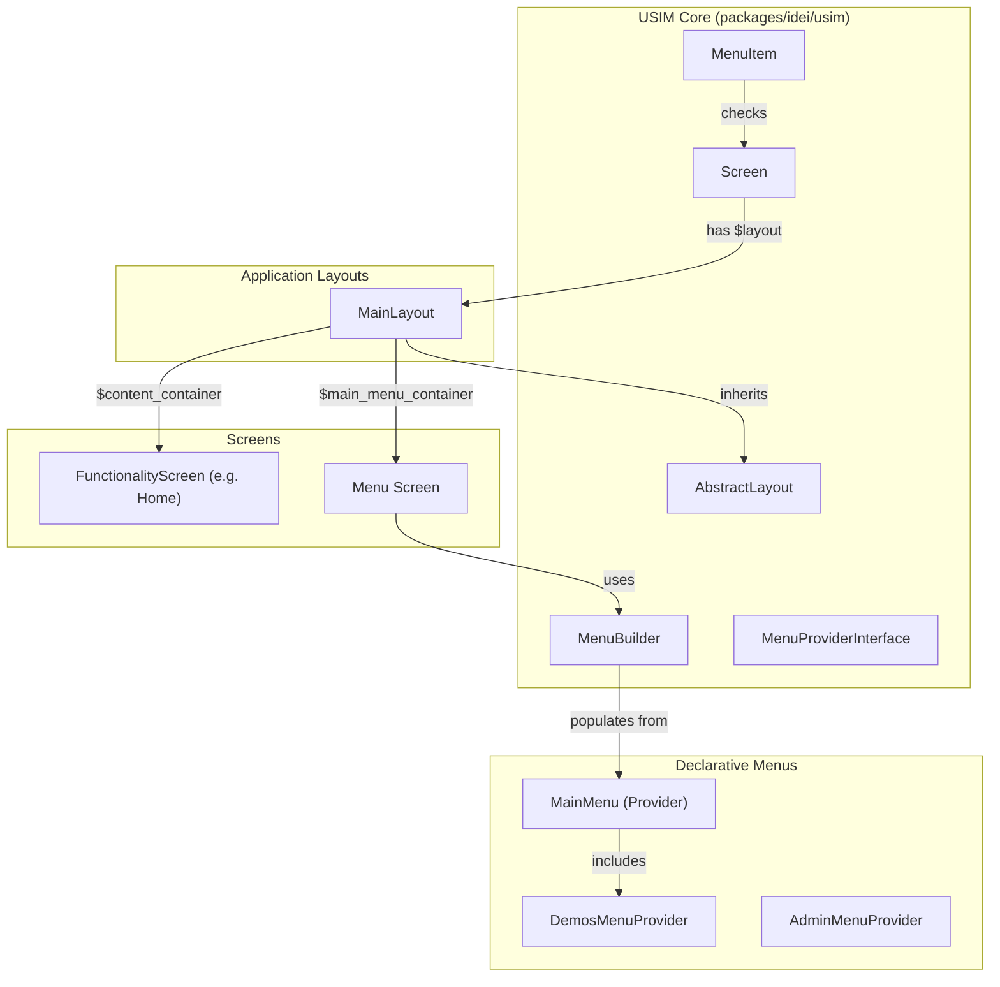

# Implementación Técnica: Refactorización de Menús y Layouts por Composición en USIM

> **Fecha:** 28 - 29 de Septiembre de 2026  
> **Rama:** `menu-refactoring`  
> **Estado:** Implementado, probado, optimizado visualmente y verificado con análisis estático (PHPStan nivel estricto).

---

## 1. Resumen Ejecutivo

Esta refactorización moderniza y desacopla la arquitectura de navegación y presentación de pantallas del framework USIM. 

Antes de esta refactorización, el menú principal estaba acoplado a un header fijo en `app.blade.php`, orquestado mediante JavaScript global (`window.MENU_SERVICE`) y con lógica heterogénea en `Menu.php` (navegación, preferencias, lógica de alta/validación de usuarios, etc.).

La nueva arquitectura introduce:
1. **Un motor nativo y declarativo de navegación en el Core (`Idei\Usim\Navigation\...`)** con soporte para evaluación dinámica de `checkAccess()`, permisos (Gates) y proveedores modulares (`MenuProviderInterface`).
2. **Un sistema de layouts por composición (`Idei\Usim\Layout\AbstractLayout`)** con slots dedicados (`$mainMenuContainer` y `$contentContainer`), eliminando la necesidad de variables globales en Blade o doble ciclo de vida HTTP.
3. **Eliminación definitiva de `$hasMenu`:** reemplazada totalmente por el contrato declarativo de layouts (`$layout` y `Screen::hasLayout()`).
4. **Separación de responsabilidades (SRP)**: extracción de la lógica de registro de usuarios hacia `RegisterActionHandler` y reducción de `Menu.php` a la orquestación visual.
5. **Soporte nativo para pantallas sin layout (modo Kiosk / Standalone)** y para layouts o menús alternativos configurables por pantalla o por ruta.
6. **Robustez en el ciclo de vida de almacenamiento y normalización visual:** inyección temprana de estado (`store_theme`), anclaje vertical superior de layouts y normalización de márgenes y paddings globales.
7. **Tipado estricto con DTO (`TriggerConfig`) y principio "Tell, Don't Ask":** sustitución de arrays asociativos abiertos por el DTO inmutable `TriggerConfig`, delegación de renderizado con `applyTo()` en items y triggers, y corrección de firmas PHPDoc en `Menu.php` para alcanzar 100% de cumplimiento en PHPStan nivel 9.

---

## 2. Comparativa Arquitectónica

### Antes de la refactorización
- **`app.blade.php`**: Contenía la barra de navegación `<div id="menu-root">` hardcodeada en el layout HTML.
- **Ciclo de vida doble**: Al cargar una pantalla, el cliente web cargaba la pantalla funcional y paralelamente ejecutaba `window.MENU_SERVICE.fetchMenu()` para traer `App\UI\Screens\Menu`.
- **Acoplamiento**: Las pantallas controlaban la presencia del menú mediante una variable booleana `$hasMenu`, mientras que `Menu.php` contenía cientos de líneas dedicadas al registro de usuarios, hash de contraseñas, validación y envío de correos.

### Después de la refactorización
- **Composición de Layouts**: Toda pantalla declara su layout mediante `public static ?string $layout = 'default';` (o una clase `AbstractLayout` específica, o `null` para pantallas independientes).
- **Eliminación de `$hasMenu`**: Se eliminó `$hasMenu` de toda la base de código. Si una pantalla requiere layout con menú, basta con que `$layout` sea no-nulo (`Screen::hasLayout()`).
- **Ciclo de vida unificado**: Una única petición `/api/ui/{screen}` resuelve el layout, embebe el menú en `$main_menu_container` y el contenido en `$content_container`.
- **Desacoplamiento Blade**: `app.blade.php` solo renderiza el contenedor raíz `#main`. No existe header hardcodeado ni `window.MENU_SERVICE`.
- **SRP y Extensibilidad**: El menú se construye con `MenuBuilder` consumiendo clases proveedoras modulares (`MainMenu`, `DemosMenuProvider`, etc.), y el registro de usuarios es gestionado por `RegisterActionHandler`.



---

## 3. Modificaciones en el Core del Framework (`packages/idei/usim`)

### 3.1 Motor de Navegación (`Idei\Usim\Navigation`)

#### `Idei\Usim\Navigation\MenuItem`
Value object fluido que representa un item de navegación:
- **Tipos soportados:** Enlace (`url`), acción (`action` con `params`), submenú (`items`) y separador (`isSeparator`).
- **Control dinámico de visibilidad:**
  - `->when(Closure|bool $condition)`: visibilidad condicional diferida.
  - `->can(string $ability, mixed $arguments = [])`: chequeo de autorización mediante Laravel `Gate::allows()`.
- **Integración con pantallas y `checkAccess()`:**
  - `MenuItem::screen(string $screenClass, ?string $label = null, ?string $icon = null)`: enlaza automáticamente con la ruta de una pantalla.
- **Método `applyTo(MenuDropdown $dropdown)`:** Aplica directamente el item al componente `MenuDropdown`, respetando el principio "Tell, Don't Ask" y garantizando tipos estrictos sin desestructurar arrays asociativos.

#### `Idei\Usim\Navigation\TriggerConfig`
DTO / Value Object inmutable (`readonly class`) para modelar la configuración del botón disparador del menú:
- **Propiedades estrictamente tipadas:** `label`, `icon`, `image`, `alt`, `style`.
- **Constructores nombrados semánticos:**
  - `TriggerConfig::make(?string $label = '☰', ?string $icon = null, string $style = 'default')`: para disparadores de texto o ícono.
  - `TriggerConfig::image(string $image, string $alt = 'User', ?string $label = null, string $style = 'default')`: para disparadores con avatar o logotipo.
  - `TriggerConfig::fromArray(array $data)`: fábrica segura contra tipos `mixed`.
- **Encapsulación con `applyTo(MenuDropdown $dropdown)`:** Delega la llamada a `$dropdown->triggerImage(...)` o `$dropdown->trigger(...)` eliminando 15 líneas de código repetitivo y desestructuración manual en el builder.

#### `Idei\Usim\Navigation\MenuBuilder`
Constructor declarativo fluido:
- Utiliza internamente `?TriggerConfig $triggerConfig` en lugar de un array abierto `mixed`.
- Provee métodos fluidos:
  - `->trigger(TriggerConfig|string|null $label = '☰', ...)`
  - `->triggerImage(string $image, string $alt = 'User', ?string $label = null, string $style = 'default')`
  - `->getTrigger(): ?TriggerConfig`
- Soporta integración modular mediante `->provider(MenuProviderInterface|string $provider)`.
- Provee los métodos:
  - `populate(MenuDropdown $dropdown)`: puebla un componente `MenuDropdown` delegando en `$this->triggerConfig?->applyTo($dropdown)` y `$item->applyTo($dropdown)`.
  - `render(): MenuDropdown`: construye y retorna una nueva instancia configurada de `MenuDropdown`.

#### `Idei\Usim\Navigation\Contracts\MenuProviderInterface`
Interfaz de diseño OCP:
```php
namespace Idei\Usim\Navigation\Contracts;

use Idei\Usim\Navigation\MenuBuilder;

interface MenuProviderInterface
{
    public function build(MenuBuilder $menu): void;
}
```

---

### 3.2 Motor de Layouts (`Idei\Usim\Layout`)

#### `Idei\Usim\Layout\AbstractLayout`
Clase abstracta base para la creación de layouts:
- Define los contenedores estructurales:
  - `$rootContainer`: Contenedor principal a pantalla completa (`width: 100%`, `minHeight: 100vh`, `flexDirection: column`).
  - `$mainMenuContainer`: Contenedor con nombre semántico `main_menu_container` donde se embebe el menú.
  - `$contentContainer`: Contenedor con nombre semántico `content_container` (`flexGrow: 1`) donde se inyecta la pantalla invocada.
- Método `wrap(Screen $screen): Container`: ejecuta el montaje de la pantalla funcional dentro del slot de contenido y del menú dentro del slot de navegación.

---

### 3.3 Extensión y Robustecimiento de `Screen.php` (`packages/idei/usim/src/Screen.php`)

Se incorporaron propiedades y métodos estáticos para soportar la composición de layouts, delegando responsabilidades a servicios auxiliares y blindando el ciclo de vida:

- **Propiedades estáticas:**
  - `public static ?string $layout = 'default';`: Layout asociado a la pantalla. Si es `'default'`, se utiliza la clase configurada en `usim.default_layout` (`MainLayout::class`). Si es `null`, la pantalla se ejecuta sin layout (modo standalone/kiosk).
  - `public static ?string $menuScreen = null;`: Permite sobreescribir la pantalla de menú para una pantalla específica (acepta FQCN o slug).
  - *Eliminación de `$hasMenu`:* La variable `$hasMenu` fue removida íntegramente; la presencia de layout/menú se determina unívocamente a través de `Screen::hasLayout()`.

- **Delegación a `Idei\Usim\Support\UsimConfig`:**
  - `Screen::resolveScreenClassFromSlug(string $slug)` y `Screen::resolveScreenSlug(string $class)` delegan la resolución de rutas y slugs a `UsimConfig`, centralizando la convención de nombres y namespaces sin saturar la clase base `Screen`.

- **Inyección temprana de estado (`incomingStorage`) en el ciclo de vida:**
  - En `Screen::initializeEventContext()`, la asignación de `$incomingStorage`, `self::$currentIncomingStorage` y la llamada a `$this->injectStorageValues($incomingStorage)` se reordenaron para ejecutarse **antes** de `reconstructScreenTreeFromCache()`.
  - Esto resolvió el problema donde el menú embebido (`Menu`) se instanciaba durante la reconstrucción del layout antes de que la pantalla anfitriona inyectara el almacenamiento, evitando que `Menu` volviera al valor por defecto `'light'` y sobreescribiera la variable `store_theme` del frontend.

- **Aislamiento de contexto en `Screen::embedInto()`:**
  - Se respaldan y restauran `self::$currentIncomingStorage` y `self::$currentQueryParams` dentro de un bloque `finally` junto a `UIIdGenerator::popCurrentContext()`, protegiendo el estado estático ante llamadas recursivas o anidadas.

- **Visibilidad de métodos auxiliares:**
  - Se modificaron a `public`: `toast()`, `closeModal()`, `redirect()` y `updateModal()`, permitiendo que Action Handlers externos (`RegisterActionHandler`) operen sobre la instancia de `$caller` sin violar el encapsulamiento.

---

### 3.4 Desacoplamiento de Vista Blade y CSS

- **`packages/idei/usim/resources/views/app.blade.php`:**
  - Se eliminó el `<div id="menu-root">` superior hardcodeado.
  - Se eliminó el script inline `window.MENU_SERVICE` y su polling/fetching al cargar páginas.
  - La aplicación ahora renderiza únicamente `#main`, delegando toda la estructura visual al layout de componentes de USIM.
- **Normalización global de `body` en `ui-components.css`:**
  - Se eliminó la regla histórica `body { padding: 20px; }` en `packages/idei/usim/resources/assets/css/ui-components.css` y `public/vendor/idei/usim/css/ui-components.css`, reemplazándola por `margin: 0; padding: 0;`.
  - Esta regla anterior provocaba que todas las pantallas normales tuvieran una separación de 20px arriba y 20px a cada lado (haciendo que el menú midiera 40px menos que el viewport), mientras que `Home` se veía de borde a borde debido a un override puntual en `welcome-usim.blade.php`.
- **Estilos de la barra de navegación:**
  - Se añadieron estilos para `[data-name="main_menu_container"]`:
    - `position: sticky; top: 0; z-index: 1000; width: 100%;` para garantizar que la barra de navegación permanezca fija al hacer scroll sin salir del flujo de diseño.

---

## 4. Modificaciones en la Aplicación (`app/`)

### 4.1 Layout de la Aplicación (`app/UI/Layouts/MainLayout.php`)

Hereda de `AbstractLayout` e implementa la barra de navegación estructurada en Flexbox:
- **Anclaje vertical y alineación del árbol:**
  - El contenedor raíz `$root` se define con:
    ```php
    $root = Container::make()
        ->name('main_layout_root')
        ->flex()
        ->flexDirection(FlexDirection::COLUMN)
        ->justifyContent(JustifyContent::START)
        ->alignItems(AlignItems::STRETCH)
        ->width('100%')
        ->minHeight('100vh');
    ```
  - **Fijación en `top: 0`:** La adición explícita de `justifyContent(JustifyContent::START)` resolvió el problema en pantallas con poco contenido (como `InputDemo` o pantallas de demostración simples), donde el flex vertical en un contenedor con `min-height: 100vh` empujaba tanto el menú como el contenido hacia el centro vertical de la ventana.
  - `alignItems(AlignItems::STRETCH)` y `width('100%')` aseguran que la barra superior ocupe todo el ancho disponible sin descuadres horizontales.
- **Contenedores de Slot:**
  - `$mainMenuContainer`: Instancia y renderiza el menú resuelto (`$screen::getMenuScreen()`). Con el CSS `[data-name="main_menu_container"]`, se mantiene `sticky` al tope de la ventana.
  - `$contentContainer`: Recibe la pantalla anfitriona y se expande ocupando el resto de la altura disponible con `flexGrow(1)`.

### 4.2 Clases Declarativas de Menús (`app/UI/Navigation/Menus/`)

- **`App\UI\Navigation\Menus\MainMenu`:** Define la estructura central del menú principal:
  - Enlaces base (Home, Dashboard, Perfil, Login).
  - Proveedores modulares delegados (`DemosMenuProvider`, etc.).
  - Separadores y opciones de administración bajo `can('access-admin')`.
- **`App\UI\Navigation\Menus\DemosMenuProvider`:** Encapsula los 12 enlaces a pantallas de demostración (Forms, Grid, Modals, Tabs, etc.), evitando saturar el menú principal.
- **`App\UI\Navigation\Menus\AdminMenuProvider` y `App\UI\Screens\Admin\AdminMenu`:** Ejemplo modular de menú especializado para áreas administrativas.

### 4.3 Extracción de Lógica de Registro (`app/Services/Auth/RegisterActionHandler.php`)

Siguiendo el principio de responsabilidad única (SRP), toda la lógica de validación, creación de usuarios, asignación de roles iniciales, persistencia y despacho de notificaciones de verificación de email se extrajo de `Menu.php` hacia este servicio dedicado.

### 4.4 Refactorización de `App\UI\Screens\Menu.php`

- Ahora utiliza `MenuBuilder` y `MainMenu` para construir el dropdown de navegación general.
- **Contenedor Plano sin Márgenes:**
  - El contenedor raíz de `Menu` se define explícitamente como:
    ```php
    Container::make()
        ->name('menu_container')
        ->plain()
        ->padding(Spacing::px(0))
        ->marginBottom(Spacing::px(0));
    ```
  - **Eliminación de franja inferior (12px):** Por defecto, si no se especifica `plain()`, un `Container` adopta la clase `ui-container-card`, la cual hereda de `.ui-container { margin-bottom: 12px; }` (la banda naranja observada en el inspector). Con `plain()`, `padding(0)` y `marginBottom(0)`, la barra de navegación se integra limpiamente sin generar separaciones no deseadas con el contenido inferior.
- Mantiene sus responsabilidades legítimas de UI:
  - Dropdown de usuario y sesión (login, logout, perfil).
  - Selector de unidades operativas (para usuarios con múltiples unidades asignadas).
  - Preferencias de tema visual (claro / oscuro) e idioma.
- Delega el procesamiento del formulario de registro a `RegisterActionHandler::handleRegistration()`.
- **Alineación de firma en `onShowErrorInfo()`:** Se corrigió la anotación `@return never` por `@return void`. En USIM, `$this->abort()` registra una instrucción en `$this->uiChanges()` sin detener la ejecución del script ni lanzar excepciones, satisfaciendo el análisis estricto de PHPStan nivel 9.

### 4.5 Normalización de Espaciados, Márgenes y Comportamiento de Contenedores

- **Normalización de `body` en CSS global:**
  - En versiones previas, `packages/idei/usim/resources/assets/css/ui-components.css` imponía `body { padding: 20px; }`, mientras que la vista `welcome-usim.blade.php` utilizaba un reset interno `body { padding: 0; }`.
  - Esta discordancia provocaba que la pantalla `Home` se viera a ancho completo (980.8px y pegada arriba), mientras que el resto de pantallas aparecían con 20px de margen superior y 40px menos de ancho (940.8px con 20px a cada lado).
  - La unificación de `body { margin: 0; padding: 0; }` en la hoja de estilos eliminó dicha discrepancia, garantizando que el menú y los layouts ocupen el 100% del viewport en todas las pantallas.
- **Eliminación de paddings compensatorios históricos (`paddingTop(80)` / `paddingTop(60)`):**
  - Históricamente, al utilizar un menú HTML renderizado con `position: fixed; top: 0;` en Blade, las pantallas de autenticación (`ForgotPassword`, `ResetPassword`, `EmailVerified`, `Registered`) y sus plantillas stubs incluían llamadas a `paddingTop(80)` o `paddingTop(60)` para evitar quedar tapadas por la barra fija.
  - Al migrar a `MainLayout` y flujo normal con `position: sticky`, este padding se convertía en un espacio en blanco excesivo e inconsistente. Dichas pantallas se normalizaron a un espaciado superior estándar (`paddingTop(Spacing::px(20))`).
- **Ajuste de espaciado en la portada (`welcome-usim.blade.php`):**
  - Se redujo el `padding-top` de la sección `.hero` de 80px a 24px para armonizar la transición visual bajo la barra de menú sticky unificada.
- **Elementos `<div class="title" style="display: none;"></div>`:**
  - Se clarificó que la presencia de estos elementos ocultos en el DOM responde a un comportamiento estándar del componente frontend `container/index.js`, el cual reserva un slot de título con `style="display: none;"` cuando no se invoca `->title(...)`. No afecta el flujo, espaciado ni el renderizado visual.
- **Configuración de bordes en `Container`:**
  - El componente `Container.php` soporta la especificación de bordes mediante `border(string $border)`. Para surtir efecto en CSS, requiere recibir una declaración shorthand CSS completa (ejemplo: `->border('1px solid #e2e8f0')` o `->border('1px solid var(--border-color, #ccc)')`), y no solo nombres de color o valores numéricos aislados, ya que la API actual de `Container` aún no cuenta con métodos granulares independientes (`borderColor()`, `borderWidth()`, `borderStyle()`).

---

## 5. Guía de Uso para Desarrolladores

### 5.1 Cómo definir o ampliar items en el Menú

Para agregar nuevos items al menú principal, basta con editar `App\UI\Navigation\Menus\MainMenu.php` o crear un nuevo `MenuProvider`:

```php
namespace App\UI\Navigation\Menus;

use Idei\Usim\Navigation\Contracts\MenuProviderInterface;
use Idei\Usim\Navigation\MenuBuilder;
use App\UI\Screens\Reports\MonthlyReport;

class ReportsMenuProvider implements MenuProviderInterface
{
    public function build(MenuBuilder $menu): void
    {
        $menu->submenu('Reportes', function (MenuBuilder $submenu) {
            $submenu
                ->screen(MonthlyReport::class, 'Reporte Mensual', '📊')
                ->link('Exportar Datos', '/reports/export', '📁')
                ->when(fn() => auth()->user()?->hasRole('analyst'));
        }, '📈');
    }
}
```

Luego, en `MainMenu.php`:
```php
$menu->provider(ReportsMenuProvider::class);
```

### 5.2 Cómo configurar el Layout de una Screen

- **Comportamiento por defecto (con menú y barra superior):**
  No requiere ninguna configuración especial, ya que hereda `public static ?string $layout = 'default';`.

- **Pantalla limpia / Kiosk / Fullscreen (sin menú ni layout):**
  ```php
  class KioskDisplayScreen extends Screen
  {
      public static ?string $layout = null;
      // ...
  }
  ```

- **Pantalla con Layout personalizado:**
  ```php
  class CustomPortalScreen extends Screen
  {
      public static ?string $layout = CustomPortalLayout::class;
      // ...
  }
  ```

- **Pantalla con Menú alternativo:**
  ```php
  class AdminDashboardScreen extends Screen
  {
      public static ?string $menuScreen = AdminMenu::class;
      // ...
  }
  ```

---

## 6. Pruebas y Aseguramiento de Calidad

### 6.1 Suites de Pruebas Ejecutadas

1. **`tests/Feature/NavigationMenuBuilderTest.php`** (Nuevos):
   - Construcción declarativa con links, actions, submenús y separadores.
   - Evaluación diferida de `when()` y `can()`.
   - Chequeo dinámico de permisos mediante `Screen::checkAccess()`.
   - Composición modular con `MenuProviderInterface`.
   - Configuración de disparadores mediante el DTO `TriggerConfig` y métodos fluidos (`trigger()`, `triggerImage()`).
2. **`tests/Feature/LayoutCompositionTest.php`** (Nuevos):
   - Enmarcado automático con `MainLayout` y slots `$main_menu_container` y `$content_container`.
   - Modo Kiosk / Standalone sin layout cuando `$layout = null`.
   - Soporte de menús alternativos por clase y por slug.
   - Resolución bidireccional de slugs.
   - Preservación y persistencia de `store_theme` (tema claro/oscuro) a través de navegaciones entre pantallas mediante la inyección temprana de estado (`incomingStorage`).
3. **`tests/Feature/HomeMenuScreenTest.php`** (Regresión):
   - 17 pruebas verificando triggers de invitado, triggers de usuario autenticado, roles, dropdown de unidades operativas y navegación.
4. **`tests/Feature/MenuRegisterDialogTest.php`** (Regresión):
   - 3 pruebas verificando apertura de diálogo modal de registro, validación, alta y verificación vía email.

**Resultado:** 32 tests pasados, 266 aserciones exitosas.

### 6.2 Análisis Estático (PHPStan)
- Ejecutado sobre el núcleo de composición y navegación: `packages/idei/usim/src/Screen.php`, `packages/idei/usim/src/Layout/`, `packages/idei/usim/src/Navigation/`, `packages/idei/usim/src/Components/MenuDropdown.php`, `app/UI/Layouts/MainLayout.php` y `app/UI/Screens/Menu.php` bajo la configuración estricta de `phpstan.neon`.
- **Resultado:** Nivel 9 de análisis estático estricto completado con 0 errores (`[OK] No errors`).
