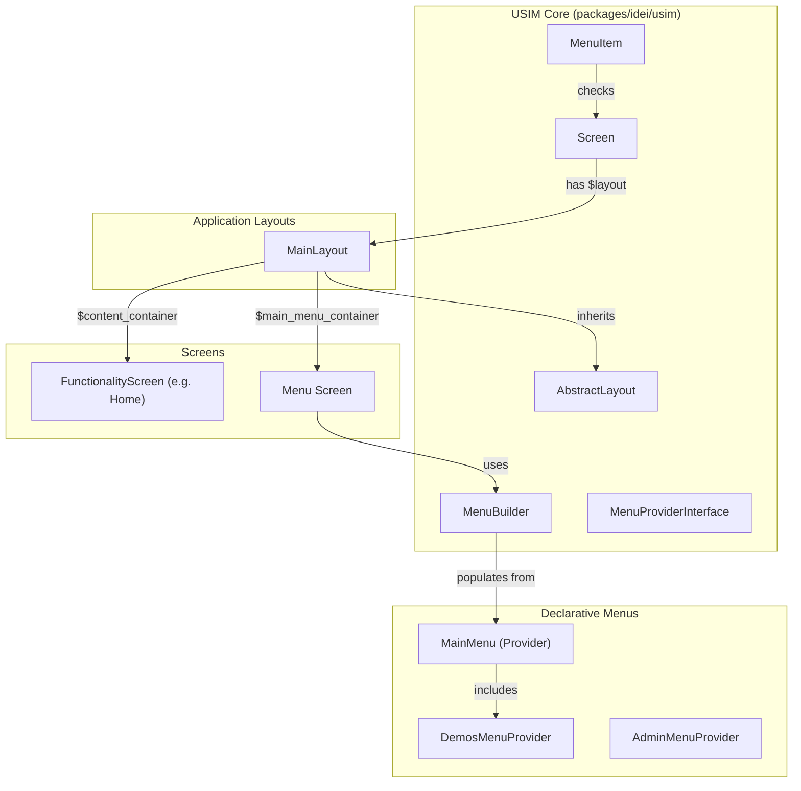

# Implementación Técnica: Refactorización de Menús y Layouts por Composición en USIM

> **Fecha:** 28 de Septiembre de 2026  
> **Rama:** `menu-refactoring`  
> **Estado:** Implementado, probado y verificado con análisis estático (PHPStan nivel estricto).

---

## 1. Resumen Ejecutivo

Esta refactorización moderniza y desacopla la arquitectura de navegación y presentación de pantallas del framework USIM. 

Antes de esta refactorización, el menú principal estaba acoplado a un header fijo en `app.blade.php`, orquestado mediante JavaScript global (`window.MENU_SERVICE`) y con lógica heterogénea en `Menu.php` (navegación, preferencias, lógica de alta/validación de usuarios, etc.).

La nueva arquitectura introduce:
1. **Un motor nativo y declarativo de navegación en el Core (`Idei\Usim\Navigation\...`)** con soporte para evaluación dinámica de `checkAccess()`, permisos (Gates) y proveedores modulares (`MenuProviderInterface`).
2. **Un sistema de layouts por composición (`Idei\Usim\Layout\AbstractLayout`)** con slots dedicados (`$mainMenuContainer` y `$contentContainer`), eliminando la necesidad de variables globales en Blade o doble ciclo de vida HTTP.
3. **Separación de responsabilidades (SRP)**: extracción de la lógica de registro de usuarios hacia `RegisterActionHandler` y reducción de `Menu.php` a la orquestación visual.
4. **Soporte nativo para pantallas sin layout (modo Kiosk / Standalone)** y para layouts o menús alternativos configurables por pantalla o por ruta.

---

## 2. Comparativa Arquitectónica

### Antes de la refactorización
- **`app.blade.php`**: Contenía la barra de navegación `<div id="menu-root">` hardcodeada en el layout HTML.
- **Ciclo de vida doble**: Al cargar una pantalla, el cliente web cargaba la pantalla funcional y paralelamente ejecutaba `window.MENU_SERVICE.fetchMenu()` para traer `App\UI\Screens\Menu`.
- **Acoplamiento**: Las pantallas controlaban la presencia del menú mediante una variable booleana `$hasMenu`, mientras que `Menu.php` contenía cientos de líneas dedicadas al registro de usuarios, hash de contraseñas, validación y envío de correos.

### Después de la refactorización
- **Composición de Layouts**: Toda pantalla declara su layout mediante `public static ?string $layout = 'default';` (o una clase `AbstractLayout` específica, o `null` para pantallas independientes).
- **Ciclo de vida unificado**: Una única petición `/api/ui/{screen}` resuelve el layout, embebe el menú en `$main_menu_container` y el contenido en `$content_container`.
- **Desacoplamiento Blade**: `app.blade.php` solo renderiza el contenedor raíz `#app-root`. No existe header hardcodeado ni `window.MENU_SERVICE`.
- **SRP y Extensibilidad**: El menú se construye con `MenuBuilder` consumiendo clases proveedoras modulares (`MainMenu`, `DemosMenuProvider`, etc.), y el registro de usuarios es gestionado por `RegisterActionHandler`.



---

## 3. Modificaciones en el Core del Framework (`packages/idei/usim`)

### 3.1 Motor de Navegación (`Idei\Usim\Navigation`)

#### `Idei\Usim\Navigation\MenuItem`
Value object fluido que representa un item de navegación:
- **Tipos soportados:** Enlace (`url`), acción (`action` con `params`), submenú (`items`) y separador (`isSeparator`).
- **Control dinámico de visibilidad:**
  - `->when(Closure|bool $condition)`: visibilidad condicional diferida.
  - `->can(string $ability, mixed $arguments = [])`: chequeo de autorización mediante Laravel `Gate::allows()`.
- **Integración con pantallas y `checkAccess()`:**
  - `MenuItem::screen(string $screenClass, ?string $label = null, ?string $icon = null)`: enlaza automáticamente con la ruta de una pantalla.
  - Al evaluar `isVisible()`, si el item está asociado a una subclase de `Screen`, invoca dinámicamente `Screen::checkAccess()` con el usuario actual.

#### `Idei\Usim\Navigation\MenuBuilder`
Constructor declarativo fluido:
- Permite definir el trigger del dropdown (`->trigger('☰')`), posición (`bottom-left`, `bottom-right`), ancho (`width`), items de menú y submenús.
- Soporta integración modular mediante `->provider(MenuProviderInterface|string $provider)`.
- Provee los métodos:
  - `populate(MenuDropdown $dropdown)`: puebla un componente `MenuDropdown` existente con los items configurados.
  - `render(): MenuDropdown`: construye y retorna una nueva instancia configurada de `MenuDropdown`.

#### `Idei\Usim\Navigation\Contracts\MenuProviderInterface`
Interfaz de diseño OCP:
```php
namespace Idei\Usim\Navigation\Contracts;

use Idei\Usim\Navigation\MenuBuilder;

interface MenuProviderInterface
{
    public function build(MenuBuilder $menu): void;
}
```

---

### 3.2 Motor de Layouts (`Idei\Usim\Layout`)

#### `Idei\Usim\Layout\AbstractLayout`
Clase abstracta base para la creación de layouts:
- Define los contenedores estructurales:
  - `$rootContainer`: Contenedor principal a pantalla completa (`width: 100%`, `minHeight: 100vh`, `flexDirection: column`).
  - `$mainMenuContainer`: Contenedor con nombre semántico `main_menu_container` donde se embebe el menú.
  - `$contentContainer`: Contenedor con nombre semántico `content_container` (`flexGrow: 1`) donde se inyecta la pantalla invocada.
- Método `wrap(Screen $screen): Container`: ejecuta el montaje de la pantalla funcional dentro del slot de contenido y del menú dentro del slot de navegación.

---

### 3.3 Extensión de `Screen.php` (`packages/idei/usim/src/Screen.php`)

Se incorporaron propiedades y métodos estáticos para soportar la composición de layouts:

- **Propiedades estáticas:**
  - `public static ?string $layout = 'default';`: Layout asociado a la pantalla. Si es `'default'`, se utiliza la clase configurada en `usim.default_layout` (`MainLayout::class`). Si es `null`, la pantalla se ejecuta sin layout (modo standalone/kiosk).
  - `public static ?string $menuScreen = null;`: Permite sobreescribir la pantalla de menú para una pantalla específica (acepta FQCN o slug).

- **Métodos de resolución:**
  - `Screen::getLayoutClass(): ?string`: Resuelve la clase concreta del layout. Excluye automáticamente pantallas de tipo menú o pantallas de dispositivo.
  - `Screen::getMenuScreen(): ?string`: Resuelve la clase de menú asociada a la pantalla, con fallback a `config('usim.default_menu_screen')` (`App\UI\Screens\Menu`).
  - `Screen::resolveScreenClassFromSlug(string $slug): ?string`: Traduce slugs (`"admin/dashboard"`, `"home"`) a su FQCN.
  - `Screen::hasLayout(): bool`: Indica si la pantalla tiene un layout activo (`getLayoutClass() !== null`).

- **Visibilidad de métodos auxiliares:**
  - Se modificaron a `public`: `toast()`, `closeModal()`, `redirect()` y `updateModal()`, permitiendo que Action Handlers externos (`RegisterActionHandler`) operen sobre la instancia de `$caller` sin violar el encapsulamiento.

---

### 3.4 Desacoplamiento de Vista Blade y CSS

- **`packages/idei/usim/resources/views/app.blade.php`:**
  - Se eliminó el `<div id="menu-root">` superior hardcodeado.
  - Se eliminó el script inline `window.MENU_SERVICE` y su polling/fetching al cargar páginas.
  - La aplicación ahora renderiza únicamente `#app-root`, delegando toda la estructura visual al layout de componentes de USIM.
- **`packages/idei/usim/resources/assets/css/ui-components.css` y `public/vendor/idei/usim/css/ui-components.css`:**
  - Se añadieron estilos para `[data-name="main_menu_container"]`:
    - `position: sticky; top: 0; z-index: 1000; width: 100%;` para garantizar que la barra de navegación permanezca fija al hacer scroll.

---

## 4. Modificaciones en la Aplicación (`app/`)

### 4.1 Layout de la Aplicación (`app/UI/Layouts/MainLayout.php`)

Hereda de `AbstractLayout` e implementa la barra de navegación:
- Instancia y renderiza el menú resuelto (`$screen::getMenuScreen()`) dentro de `$mainMenuContainer`.
- Renderiza el contenido de la pantalla funcional dentro de `$contentContainer`.

### 4.2 Clases Declarativas de Menús (`app/UI/Navigation/Menus/`)

- **`App\UI\Navigation\Menus\MainMenu`:** Define la estructura central del menú principal:
  - Enlaces base (Home, Dashboard, Perfil, Login).
  - Proveedores modulares delegados (`DemosMenuProvider`, etc.).
  - Separadores y opciones de administración bajo `can('access-admin')`.
- **`App\UI\Navigation\Menus\DemosMenuProvider`:** Encapsula los 12 enlaces a pantallas de demostración (Forms, Grid, Modals, Tabs, etc.), evitando saturar el menú principal.
- **`App\UI\Navigation\Menus\AdminMenuProvider` y `App\UI\Screens\Admin\AdminMenu`:** Ejemplo modular de menú especializado para áreas administrativas.

### 4.3 Extracción de Lógica de Registro (`app/Services/Auth/RegisterActionHandler.php`)

Siguiendo el principio de responsabilidad única (SRP), toda la lógica de validación, creación de usuarios, asignación de roles iniciales, persistencia y despacho de notificaciones de verificación de email se extrajo de `Menu.php` hacia este servicio dedicado.

### 4.4 Refactorización de `App\UI\Screens\Menu.php`

- Ahora utiliza `MenuBuilder` y `MainMenu` para construir el dropdown de navegación general.
- Mantiene sus responsabilidades legítimas de UI:
  - Dropdown de usuario y sesión (login, logout, perfil).
  - Selector de unidades operativas (para usuarios con múltiples unidades asignadas).
  - Preferencias de tema visual (claro / oscuro) e idioma.
- Delega el procesamiento del formulario de registro a `RegisterActionHandler::handleRegistration()`.

---

## 5. Guía de Uso para Desarrolladores

### 5.1 Cómo definir o ampliar items en el Menú

Para agregar nuevos items al menú principal, basta con editar `App\UI\Navigation\Menus\MainMenu.php` o crear un nuevo `MenuProvider`:

```php
namespace App\UI\Navigation\Menus;

use Idei\Usim\Navigation\Contracts\MenuProviderInterface;
use Idei\Usim\Navigation\MenuBuilder;
use App\UI\Screens\Reports\MonthlyReport;

class ReportsMenuProvider implements MenuProviderInterface
{
    public function build(MenuBuilder $menu): void
    {
        $menu->submenu('Reportes', function (MenuBuilder $submenu) {
            $submenu
                ->screen(MonthlyReport::class, 'Reporte Mensual', '📊')
                ->link('Exportar Datos', '/reports/export', '📁')
                ->when(fn() => auth()->user()?->hasRole('analyst'));
        }, '📈');
    }
}
```

Luego, en `MainMenu.php`:
```php
$menu->provider(ReportsMenuProvider::class);
```

### 5.2 Cómo configurar el Layout de una Screen

- **Comportamiento por defecto (con menú y barra superior):**
  No requiere ninguna configuración especial, ya que hereda `public static ?string $layout = 'default';`.

- **Pantalla limpia / Kiosk / Fullscreen (sin menú ni layout):**
  ```php
  class KioskDisplayScreen extends Screen
  {
      public static ?string $layout = null;
      // ...
  }
  ```

- **Pantalla con Layout personalizado:**
  ```php
  class CustomPortalScreen extends Screen
  {
      public static ?string $layout = CustomPortalLayout::class;
      // ...
  }
  ```

- **Pantalla con Menú alternativo:**
  ```php
  class AdminDashboardScreen extends Screen
  {
      public static ?string $menuScreen = AdminMenu::class;
      // ...
  }
  ```

---

## 6. Pruebas y Aseguramiento de Calidad

### 6.1 Suites de Pruebas Ejecutadas

1. **`tests/Feature/NavigationMenuBuilderTest.php`** (Nuevos):
   - Construcción declarativa con links, actions, submenús y separadores.
   - Evaluación diferida de `when()` y `can()`.
   - Chequeo dinámico de permisos mediante `Screen::checkAccess()`.
   - Composición modular con `MenuProviderInterface`.
2. **`tests/Feature/LayoutCompositionTest.php`** (Nuevos):
   - Enmarcado automático con `MainLayout` y slots `$main_menu_container` y `$content_container`.
   - Modo Kiosk / Standalone sin layout cuando `$layout = null`.
   - Soporte de menús alternativos por clase y por slug.
   - Resolución bidireccional de slugs.
3. **`tests/Feature/HomeMenuScreenTest.php`** (Regresión):
   - 17 pruebas verificando triggers de invitado, triggers de usuario autenticado, roles, dropdown de unidades operativas y navegación.
4. **`tests/Feature/MenuRegisterDialogTest.php`** (Regresión):
   - 3 pruebas verificando apertura de diálogo modal de registro, validación, alta y verificación vía email.

**Resultado:** 29 tests pasados, 238 aserciones exitosas.

### 6.2 Análisis Estático (PHPStan)
- Ejecutado sobre `packages/idei/usim/src/Screen.php` con el archivo `phpstan.neon` del proyecto.
- **Resultado:** 0 errores (`[OK] No errors`).
