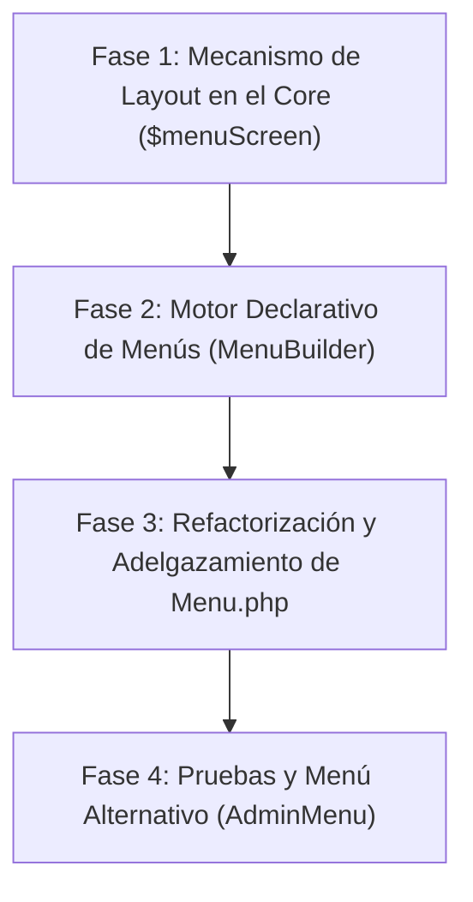

# Plan de Refactorización: Sistema Extensible de Menús y Layouts para USIM

> **Propósito:** Guía de implementación técnica para desacoplar el menú principal (`App\UI\Screens\Menu`), introducir un sistema declarativo de navegación (`MenuBuilder`) y habilitar la selección dinámica de menús por pantalla mediante `public static ?string $menuScreen`.

---

## 1. Visión y Objetivos de Diseño

1. **Cumplir SOLID y Clean Code:**
   - **SRP (Single Responsibility):** Extraer la lógica de registro de usuarios, validaciones y submenús fuera de `Menu.php`. Reducir la clase de ~820 líneas a menos de 100 líneas centradas únicamente en orquestar la barra de navegación.
   - **OCP (Open/Closed):** Permitir que nuevos módulos registren sus propios items mediante contratos (`MenuProviderInterface`) sin modificar el archivo del menú central.
   - **Composición sobre Herencia:** Las pantallas no heredan del menú; las pantallas **declaran** qué menú necesitan mediante metadata estática.
2. **Ergonomía para el desarrollador (DIY / DRY):**
   - Permitir a un desarrollador definir un menú completo en segundos usando una API fluida (`MenuBuilder::make()->link(...)->screen(...)->when(...)`).
3. **Mecanismo Dinámico `$menuScreen`:**
   - Permitir cambiar de menú por pantalla simplemente declarando:
     ```php
     public static ?string $menuScreen = AdminMenu::class;
     ```
     o para modo sin menú (kiosk/clean):
     ```php
     public static ?string $menuScreen = null;
     ```

---

## 2. Fases de Implementación



---

### Fase 1: Mecanismo de Layout / Menú Dinámico en el Core

**Objetivo:** Permitir que cada pantalla decida qué Screen de Menú se envía al frontend (`window.MENU_SERVICE`).

- [ ] **Paso 1.1:** Modificar `packages/idei/usim/src/Screen.php`:
  - Declarar la propiedad estática:
    ```php
    public static ?string $menuScreen = \App\UI\Screens\Menu::class;
    ```
  - Implementar el método de resolución:
    ```php
    public static function getMenuService(): ?string
    {
        // Si explícitamente se apagó el menú clásico o $menuScreen es null
        if (!static::$hasMenu || static::$menuScreen === null) {
            return null;
        }

        // Si pertenece al namespace Device, por convención no lleva menú
        if (str_contains(static::class, 'Screens\\Device\\')) {
            return null;
        }

        // Resuelve la clase a ruta USIM (ej. App\UI\Screens\Admin\AdminMenu -> 'admin/admin-menu' o 'menu')
        return static::resolveScreenSlug(static::$menuScreen);
    }
    ```
  - Mantener compatibilidad hacia atrás: `hasMenu()` retorna `static::getMenuService() !== null`.
- [ ] **Paso 1.2:** Actualizar `routes/web.php` (y el stub en el paquete USIM):
  - Obtener el servicio de menú dinámico para la pantalla solicitada:
    ```php
    $menuService = class_exists($screenClass) && method_exists($screenClass, 'getMenuService')
        ? $screenClass::getMenuService()
        : 'menu';

    return view('usim::app', [
        'screen' => $screenRoute,
        'reset' => $reset,
        'hasMenu' => $menuService !== null,
        'menuService' => $menuService,
    ]);
    ```
- [ ] **Paso 1.3:** Actualizar `packages/idei/usim/resources/views/app.blade.php`:
  - Enviar el servicio dinámico a JavaScript:
    ```blade
    window.MENU_SERVICE = @json($menuService ?? (($hasMenu ?? true) ? 'menu' : null));
    ```

---

### Fase 2: Motor Declarativo de Navegación (`Navigation`)

**Objetivo:** Crear una capa de abstracción desacoplada para construir menús rápidamente.

- [ ] **Paso 2.1:** Crear `App\UI\Navigation\MenuItem`:
  - Value object con propiedades: `label`, `icon`, `url`, `action`, `params`, `screenClass`, `isSeparator`, `children`.
  - Métodos fluidos de visibilidad:
    - `->when(Closure|bool $condition)`: evaluación diferida de visibilidad.
    - `->can(string $permission)`: chequeo automático contra gates/roles de Laravel.
  - Método `isVisible(): bool` que evalúa permisos en tiempo de renderizado.
- [ ] **Paso 2.2:** Crear `App\UI\Navigation\MenuBuilder`:
  - Métodos fluidos:
    - `->link(string $label, string $url, ?string $icon = null, Closure|bool|null $when = null)`
    - `->screen(string $screenClass, ?string $label = null, ?string $icon = null, Closure|bool|null $when = null)`
    - `->action(string $label, string $action, array $params = [], ?string $icon = null, Closure|bool|null $when = null)`
    - `->submenu(string $label, Closure $callback, ?string $icon = null, Closure|bool|null $when = null)`
    - `->separator(Closure|bool|null $when = null)`
  - Método `render(): MenuDropdown`: compila la estructura al componente nativo `Idei\Usim\Components\MenuDropdown`.
- [ ] **Paso 2.3:** Crear contrato `App\UI\Navigation\Contracts\MenuProviderInterface`:
  ```php
  interface MenuProviderInterface
  {
      public function build(MenuBuilder $menu): void;
  }
  ```

---

### Fase 3: Refactorización y Limpieza de `Menu.php`

**Objetivo:** Reducir `Menu.php` a su responsabilidad real (orquestar la barra superior).

- [ ] **Paso 3.1:** Extraer la lógica de Registro de Usuarios:
  - Mover `onSubmitRegister`, `handleRegisterSuccess`, `handleRegisterError`, `updateModalValidationErrors`, `normalizeRoles`, etc. a un Action Handler o dialog dedicado (`App\UI\Actions\Auth\RegisterActionHandler` o delegar a `RegisterDialog`).
- [ ] **Paso 3.2:** Modularizar los Demos en un Provider:
  - Crear `App\UI\Navigation\Providers\DemosMenuProvider` implementando `MenuProviderInterface`.
  - Mover la definición de los 15 items de demos a esta clase.
- [ ] **Paso 3.3:** Reescribir `Menu::buildLeftMenu()` y `Menu::buildUserMenu()` utilizando `MenuBuilder`:
  - Sustituir la lógica imperativa por la API fluida y declarativa.

---

### Fase 4: Validación y Demostración

- [ ] **Paso 4.1:** Crear `App\UI\Screens\Admin\AdminMenu`:
  - Un menú exclusivo para administradores con items como Gestión de Usuarios, Traducciones, Logs y Configuración.
- [ ] **Paso 4.2:** Probar en una pantalla existente:
  - En `App\UI\Screens\Admin\UsersManager`, configurar:
    ```php
    public static ?string $menuScreen = \App\UI\Screens\Admin\AdminMenu::class;
    ```
  - Verificar que al entrar a `/admin/users-manager`, la barra superior carga `AdminMenu` en lugar del menú general.
- [ ] **Paso 4.3:** Probar en una pantalla Kiosk:
  - Verificar que con `public static ?string $menuScreen = null;` la barra no se monta y el contenedor entra en modo `usim-kiosk-mode`.

---

## 3. Prompt de Continuidad para la Siguiente Sesión

Copia y pega el siguiente bloque en un nuevo chat con este asistente para continuar inmediatamente:

```text
Hola. Estoy retomando el trabajo en el framework USIM.
Por favor lee detenidamente el archivo "docs/plan-refactoring-menu-y-layouts.md".

ESTADO ACTUAL:
Tenemos definido el plan de arquitectura para:
1. Implementar el soporte de menús dinámicos por pantalla usando:
   public static ?string $menuScreen = \App\UI\Screens\Menu::class;
2. Crear el sistema declarativo MenuBuilder / MenuItem.
3. Refactorizar y reducir App\UI\Screens\Menu.php separando la lógica de autenticación y demos.

INSTRUCCIONES PARA ESTA SESIÓN:
1. Iniciaremos con la FASE 1: "Mecanismo de Layout / Menú Dinámico en el Core".
2. Revisa Screen.php, routes/web.php y packages/idei/usim/resources/views/app.blade.php.
3. Antes de modificar archivos, resume brevemente los cambios exactos que harás en cada archivo de la Fase 1 y pide mi confirmación para proceder.
```
