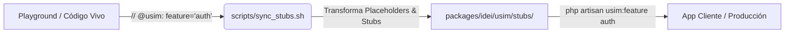

# **Guía de Sincronización de Stubs y Empaquetado de Features (sync_stubs.sh)**

## **Ecosistema USIM Framework — Versión 1.0 (Agosto 2026)**

---

## 1. Visión General y Propósito

En el monorepo de USIM, el directorio raíz actúa como el **laboratorio central de producción (*Playground*)** donde se crean y prueban pantallas, servicios, modelos, migraciones y tests.

El script [`scripts/sync_stubs.sh`](file:///C:/Users/emili/Desktop/usim-framework/scripts/sync_stubs.sh) automatiza el puente entre el código vivo del playground y los stubs empaquetables en [`packages/idei/usim/stubs/`](file:///C:/Users/emili/Desktop/usim-framework/packages/idei/usim/stubs), permitiendo organizar todo el framework bajo una **arquitectura modular de Features (*Vertical Slices*)**.



---

## 2. Sintaxis de Directivas por Tipo de Archivo

Para que un archivo sea reconocido y sincronizado como stub, se debe incluir la directiva `@usim` (o `@usim-stub`) en su cabecera:

### A. Archivos PHP (Screens, Services, Models, Controllers, Tests, Seeders)
Se coloca en las primeras líneas del archivo (debajo de `<?php`):

```php
<?php

// @usim: feature="auth", type="screen"

namespace App\UI\Screens\Auth;

use App\UI\Screens\Home;
use App\UI\Components\Modals\LoginDialog;
use App\Models\User;
```

### B. Vistas Blade (`resources/views/`)
Utiliza la sintaxis de comentarios de Blade (se remueve automáticamente en el stub resultante):

```blade
{{-- @usim: feature="core", type="view" --}}
<!DOCTYPE html>
<html>
    ...
```

### C. Scripts Shell / Bash (`scripts/`)
Utiliza comentarios con `#` (conserva permisos de ejecución `chmod +x`):

```bash
#!/usr/bin/env bash
# @usim: feature="core", type="script"

set -e
...
```

### D. Gráficos Vectoriales SVG (`public/`)
Utiliza comentarios XML/HTML:

```xml
<!-- @usim: feature="core", type="asset" -->
<svg xmlns="http://www.w3.org/2000/svg" viewBox="0 0 24 24">
    ...
</svg>
```

### E. Archivos Binarios (Imágenes PNG/JPG/WebP, Audios MP3/WAV)
Para recursos binarios individuales donde no es posible inyectar texto, se crea un **archivo sidecar hermano** con extensión `.meta`.

* **Ejemplo**: Si tienes `public/images/logo.png`, creas a su lado `public/images/logo.png.meta` con el contenido:
  ```text
  @usim: feature="core", type="asset", target="assets/core/images/logo.png"
  ```
* **Comportamiento**: El script lee el archivo `.meta`, copia el binario compañero directamente y no distribuye el archivo `.meta`.

### F. Directorios Completos (Sidecar de Directorio `.usim-dir.meta`)
Para exportar **carpetas enteras** (como `lang/es/`, directorios de assets, o módulos completos) sin tener que modificar individualmente cada archivo:

1. Crea un archivo `.usim-dir.meta` en la raíz de la carpeta deseada:
   * **Ejemplo**: [`lang/es/.usim-dir.meta`](file:///C:/Users/emili/Desktop/usim-framework/lang/es/.usim-dir.meta)
     ```ini
     @usim: feature="core", type="lang", recursive=true, exclude="*.tmp,local_*"
     ```
2. **Jerarquía y Herencia**:
   * Todos los archivos dentro de la carpeta y sus subcarpetas (`recursive=true`) heredan los metadatos.
   * **Prioridad**: Si un archivo individual dentro de la carpeta tiene su propia directiva `// @usim:`, la directiva individual tiene precedencia sobre el `.usim-dir.meta`.
   * **Exclusiones**: El atributo `exclude="patron1,patron2"` permite ignorar archivos de pruebas o borradores.
   * El archivo `.usim-dir.meta` **nunca se copia** a los stubs de salida.

---

## 3. Atributos Soportados en las Directivas

| Atributo | Requerido | Valores / Formato | Propósito y Descripción |
| :--- | :---: | :--- | :--- |
| `feature` | Opcional | `"core"`, `"auth"`, `"lang"`, `"settings"`, etc. | Define a qué módulo/feature pertenece el recurso. Si se omite, por defecto es `"core"`. |
| `type` | Opcional | `"screen"`, `"component"`, `"service"`, `"controller"`, `"model"`, `"migration"`, `"seeder"`, `"factory"`, `"test"`, `"view"`, `"lang"`, `"asset"`, `"script"` | Tipo lógico del recurso. Si se omite, se infiere automáticamente de la ruta. |
| `recursive` | Opcional | `"true"` (default), `"false"` | *(Exclusivo de `.usim-dir.meta`)* Aplica la directiva recursivamente a subdirectorios. |
| `exclude` | Opcional | `"*.tmp,Draft*"` | *(Exclusivo de `.usim-dir.meta`)* Lista de patrones glob a ignorar. |
| `target` | Opcional | Ruta relativa en `stubs/` (ej. `"screens/Admin/Dashboard.php.stub"`) | Permite sobrescribir la ruta destino o renombrar el archivo en el paquete de stubs. |
| `subpath` | Opcional | Subruta relativa (ej. `"Admin/TranslateManager.php"`) | Ayuda al instalador de PHP a resolver la ubicación exacta en el cliente. |
| `skip` | Opcional | `"true"`, `"1"` | Omite temporalmente la sincronización del archivo sin tener que borrar los metadatos. |

---

## 4. Matriz de Transformación y Reemplazo de Placeholders

El script aplica transformaciones inversas de forma automática según el `type`:

| Tipo Lógico (`type`) | Origen en Playground | Destino por Defecto en `stubs/` | Reemplazos Aplicados |
| :--- | :--- | :--- | :--- |
| `screen` | `app/UI/Screens/Auth/Login.php` | `screens/Auth/Login.php.stub` | `namespace` $\rightarrow$ `{{ namespace }}`<br>`App\UI\Screens\` $\rightarrow$ `{{ screensNamespace }}\`<br>`App\UI\Components\` $\rightarrow$ `{{ componentsNamespace }}\`<br>`App\Models\User` $\rightarrow$ `{{ userModel }}` |
| `component` | `app/UI/Components/Modals/LoginDialog.php` | `components/Modals/LoginDialog.php.stub` | `namespace` $\rightarrow$ `{{ componentsNamespace }}`<br>`App\UI\Components\` $\rightarrow$ `{{ componentsNamespace }}\`<br>`App\UI\Screens\` $\rightarrow$ `{{ screensNamespace }}\` |
| `service` | `app/Services/Auth/LoginService.php` | `services/Auth/LoginService.php.stub` | `namespace` $\rightarrow$ `{{ namespace }}`<br>`App\Models\User` $\rightarrow$ `{{ userModel }}` |
| `controller` | `app/Http/Controllers/Api/AuthController.php` | `controllers/AuthController.php.stub` | `namespace` $\rightarrow$ `{{ namespace }}`<br>`App\Models\User` $\rightarrow$ `{{ userModel }}` |
| `model` | `app/Models/User.php` | `models/User.php.stub` | `namespace` $\rightarrow$ `{{ namespace }}` |
| `migration` | `database/migrations/2026_08_15_000000_create_usim_languages_table.php` | `migrations/create_usim_languages_table.stub` | Elimina timestamp `YYYY_MM_DD_HHMMSS_` del nombre. |
| `test` | `tests/Feature/LoginScreenTest.php` | `tests/Feature/LoginScreenTest.php.stub` | `App\Models\User` $\rightarrow$ `{{ userModel }}`<br>`App\UI\Screens\` $\rightarrow$ `{{ screensNamespace }}\` |
| `view` | `resources/views/landing.blade.php` | `views/landing.blade.php` | Remueve directiva `@usim` y preserva sintaxis Blade. |
| `asset` | `public/images/icon.png` (vía `.meta`) | `assets/{feature}/images/icon.png` | Copia binaria byte a byte. |
| `script` | `scripts/start.sh` | `scripts/start.sh.stub` | Conserva permisos ejecutables `+x`. |

---

## 5. Uso del Script CLI (`sync_stubs.sh`)

### Opciones de Línea de Comandos

```bash
./scripts/sync_stubs.sh [OPCIONES]
```

* `-s, --search <patrón>`: Filtra la salida por coincidencia de texto en la ruta de origen o destino (ej. `-s TranslateManager` o `-s welcome/hero`).
* `-c, --check <ruta>`: Diagnóstico puntual de inclusión de un archivo individual o carpeta (muestra feature, tipo, origen de directiva y estado).
* `-n, --dry-run`: Modo simulación (por defecto en modo compacto). Muestra qué archivos se crearían o actualizarían sin realizar cambios en disco.
* `-f, --feature <nombre>`: Sincroniza únicamente los recursos de la feature especificada (ej. `--feature auth`).
* `-t, --type <tipo>`: Filtra por tipo de recurso (ej. `--type screen`).
* `-l, --list-features`: Escanea el playground y muestra una tabla con todas las features encontradas y su conteo de archivos.
* `-v, --verbose`: Imprime detalles exhaustivos archivo por archivo y vista previa de cabeceras.
* `--force`: Fuerza la sobrescritura de todos los stubs coincidentes.
* `-h, --help`: Muestra la ayuda interactiva en consola.

---

### Ejemplos Prácticos de Flujo de Trabajo

#### 1. Diagnóstico puntual de un archivo o carpeta específica (`--check`):
```bash
# Diagnosticar un archivo individual
./scripts/sync_stubs.sh --check app/UI/Screens/Admin/TranslateManager.php

# Diagnosticar una carpeta completa
./scripts/sync_stubs.sh --check lang/es/modal
```

#### 2. Buscar si determinados archivos están incluidos (`--search`):
```bash
./scripts/sync_stubs.sh -n -s "TranslateManager"
./scripts/sync_stubs.sh -n -s "permission"
```

#### 3. Simulación de sincronización compacta (`--dry-run`):
```bash
./scripts/sync_stubs.sh --dry-run
```

#### 4. Ver catálogo de features declaradas en el Playground:
```bash
./scripts/sync_stubs.sh --list-features
```

#### 5. Sincronizar únicamente la feature de Autenticación (`auth`):
```bash
./scripts/sync_stubs.sh --feature auth
```

#### 6. Sincronización completa con desglose detallado (`-v`):
```bash
./scripts/sync_stubs.sh -v
```

---

## 6. Conexión con el Motor de PHP (`FeatureRegistry`, `FeatureInstaller`, `usim:features`, `usim:feature`, `usim:install`)

Cuando `sync_stubs.sh` procesa un archivo, deja en la cabecera del stub una directiva limpia y normalizada:

```php
<?php

// @usim: feature="auth", type="screen"
namespace {{ namespace }};
```

### Flujo del Motor Dinámico en PHP:

1. **`FeatureRegistry`** (`Idei\Usim\Console\Support\FeatureRegistry`):
   - Escanea `packages/idei/usim/stubs/`.
   - Lee dinámicamente las cabeceras `@usim:` para indexar qué archivos componen cada feature (`core`, `auth`, `lang`).
   - Organiza métricas de componentes (Screens, Modals, Services, Controllers, Models, Migrations, Tests, Views, Lang).

2. **`FeatureInstaller`** (`Idei\Usim\Console\Support\FeatureInstaller`):
   - Resuelve la ruta física en el cliente para cada componente según su `type` y la configuración de namespaces (`screensPath`, `componentsPath`, `userModel`).
   - Reemplaza contextualmente los placeholders (`{{ namespace }}`, `{{ screensNamespace }}`, `{{ componentsNamespace }}`, `{{ userModel }}`).
   - **Remueve la directiva `// @usim`** antes de escribir en disco para que la aplicación del cliente final tenga código 100% limpio.
   - Preserva permisos de ejecución `0755` en scripts.

3. **Comandos Artisan Disponibles**:
   - `php artisan usim:features`: Lista las features disponibles, cantidad de archivos y estado de instalación (`✓ Installed`, `Partial`, `Not Installed`).
   - `php artisan usim:feature <name>`: Instala una feature individual con opciones `--dry-run`, `--force` y `--migrate`.
   - `php artisan usim:install`: Instalador interactivo o desatendido (`--all`, `--features=auth,lang`).
   - `php artisan usim:discover`: Descubre y regenera el caché de pantallas registradas.

