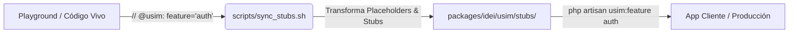

# **Guía de Sincronización de Stubs y Empaquetado de Features (sync_stubs.sh)**

## **Ecosistema USIM Framework — Versión 1.0 (Agosto 2026)**

---

## 1. Visión General y Propósito

En el monorepo de USIM, el directorio raíz actúa como el **laboratorio central de producción (*Playground*)** donde se crean y prueban pantallas, servicios, modelos, migraciones y tests.

El script [`scripts/sync_stubs.sh`](file:///C:/Users/emili/Desktop/usim-framework/scripts/sync_stubs.sh) automatiza el puente entre el código vivo del playground y los stubs empaquetables en [`packages/idei/usim/stubs/`](file:///C:/Users/emili/Desktop/usim-framework/packages/idei/usim/stubs), permitiendo organizar todo el framework bajo una **arquitectura modular de Features (*Vertical Slices*)**.



---

## 2. Sintaxis de Directivas por Tipo de Archivo

Para que un archivo sea reconocido y sincronizado como stub, se debe incluir la directiva `@usim` (o `@usim-stub`) en su cabecera:

### A. Archivos PHP (Screens, Services, Models, Controllers, Tests, Seeders)
Se coloca en las primeras líneas del archivo (debajo de `<?php`):

```php
<?php

// @usim: feature="auth", type="screen"

namespace App\UI\Screens\Auth;

use App\UI\Screens\Home;
use App\UI\Components\Modals\LoginDialog;
use App\Models\User;
```

### B. Vistas Blade (`resources/views/`)
Utiliza la sintaxis de comentarios de Blade (se remueve automáticamente en el stub resultante):

```blade
{{-- @usim: feature="core", type="view" --}}
<!DOCTYPE html>
<html>
    ...
```

### C. Scripts Shell / Bash (`scripts/`)
Utiliza comentarios con `#` (conserva permisos de ejecución `chmod +x`):

```bash
#!/usr/bin/env bash
# @usim: feature="core", type="script"

set -e
...
```

### D. Gráficos Vectoriales SVG (`public/`)
Utiliza comentarios XML/HTML:

```xml
<!-- @usim: feature="core", type="asset" -->
<svg xmlns="http://www.w3.org/2000/svg" viewBox="0 0 24 24">
    ...
</svg>
```

### E. Archivos Binarios (Imágenes PNG/JPG/WebP, Audios MP3/WAV)
Para recursos binarios donde no es posible inyectar texto, se crea un **archivo sidecar hermano** con extensión `.meta`.

* **Ejemplo**: Si tienes `public/images/logo.png`, creas a su lado `public/images/logo.png.meta` con el contenido:
  ```text
  @usim: feature="core", type="asset", target="assets/core/images/logo.png"
  ```
* **Comportamiento**: El script lee el archivo `.meta`, copia el binario compañero directamente y no distribuye el archivo `.meta`.

---

## 3. Atributos Soportados en las Directivas

| Atributo | Requerido | Valores / Formato | Propósito y Descripción |
| :--- | :---: | :--- | :--- |
| `feature` | Opcional | `"core"`, `"auth"`, `"lang"`, `"settings"`, etc. | Define a qué módulo/feature pertenece el recurso. Si se omite, por defecto es `"core"`. |
| `type` | Opcional | `"screen"`, `"component"`, `"service"`, `"controller"`, `"model"`, `"migration"`, `"seeder"`, `"factory"`, `"test"`, `"view"`, `"lang"`, `"asset"`, `"script"` | Tipo lógico del recurso. Si se omite, se infiere automáticamente de la ruta. |
| `target` | Opcional | Ruta relativa en `stubs/` (ej. `"screens/Admin/Dashboard.php.stub"`) | Permite sobrescribir la ruta destino o renombrar el archivo en el paquete de stubs. |
| `subpath` | Opcional | Subruta relativa (ej. `"Admin/TranslateManager.php"`) | Ayuda al instalador de PHP a resolver la ubicación exacta en el cliente. |
| `skip` | Opcional | `"true"`, `"1"` | Omite temporalmente la sincronización del archivo sin tener que borrar los metadatos. |

---

## 4. Matriz de Transformación y Reemplazo de Placeholders

El script aplica transformaciones inversas de forma automática según el `type`:

| Tipo Lógico (`type`) | Origen en Playground | Destino por Defecto en `stubs/` | Reemplazos Aplicados |
| :--- | :--- | :--- | :--- |
| `screen` | `app/UI/Screens/Auth/Login.php` | `screens/Auth/Login.php.stub` | `namespace` $\rightarrow$ `{{ namespace }}`<br>`App\UI\Screens\` $\rightarrow$ `{{ screensNamespace }}\`<br>`App\UI\Components\` $\rightarrow$ `{{ componentsNamespace }}\`<br>`App\Models\User` $\rightarrow$ `{{ userModel }}` |
| `component` | `app/UI/Components/Modals/LoginDialog.php` | `components/Modals/LoginDialog.php.stub` | `namespace` $\rightarrow$ `{{ componentsNamespace }}`<br>`App\UI\Components\` $\rightarrow$ `{{ componentsNamespace }}\`<br>`App\UI\Screens\` $\rightarrow$ `{{ screensNamespace }}\` |
| `service` | `app/Services/Auth/LoginService.php` | `services/Auth/LoginService.php.stub` | `namespace` $\rightarrow$ `{{ namespace }}`<br>`App\Models\User` $\rightarrow$ `{{ userModel }}` |
| `controller` | `app/Http/Controllers/Api/AuthController.php` | `controllers/AuthController.php.stub` | `namespace` $\rightarrow$ `{{ namespace }}`<br>`App\Models\User` $\rightarrow$ `{{ userModel }}` |
| `model` | `app/Models/User.php` | `models/User.php.stub` | `namespace` $\rightarrow$ `{{ namespace }}` |
| `migration` | `database/migrations/2026_08_15_000000_create_usim_languages_table.php` | `migrations/create_usim_languages_table.stub` | Elimina timestamp `YYYY_MM_DD_HHMMSS_` del nombre. |
| `test` | `tests/Feature/LoginScreenTest.php` | `tests/Feature/LoginScreenTest.php.stub` | `App\Models\User` $\rightarrow$ `{{ userModel }}`<br>`App\UI\Screens\` $\rightarrow$ `{{ screensNamespace }}\` |
| `view` | `resources/views/landing.blade.php` | `views/landing.blade.php` | Remueve directiva `@usim` y preserva sintaxis Blade. |
| `asset` | `public/images/icon.png` (vía `.meta`) | `assets/{feature}/images/icon.png` | Copia binaria byte a byte. |
| `script` | `scripts/start.sh` | `scripts/start.sh.stub` | Conserva permisos ejecutables `+x`. |

---

## 5. Uso del Script CLI (`sync_stubs.sh`)

### Opciones de Línea de Comandos

```bash
./scripts/sync_stubs.sh [OPCIONES]
```

* `-n, --dry-run`: Modo simulación. Muestra qué archivos se crearían o actualizarían sin realizar cambios en disco.
* `-f, --feature <nombre>`: Sincroniza únicamente los recursos de la feature especificada (ej. `--feature auth`).
* `-t, --type <tipo>`: Filtra por tipo de recurso (ej. `--type screen`).
* `-l, --list-features`: Escanea el playground y muestra una tabla con todas las features encontradas y su conteo de archivos.
* `-v, --verbose`: Imprime detalles exhaustivos de cada archivo y vista previa de cabeceras.
* `--force`: Fuerza la sobrescritura de todos los stubs coincidentes.
* `-h, --help`: Muestra la ayuda interactiva en consola.

---

### Ejemplos Prácticos de Flujo de Trabajo

#### 1. Ver qué features están declaradas en el Playground:
```bash
./scripts/sync_stubs.sh --list-features
```

#### 2. Probar en modo simulación (Dry Run):
```bash
./scripts/sync_stubs.sh --dry-run
```

#### 3. Sincronizar únicamente la feature de Autenticación (`auth`):
```bash
./scripts/sync_stubs.sh --feature auth
```

#### 4. Sincronizar únicamente la feature de Idiomas (`lang`):
```bash
./scripts/sync_stubs.sh --feature lang
```

#### 5. Sincronización completa de todo el ecosistema:
```bash
./scripts/sync_stubs.sh
```

---

## 6. Conexión con el Instalador de PHP (`usim:install` y `usim:feature`)

Cuando `sync_stubs.sh` procesa un archivo, deja en la cabecera del stub una directiva limpia y normalizada:

```php
<?php

// @usim: feature="auth", type="screen"
namespace {{ namespace }};
```

El instalador de Laravel (`InstallCommand` / `InstallFeatureCommand`):
1. Lee esta cabecera para saber qué archivos pertenecen a la feature solicitada (ej. `php artisan usim:feature auth`).
2. Resuelve la ruta física en base a `type` y a la configuración de la app cliente (`config('usim.screens.path')`).
3. Reemplaza los tokens de plantilla (`{{ namespace }}`, etc.).
4. **Remueve la línea `// @usim`** antes de escribir en disco para que la aplicación del cliente final tenga código 100% limpio.
